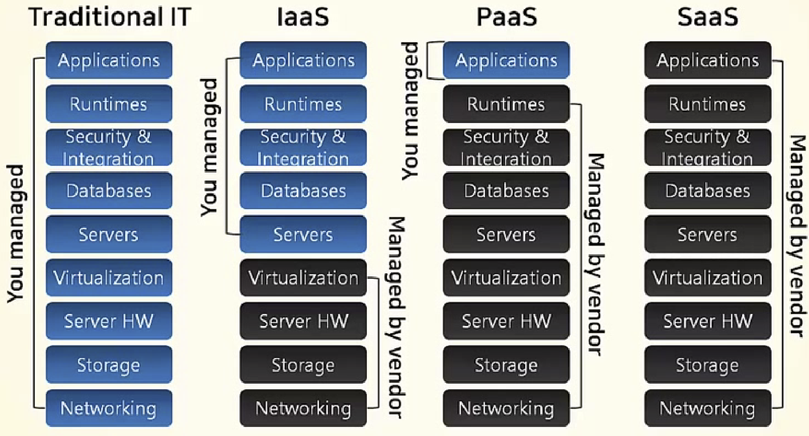

# Intro to AWS

 

#### Contents for Today

- Cloud Computing
- AWS 
- Main services
- Security
- Architecture

 

####  Useful Informations

1. On-premise

   : 사용자가 직접 Infra, Platform, Application을 관리하는 모델이다  

2. Saas (Software as a Service)

   : 가장 일반적인 유형의 Cloud Service이며 Service를 제공하는 곳에서 Infra와 Software까지 모두 제공, 즉 Application Level까지 Service로 제공된다

 

 

## Intro to AWS Cloud

 

### What is Cloud Computing?

- `Internet based computing`의 일종으로 정보를 자신의 computer가 아닌 Internet에 연결된 다른 computer로 처리하는 기술
- Served when shared computer manage resources & data are requested 
- `Configurable computer resources` ( ex. Network, Server, Storage, Application, Service)에 대해 어디서나 접근 가능한 주문형 접근을 가능케 하는 모델
- 최소한의 관리 노력으로 빠르게 예비 및 release를 가능케 함
- `Clouding computing`과 `Storage Solution`들은 사용자와 기업들에게 개인 소유나 타사 Data center의 data를 저장, 가공하는 다양한 기능을 제공
- 전기망을 통한 전력망과 비슷한 일관성 및 규모의 경제를 달성하기 위해 자원의 공유에 의존함

 

 

 

### Cloud Computing Services

 

#### 1. On-premise (Traditional IT)

- 사용자가 직접 Infra, Platform, Application 관리
- 규모 있는 업체라면 직접 **IDC (Internet Data Center)** 를 구축하고, 일반적인 경우 IDC에 공간을 할당 받아 물리 서버를 설치하고 Hardware, Operating System, Server Application을 모두 관리함

 

#### 2. IaaS (Infrastructure as a Service)

- `AWS EC2`  가 대표적
- Virtual Server, Data Storage & Hosting Computer, Network 등 **IT Infra**를 지원해주는 Service로 Hardware를 Service로 제공하는 Cloud Model
- Manage OS & Applications

 

#### 3. PaaS (Platform as a Service)

- `AWS Elastic Beanstalk` 이 대표적

  - Elastic Beanstalk을 사용하면, application을 실행하는 **Infra**에 대한 염려 없이 AWS Cloud에서 **신속하게 배포, 운영 및 관리**할 수 있다!

- Serves Fundamental Iaas + Development Tools & Functions + Deployment

  -> They serve pretty much everything you need when you develop & deploy

- Developers only have to write `logic` to connect their application & served services 

 

#### 4. Saas (Software as a Service)

- `Google Apps`,  `Office 365` 가 대표적

- 가장 일반적인 유형의 Cloud Service이며 Service를 제공하는 곳에서 Infra와 Software까지 모두 제공

  -> Serves  **application level service**

- 개발자보다는 실 사용자에게 바로 제공함

 

 

## AWS (Amazon Web Service) 를 이용한 Cloud Computing

### AWS

> Web 과 mobile의 App, Big data project, Social game에 이르는 거의 모든 물리적인 computing resources를 Cloud를 통해 실행할 수 있는 다양한 Infra 및 Application Services를 제공함

- 가장 안전하고 신뢰할 수 있는 Cloud Service
- 쉽고 빠른 **확장성** 제공
- 선 비용이나 장기 약정 없이 **사용한 만큼** 만 비용을 지불하므로 **비용을 절감** 할 수 있는 Platform 제공

 

### Amazon Cloud Service

1. Computing, Storage, Database, Networking, Analysis, Machine Learning, AI, IoT, Security, Application Development, Deploy & Maintenance 등 다양한 Application Service 제공

2. 가장 **포괄적인 범위의 서비스**를 제공할 뿐만 아니라, 해당 서비스에서도 가장 **심층적인 기능을 지원**

3. `Amazon Elastic Container Service(ESC)`, `Amazon Elastic Container Service for Kubernetes(EKS)` and `AWS Fargate` gives you the most effective way to execute container

4. the most safe and flexible cloud computing environment 

5. AWS의 core infra는 군사, 국제 은행 및 보안이 매우 중요한 조직의 **보안 요구사항을 충족**하기 위해 설계되었음

6. 동일하고 안전한 보안 hardware/software를 사용하여 각 region을 구축 & 운영

   - AWS의 모든 고객은 보안에 매우 위험한 workload를 처리할 수 있을 정도로 **안전**하고 **검증된** service offering과 연관된 supply chain을 지원하는 유일한 상용 cloud의 혜택을 누릴 수 있음

   - 263개의 **보안**, **규정 준수** 및 governance service/main function을 포함하는 심층적인 **cloud security set** 지원

7. 85개의 **보안 표준**과 **규정 준수 인증**을 지원하며, 고객 데이터를 저장하는 116개의 모든 AWS 서비스는 해당 데이터를 **암호화** 하는 기능 제공

8. `Machine Learning`, `AI`, `IoT`, `Serverless Computing`  과 같은 새로운 분야에서 매우 빠른 혁신을 이루었음

9. AWS로 최신 기술을 활용하여 보다 빠르게 혁신하고, 차별화하고, solution을 제공할 수 있음

   ex)

   - 2014년 AWS Lambda를 출시하며 event 중심의 serverless computing 공간을 처음으로 선보임
   - AWS Lambda를 통해 개발자는 server를 provisioning 하거나 관리하지 않고도 코드를 실행할 수 있고, 기본 server에 대한 provisioning, modification, patch or manage를 걱정하지 않아도 됨
     - Lamda 굳굳

  

 

## AWS 주요 서비스

 

 

### AWS Security

: 보안, 자격 증명 및 규정 준수 제품

- AWS에서 가장 높은 우선 순위 == `Cloud Security`
- AWS 고객은 위험에 가장 민감한 조직의 요구 사항에 부합하도록 구축된 Data center & Network Architecture의 혜택을 누릴 수 있음

 

### AWS Architecture

- ex) AWS 산업용 예측 유지 보수 기계 학습 모델
  - AWS Iot SiteWise & AWS IoT Analytics를 Amazon SNS 이상 탐지 알림과 함께 사용하여 Predictive Maintenance ML model 생성 

#### AWS Reference Model Architecture 

1. Web Application Hosting

   : 확장성과 신뢰성이 매우 높은 web or mobile application 구축

2. Content & Media Serving

   : 엄청난 양의 콘텐츠와 미디어를 서비스하는 신뢰성 높은 시스템을 구축

3. 일괄 처리 (batch)

   : 비디오 처리 pipeline 같은 자동 확장 가능한 일괄 처리 시스템을 구축

4. 내결함성 및 HA

   : 가용성이 뛰어나며 장애 발생 시 새 instance로 신속하게 fail over(시스템 대체 작동) 하는 system을 구축

5. 대규모 컴퓨팅

   : Big data를 처리하는 고성능 computing system 구축

6. 광고 지원

   : 확장성이 뛰어난 온라인 광고 게재 solution을 구축

7. Local Application을 위한 DR (Disaster Recovery)

   : On-premise application에 대해 비용 효율적인 재해 복구(DR) Solution 구축 

8. 파일 동기화

   : 단순한 파일 동기화 서비스를 구축

9. 전자 상거래 Web Site

   1.  Web Front-end

      : 유연한 제품 catalog를 갖춘 전자 상거래 web site 구축

   2. 결제 서비스

      : 전자 상거래 web site에 안전하고 확장성이 뛰어난 결제 pipeline을 구축

   3. Marketing & Recommendation

      : 확장성이 뛰어난 추천 엔진을 구축

10. 시계열 데이터 처리

  

#### Summary

: Amazon Cloud Service serves services including **computing**, **storage**, **database**, **AI**, **IoT**, **machine learning** and more.
