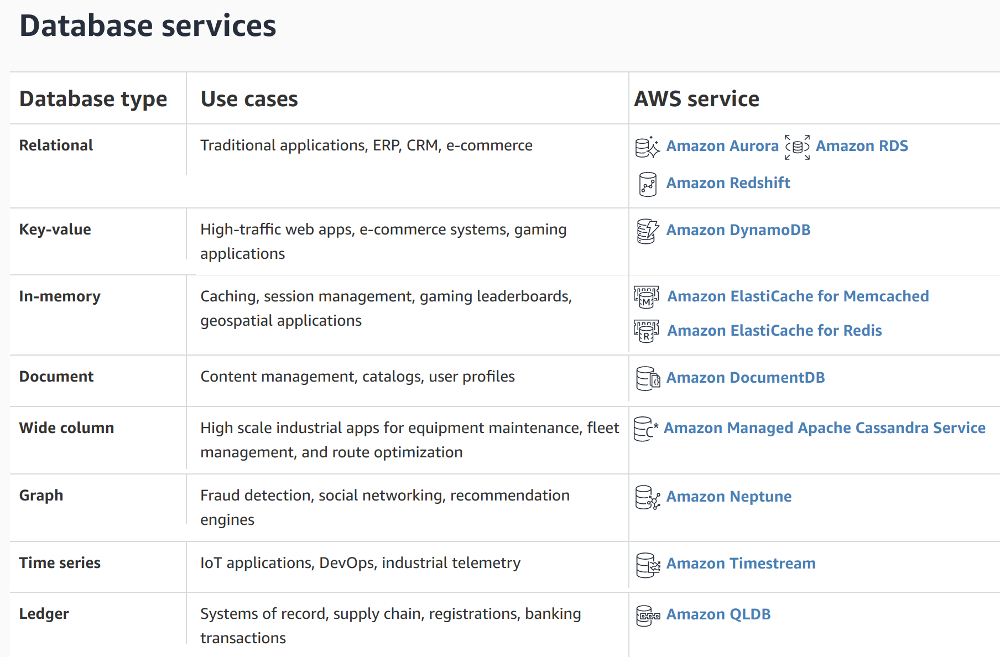
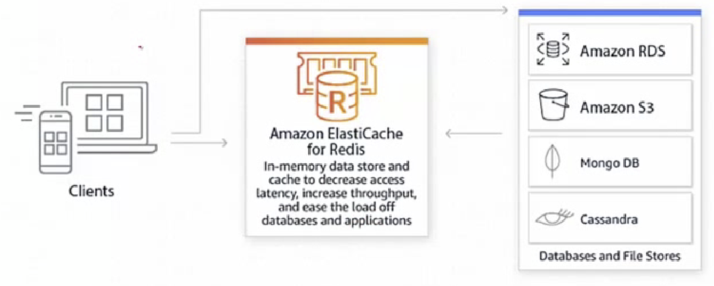

# AWS Database Server

 

#### Contents

- Database
- RDS (Relational Database Services)
- Amazon RDS for MySQL

 

#### Useful Informations

1. AWS 에서는 특정 application 사용 사례에 맞출 수 있도록 특별히 구축된 매우 다양한 관계형 및 비관계형 database를 제공한다
2. AWS 완전 관리형 database service가 제공하는 것
   - Transaction application을 위한 `관계형 database`
   -  Internet 규모의 application을 위한 `비관계형 database `
   - 분석을 위한 `data warehouse`
   - Caching, real-time workload를 위한 `In-memory data store`
   - 상호 연결성이 높은 data가 있는 application 구축을 위한 `Graph Database` 

 

 

## AWS Database

> 모든 application의 요구에 맞춰 특별히 구축된 database

- Cloud 덕분에 storage 및 computing 비용이 지속적으로 하락함에 따라 새로운 세대의 application이 등장하여 database에 대한 새로운 요구 사항들이 제기되고 있음
- Database를 테라바이트에서 페타바이트 규모로 저장하고, 밀리초 단위 지연 시간으로 data에 access하고, 초당 수백만 건의 요청을 처리하고, 전 세계적으로 수백만 명의 사용자를 지원하도록 확장할 수 있어야함
  - Application의 특정 요구를 처리하도록 특별히 구축된 관계형 및 비관계형 database가 모두 필요함
- AWS에서는 특정 application 사용 사례에 맞출 수 있도록 특별히 구축된 다양한 database를 제공함
- 기존 database를 AWS로 migration 할 때에는 `AWS  Database Migration Service` 를 사용해서 쉽고 비용 효율적이게 migration 할 수 있음

 

### AWS 완전 관리형 Database Service

 

 

1.  **RDBMS** for Transaction application

2. **NoSQL** Internet size application 

3. Data warehouse for analytics

4. In-memory store for caching & **real-time** workload

   

   - 게임 순위표, 앱 기반 차량 호출(ride hailing), Social Media Messaging, On-line shopping 등의 실시간 application 사용 사례에는 micro초 단위의 지연 시간과 높은 처리량이 필요함
   - 더 느린 disk 기반 database에 전적으로 의존하기 보다는, 빠른 관리형 In-memory data store & cache 에서 정보를 검색하여 실시간 application 사용 사례의 성능을 개선 할 수 있음
   - `Amazon ElasticCache` 는 cloud에서 In-memory data store & cache를 손쉽게 배포, 실행 및 확장 할 수 있게 지원하는 `Redis` 또는 `Memcached` 호환 In-memory data store & caching service

5. 상호 연결성이 높은 data가 있는 application 구축을 위한 `Graph database`

6. 시간에 따르 변화를 측정하기 위한 시계열 database

7. 완전하고 검증 가능한 transaction record를 유지/관리 하기 위한 원장 database

 

 

## Amazon Relational Database Service (RDS)

> Click 몇 번으로 Cloud에서 관계형  database를 설정, 운영, 확장

 

- Cloud에서 RDBMS를 간편하게 설정/운영 할 수 있음
- Hardware provisioning, database 설정, 패치 및 backup과 같은 시간 소모적인 관리 작업을 자동화하면서 비용 효율적이고 크기 조정 가능한 용량을 제공함
- 사용자가 Application에 집중하여 application에 필요한 성능, 고가용성 (HA), 보안 및 호환성을 제공할 수 있도록 지원함
- Amazon RDS는 여러 database instance 유형 (memory, performance, I/O optimization) 으로 제공되며 `Amazon Aurora`, `PostgreSQL`, `MySQL`, `MariaDB`, `Oracle Database` 및 `SQL Server`를 비롯한 6개의 database engine 중에서 선택할 수 있음
- `AWS Database Migration Service` 를 사용하여 기존 database를 Amazon RDS 로 migration or duplicate 가능

 

 

## Amazon RDS Database Engine

 

### 1. Amazon Aurora

- 고성능 상용 database의 속도와 가용성에 open source database의 간편성과 비용 효율성을 결합한 `MySQL` 및 `PostgreSQL` 호환 RDBMS engine
- MySQL보다 5배 뛰어난 성능과 상용 database의 보안성, 가용성 및 안정성을 1/10의 비용으로 제공함

 

### 2. Oracle

- Amazon RDS에서는 비용 효율적이면서 크기 조정이 가능한 hardware 용량을 갖춘 여러 version의 Oracle Database를 몇 분 만에 배포 할 수 있음
- 기존의 Oracle license를 가져오거나 1시간 단위로 license 사용료를 지불할 수 있음
- RDS를 사용하면 provisioning backup, patch, monitor, hardware expansion 등 복잡한 database 관리 작업을 관리해주므로 사용는 application 개발에 집중 할 수 있음

 

### 3. (Microsoft) SQL Server

- SQL Server용 Amazon RDS를 활용하면 cloud에서 SQL Server를 쉽게 설치, 운영 및 확장 할 수 있음
- `Express`, `Web`, `Standard` 및 `Enterprise` 를 포함한 여러 version의 SQL Server를 배포 할 수 있음
- SQL Server용 Amazon RDS는 SQL Server의 기본 기능에 직접 access 할 권한을 제공하기 때문에 사용중인 application과 도구들은 아무런 변경 없이 작동해야함 

 

### 4. MySQL

- 매우 많은 web supplication에서 사용하는 open source RDBMS
- 기존 database 에서 이미 사용하고 있는 code, application, 도구 등을 아무런 변경 없이 Amazon RDS에서 사용할 수 있음

 

### 5. PostgreSQL

- 확장성 및 표준 준수에 중점을 둔 강력한 enterprise 급 open source RDBMS
- 여러가지 정교한 기능들을 자랑하며 Java, Perl, Python, Ruby, Tcl, C/C++ 및 Oracle의 PL/SQL과 유사한 자체 PL/pgSQL을 포함해 12개 이상의 programming languages로 저장된 procedure를 실행함

 

### 6. MariaDB

- MySQL의 한 갈래에 속하는 MySQL 호환 database engine으로서 MySQL의 최초 개발자들이 개발하고 있음
- Amazon RDS를 사용하면 cloud에서 MySQL 배포를 손쉽게 설정, 운영 및 확장할 수 있음
- Amazon RDS에서는 비용 효율적이며 크기 조정이 가능한 hardware 용량을 갖춘 확장 가능한 MariaDB database를 몇 분 만에 배포할 수 있음

  

## Amazon RDS for MySQL

> Click 몇 번으로 cloud에서 RDBMS를 설정, 운영 및 확장

 

- Amazon RDS는 MySQL Community Edition version 5.5, 5.6, 5.7 및 8.0을 지원하므로 현재 사용중인 코드, application, 도구에서 Amazon RDS를 사용 할 수 있음
- MySQL용 Amazon RDS는 다수의 산업 표준을 준수함
  - Region 별로 준수되는 표준이 다르므로 각각 조사할 필요 있음!
- **FedRAMP (연방 위험 및 인증 관리 프로그램)** 보안 요건을 충족하며 FedRAMP 공동 승인 위원회 (JAB)로 부터 **AWS GovCloud**(미국 서부) region 내에서 행사 할 수 있는 `FedRAMP HIGH Baseline` 수준의 잠정적 운영 권한 (**P-ATO**)를 취득했음
- Amazon RDS는 여러 MySQL version을 실행하는 DB instance를 지원함
  - MySQL 8.0
  - MySQL 5.7
  - MySQL 5.6
  - MySQL 5.5
- 사용자는 먼저 Amazon RDS 관리 도구 또는 interface를 사용하여 **Amazon RDS MySQL DB instance**를 생성함
- DB instance 크기 조정, DB instance에 대한 연결 인증, backup 또는 snapshot 생성 및 복원, 다중 AZ 보조 생성, 읽기 전용 복제본 생성 및 DB instance의 성능 모니터링이 가능함
- 표준 MySQL utility 및 application을 사용하여 DB instance에서 data를 저장하고 data에 access 할 수 있음

 

 

#### Summary

: AWS Database는 database를 테라바이트에서 페타바이트 규모로 저장하고, 밀리초 단위 지연시간으로 data에 access 하고, 초당 수백만 건의 요청을 처리하고, 전 세계적으로 수백만명의 사용자를 지원할 수 있도록 확장할 수 있는 서비스를 제공한다

