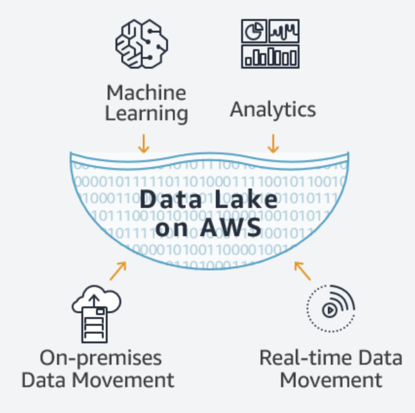
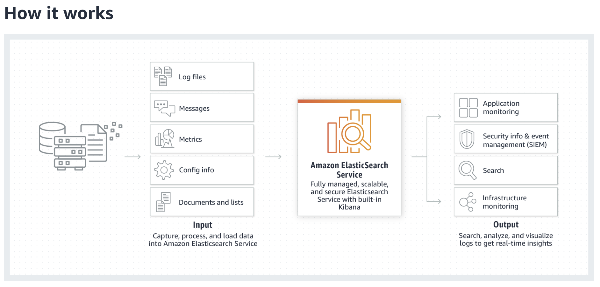
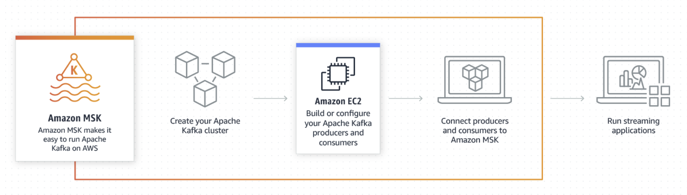

# AWS Analytics

 

#### Contents

- AWS Analytic Services

 

#### Useful Informations

1. AWS는 분석을 위해 **Data Lake**를 빠르고 쉽게 구축하고 관리하는데 필요한 모든 것을 제공하는 통합 서비스 제품군을 제공한다
   - Data Lake 및 분석 solution 구축을 위한 가장 포괄적이고 안전하고 확장 가능하며 비용 효율적인 Service portfolio다
2. Amazon S3는 web site, mobile app, enterprise application, IoT sensor, data from device 등 어디서나 모든 유형의 data를 저장하고 검색할 수 있도록 구축되었다
   - 모든 양의 data를 저장 및 검색할 수 있도록 탁월한 가용성을 갖추고 제작되었으며 99.999999% 의 내구성을 제공하도록 제작되었다

 

 

## AWS 분석 서비스

 

### Data Lakes and Analytics on AWS

> Data Lake 및 Analytic Solution 구축을 위한 가장 포괄적이고 안전하고 확장 가능하며 비용 효율적인 Service Portfolio

- AWS는 분석을 위해 `Data Lake (정제되지 않은 raw data)` 를 빠르고 쉽게 구축하고 관리하는데 필요한 모든 것을 제공하는 통합 서비스 제품군을 제공함
- Data Lakes on AWS 는 기존의 `Data Silo (격리된 local data)`  및 `Data Warehouse` 가 수행할 수 없는 방식으로 다양한 유형의 data와 분석 기법을 결합하여 보다 심층적인 통찰력을 얻기 위해 필요한 규모, 민첩성 및 유연성을 처리할 수 있음
- AWS는 security & governance를 저하하지 않으면서 모든 관련 data에 쉽게 access 할 수 있는 가장 광범위한 분석 및 machine learning service를 고객에게 제공함

 

 

1. #### Data Movement

   : Import your data from on premises, and in real-time

2. #### Data Lake

   : Store any type of data securely, from gigabytes to exabytes

3. #### Analytics

   : Analyze your data with the broadest selection of analytics services

4. #### Machine Learning

   : Predict future outcomes, and prescribe actions for rapid response

 

 

### Data Lake

- Data 가 Cloud에 대한 준비가 되면 AWS 에서 `Amazon S3` 및 `Amazon Glacier` 를 사용하여 data를 모든 형식으로 안전하게 그리고 방대한 규모로 쉽게 저장할 수 있음
- 최종 사용자가 분석에 사용할 관련 데이터를 쉽게 찾을 수 있도록 `AWS Glue`는 사용자가 검색하고 query 할 수 있는 단일 catalog를 자동으로 생성함

 

#### Storage - `Amazon S3`

> Amazon S3는 data access를 위한 안전하고 확장성이 뛰어난 밀리초 지연시간의 객체 스토리지이다

- `S3 Select`는 **data 읽기 및 검색**에 중점을 둠으로써 응답 시간을 최대 400%까지 단축함
- S3는 가장 엄격한 규제 요구 사항까지도 충족하는 포괄적인 보안 및 규정 준수 기능을 제공함

 

#### Backup & Archive - `Amazon Glacier`

> Amazon Glacier는 data를 수 분 내에 access 할 수 있는 장기 backup 및 archive를 위한 안전하고 내구성 있는 매우 저렴한 storage 이다

- `Glacier Select` 는 필요한 data만 읽고 검색함
- 고객은 월별 GB당 0.004 USD의 저렴한 요금으로 data를 저장할 수 있으므로 On-premise solution과 비교하면 상당한 비용 절감을 기대할 수 있음

 

#### Data Catalog - `AWS Glue`

> AWS Glue는 data lake의 data를 검색할 수 있도록 data catalog를 제공하고 분석을 위해 data를 준비하도록 **Extract / Transform / Load (ETL)**를 수행할 수 있는 완전 관리형 서비스 이다

- Data catalog는 모든 data 자산에 대한 permanent meta-data storage로 자동 생성되므로 모든 data를 검색, query 할 수 있음

 

 

### Amazon Athena (대화식 분석)

> Amazon Athena is an interactive query service that makes it easy to analyze data in Amazon S3 using standard SQL

 

- Amazon Athena는 **Standard SQL query**를 사용해 S3와 Glacier에 있는 data를 직접 간편하게 분석할 수 있게 해줌
- Athena는 **serverless**이므로, 설정하거나 관리할 infra가 없음
- Data를 즉시 query하고, 몇 초내에 결과를 얻고, 실행한 query에 대해서만 비용을 지불함
- Amazon S3에 저장된 data를 가리키고 schema를 정의한 후 Standard SQL을 사용하여 query를 시작하기만 하면 됨!
- 대부분 결과가 수 초 이내에 제공됨

 

 

### Amazon CloudSearch (관리형 검색 서비스)

> Amazon CloudSearch is a managed service in the AWS Cloud that makes it simple and cost-effective to set up, manage, and scale a search solution for your website or application

- Amazon CloudSearch supports 34 languages and popular search features such as **highlighting**, **auto-complete**, and **geospatial** search

 

 

### Amazon EMR

> Easily run and scale Apache **Spark**, **Hadoop**, **HBase**, **Presto**, **Hive**, and other big data frameworks

#### Big Data

- Amazon EMR 은 관리형 서비스로서 대량의 data를 쉽고 빠르며 비용 효율적으로 처리할 수 있음
- 데이터 엔지니어링, 데이터 과학 개발 및 협업을 위한 관리형 EMR Notebook
- 각 project는 version release 후 30일 이내에 EMR에서 update 되므로 community로부터 가장 최신의 최고 project를 손쉽게 얻을 수 있음

 

 

### Amazon Elasticsearch Service

> Amazon Elasticsearch Service is a fully managed service that makes it easy for you to deploy, secure, and run Elasticsearch cost effectively at scale

 

#### 운영 분석

- Application monitoring, log 분석, click stream 분석과 같은 운영 분석의 경우 Amazon Elasticsearch Service를 사용하면 거의 실시간으로 data를 검색, 탐색 filtering, 집계 및 시각화 할 수 있음
- Amazon Elasticsearch Service는 Elasticsearch의 간편한 API 및 실시간 분석 기능과 더불어 production workload에 필요한 가용성, 확장성, 보안성을 제공함

 

#### 실시간 분석

- `Amazon Kinesis` 를 사용하면 IoT telemetry data, application log, web site click stream과 같은 **streaming data**를 간편하게 수집, 처리 및 분석할 수 있음
- 모든 data가 수집된 후에야 처리를 시작할 수 있는 것이 아니라 data lake에 data가 수신되는 대로 처리 및 분석하여 실시간으로 대응할 수 있음

 

 

### Amazon Managed Streaming for Apache Kafka (Amazon MSK)

> Amazon MSK is a fully managed service that makes it easy for you to build and run applications that use Apache Kafka to process **streaming data**

 

 

- Apache Kafka is an **open-source platform** for building real-time streaming data pipelines and applications
- With Amazon MSK, you can use native **Apache Kafka APIs** to populate data lakes, stream changes to and from databases, and power machine learning and analytics applications
- Amazon MSK를 사용하면 Apache Kafka infra 관리에 대한 전문성 없이도 Apache Kafka에서 편리하게 production application을 구축하고 실행할 수 있음
  - Infra 관리 시간을 줄이고, 더 많은 시간을 application 개발에 활용할 수 있음
- Streaming data를 지속적으로 분석하여 관련 대응 조치를 취하는 application용 data source로 Apache Kafka를 사용함

 

 

### Amazon Redshift

> The most popular and fastest cloud data warehouse

 

 

#### Data warehousing

- Amazon Redshift는 petabite의 정형 데이터에 대해 복잡한 분석 query를 실행할 수 있는 기능을 제공
- 불필요한 data 이동 없이 S3의 정형/비정형 data에 대해 직접 SQL query를 실행하는 `Redshift Spectrum` 을 포함함
- Amazon Redshift는 기존 solution 비용이 1/10도 되지 않음!
  - 시간당 0.25 USD
  - 연간 1,000 USD

 

 

### Amazon QuickSight

> Amazon QuickSight is a fast, cloud-powered business intelligence service that makes it easy to deliver insights to everyone in your organization

 

 

#### 빠른 비즈니스 분석 서비스 & 대시보드 및 시각화

- 대시보드 및 시각화의 경우, Amazon QuickSight는 빠르고 강력한 Cloud 기반 비즈니스 분석 서비스를 제공하므로 모든 browser or mobile 장치에서 access 할 수 있는 시각화 및 풍부한 대시보드를 쉽게 작성할 수 있음

 

 

### Amazon Data Pipeline

> AWS Data Pipeline is a web service that helps you reliably process and move data between different AWS compute and storage services, as well as on-premises data sources, at specified intervals

- With AWS Data Pipeline, you can regularly **access your data** where it’s stored, **transform and process it at scale**, and efficiently **transfer the results to AWS services** such as Amazon S3, Amazon RDS, Amazon DynamoDB, and Amazon EMR
- AWS Data Pipeline helps you easily create complex data processing workloads that are fault tolerant, repeatable, and highly available
- You don’t have to worry about ensuring resource availability, managing inter-task dependencies, retrying transient failures or timeouts in individual tasks, or creating a failure notification system
- AWS Data Pipeline also **allows you to move and process data** that was **previously locked up in on-premises data silos**.

 

 

### AWS Glue (Prepare and Load Data

> AWS Glue is a fully managed extract, transform, and load (ETL) service that makes it easy for customers to prepare and load their data for analytics

 

#### 간편하고 유연하며 비용 효율적인 ETL

- You can create and run an ETL job with a few clicks in the AWS Management Console
- You simply point AWS Glue to your data stored on AWS, and AWS Glue discovers your data and stores the associated metadata (e.g. table definition and schema) in the AWS Glue Data Catalog
- Once cataloged, your data is immediately searchable, queryable, and available for ETL

 

#### 작동 방식

1. 데이터 원본과 데이터 대상을 선택함
2. AWS Glue가 Scala or Python으로 ETL code를 생성하여 원본으로부터 data를 추출하고, 해당 data를 schema에 맞춰 변환하고, 이를 대상으로 loadㅏㅁ
3. 사용자는 console, 선호하는 IDE or notebook을 사용하여 해당 코드를 편집, debugging, test 할 수 있음

 

### Use Cases

 

#### 1. Queries Against an Amazon S3 Data Lake

 

#### 2. Analyze Log Data in Your Data Warehouse

 

#### 3. Unified View of Your Data Across Multiple Data Stores

 

#### 4. Event-driven ETL Pipelines

  

### AWS Lake Formation

> AWS Lake Formation is a service that makes it easy to set up a secure data lake in days

 

 

- A data lake is a **centralized**, **curated**, and **secured** repository that stores all your data, both in its original form and prepared for analysis.
- A data lake enables you to break down `data silos` and combine different types of analytics to gain insights and guide better business decisions

- Creating a data lake with Lake Formation is as simple as defining data sources and what data access and security policies you want to apply
- `Lake Formation` then helps you
  - collect and catalog data from databases and object storage
  - move the data into your new [Amazon S3](https://aws.amazon.com/s3/) data lake
  - clean and classify your data using machine learning algorithms
  - secure access to your sensitive data

- Your users can access a centralized [data catalog](https://aws.amazon.com/glue/faqs/#AWS_Glue_Data_Catalog/) which describes available data sets and their appropriate usage
- Your users then leverage these data sets with their choice of analytics and machine learning services, like [Amazon Redshift](https://aws.amazon.com/redshift/), [Amazon Athena](https://aws.amazon.com/athena/), and (in beta) [Amazon EMR](https://aws.amazon.com/emr/) for Apache Spark
- Lake Formation builds on the capabilities available in [AWS Glue](https://aws.amazon.com/glue/).

 

#### How it works

- Identify existing data stores in S3 or relational and NoSQL databases, and move the data into your data lake
- Crawl, catalog, and prepare the data for analytics
- Then provide your users secure self-service access to the data through their choice of analytics services
- Other AWS services and third-party applications can also access data through the services shown
- Lake Formation manages all of the tasks in the orange box and is integrated with the data stores and services shown in the blue boxes.

 

 

 

#### Summary

- AWS는 분석을 위해 Data Lake를 빠르고 쉽게 구축하고 관리하는데 필요한 모든 것을 제공하는 통합 서비스 제품군을 제공함
- Amazon S3는 Data access를 위한 안전하고 확장성이 뛰어나고 밀리초 지연 시간의 객체 스토리지 이다
