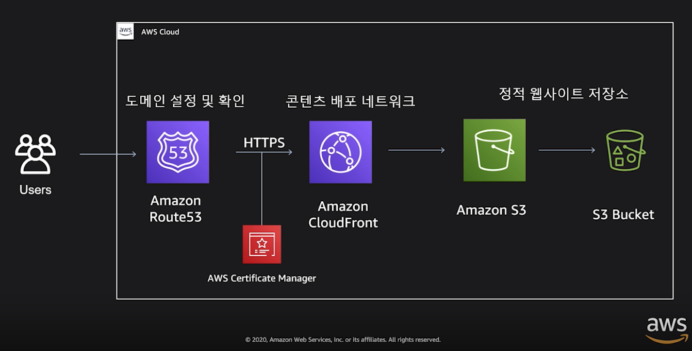

# AWS 클라우드 기반 나의 첫 웹 애플리케이션 만들기

> 발표자: 윤석찬, AWS 수석 테크 에반젤리스트

 

 

### AWS를 통해 손쉽게 애플리케이션을 배포하기 위한 3가지 방법

1. 정적 웹 사이트 및 프론트엔드 앱
2. 가상 서버 기반 백엔드 앱
3. 완전 관리형 서버 및 DB 기반 앱

 

 

## 1. 정적 웹 사이트 및 프론트엔드 앱

 

### 1-1. AWS 기반 정적 웹 사이트 배포 방식

 

### 1-2. AWS Amplify Console

> 몇 번의 클릭으로 정적 웹 사이트 및 프론트엔드 앱 배포 가능

 

#### 정적 웹 사이트 배포 도구

: 다양한 Static web site or Serverless web app에 적합

- **Single Page Apps**
  - `React`, `Angular`, `Vue`, `Ember` 로 만들어진 단일 페이지 웹 기반 모바일 앱 지원 가능
- **블로그 및 웹 사이트**
  - `Gatsby`, `Hugo`, `Jekyll` 과 같은 정적 웹 사이트 생성기를 통해 블로그 기반 정보 사이트 배포 가능
- **풀스택 서버리스 앱**
  - `GraphQL` 또는 `REST API` 를 사용하여 동적 기능을 추가함으로써 풀스택 서버리스 앱 배포 가능

 

#### 지속적인 통합 및 배포 (CI/CD) 가능

: 복잡한 CI/CD 도구 사용 없이도 DevOps 기반 배포 가능

- **앱 배포 과정 단순화**
  - 개발 과정에서 `git push` 같은 소스 변경 사항을 지속적으로 통합하여 배포 과정을 단순화
- **즉석 세부 (Atomic) 배포**
  - 코드 업데이트한 후 바로 배포 진행, 실패하더라도 바로 rollback 하여 서비스에 영향 없음

- **기능 기반 브랜치 가능**
  - 정식 서비스에 영향을 미치지 않고, 신규 기능을 branch에 연결하여 배포 수행 가능

 
