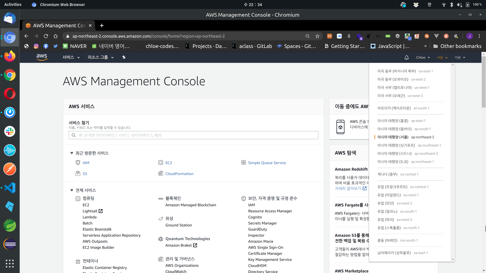
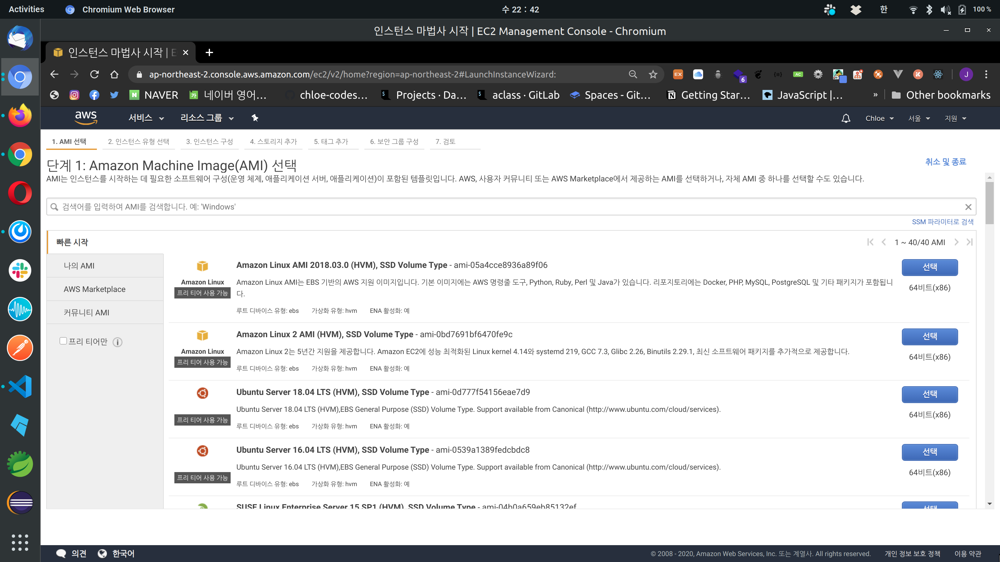
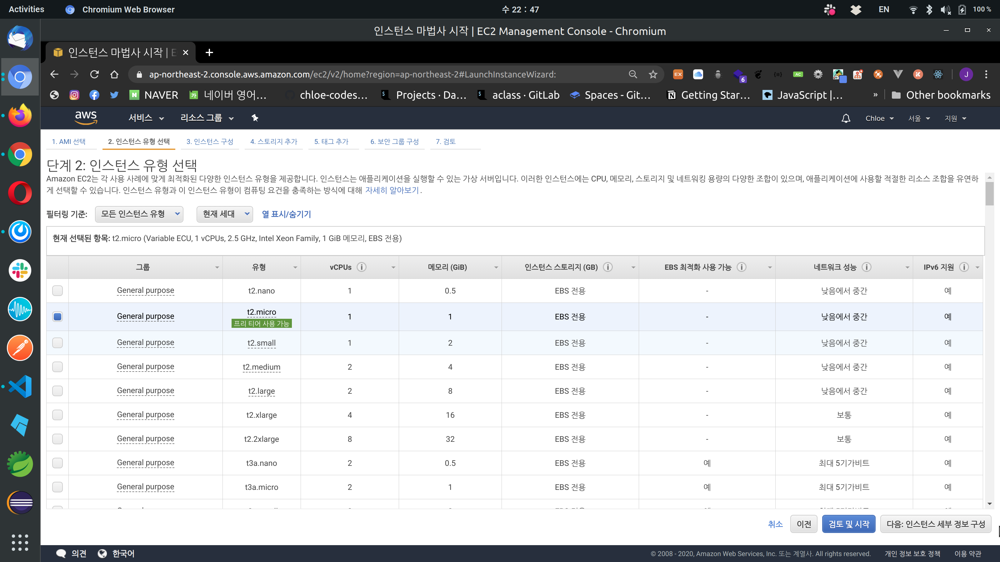
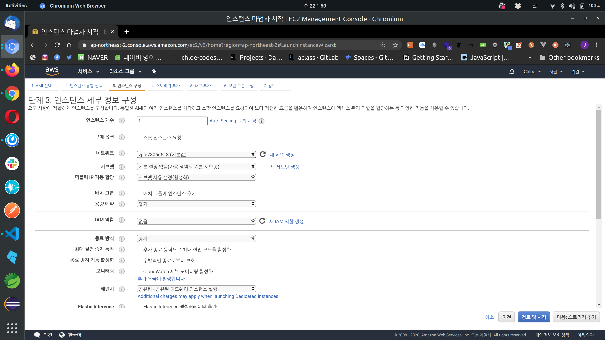
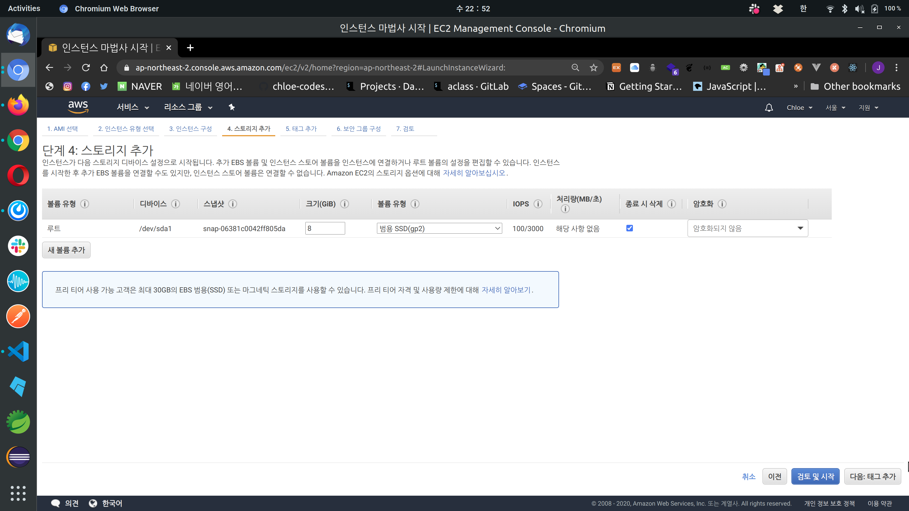
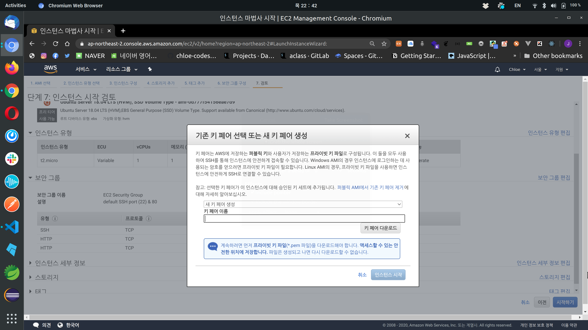
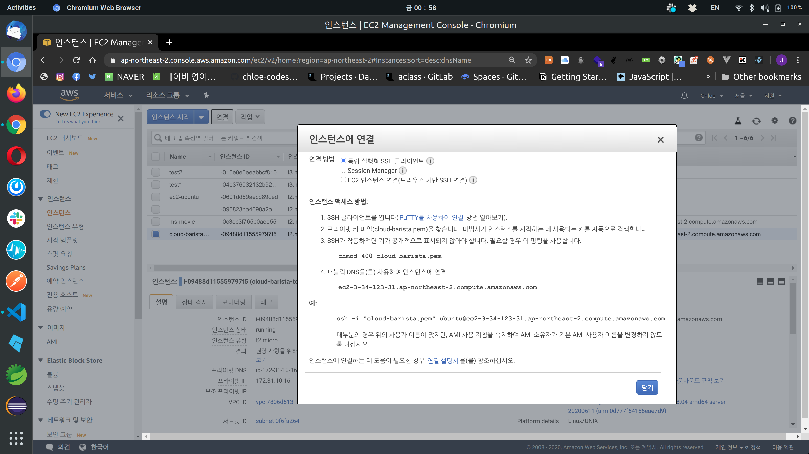
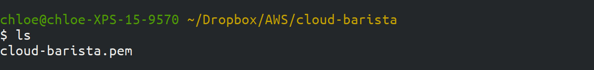
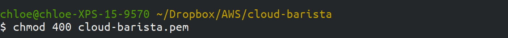
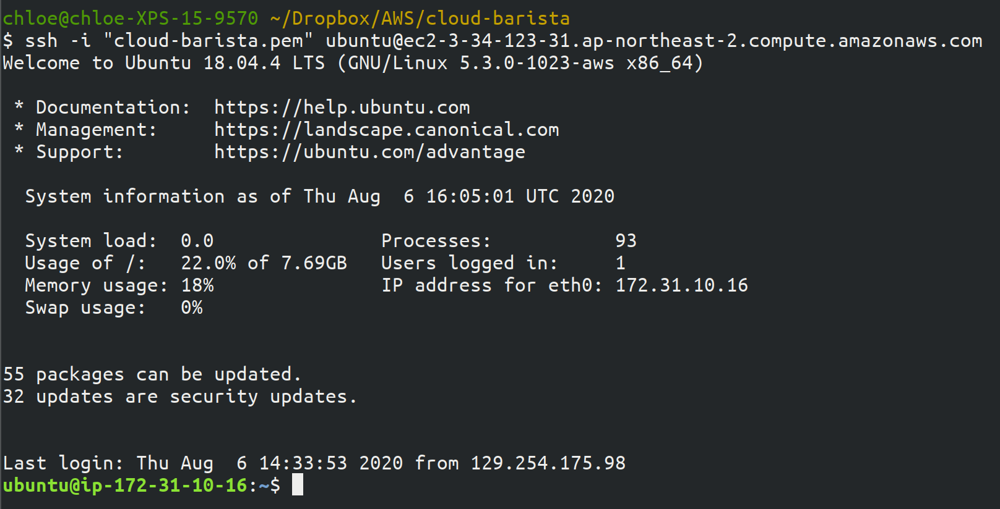

# Amazon EC2-Creating an AWS EC2 Instance

> Back to basics!
>
> Cloud 개념 & EC2 Instance 만드는 법 정리해용

 

## 클라우드 개념 잡기

 

### Cloud Computing 이란?

- 벤더마다 세부적인 내용은 다를 수 있지만,
  - **일관성**이 있으며
  - **규모**가 크고
  - **공개적**으로 접근할 수 있는 리소스의 모음
- `리소스`들은  계산, 저장, 네트워킹 기능을 수행한다
  - 실제 소모되는 리소스를 기반으로 비용을 지불하며,
  - 장기간 or 단기간 사용할 수 있다

 

 

### Cloud Computing 의 개념

 

#### Cloud Service Provider (CSP)

- Computing 자원 (VM, Container)를 서비스로 제공하는 사업자
  - ex) Amazon (Amazon Web Service), Microsoft (Azure), Google (Google Cloud Platform)

 

#### Virtual Machine (VM)

- 클라우드 상에 존재하는 컴퓨터

 

#### VM Image

- 가상머신의 상태 정보를 담고 있는 파일

 

#### Security Group

- 방화벽과 같이 네트워크 접근을 통제 / 제어하는 서비스

 

#### Secure Shell (SSH)

- 네트워크 상의 다른 컴퓨터에 로그인하거나 원격 시스템에서 명령을 실행하는 응용 프로그램 or protocol

 

#### Key Pair

- RSA 알고리즘 기반의 공개키와 개인키로 이뤄진 키의 쌍으로 VM Instance에 접근하는데 사용

 

 

### Amazon EC2 Basics

- Amazon EC2 (Elasitc Compute Cloud) 인프라를 사용하면 **AMI(Amazon Machine Instance)** 를 실행하는 **서버 인스턴스**를 가동할 수 있다
- 사용할 수 있는 **인스턴스 유형**의 범위는 `메모리`, `처리 능력`, `로컬 디스크 스토리지`에 따라 매우 넓다
- 각 인스턴스는 **방화벽**에 의해 보호되며, 박화벽은 모든 내/외부의 연결을 차단한다
  - 인스턴스를 가동할 때 여러 개의 **보안 그룹**을 인스턴스에 구성 할 수 있고, 보안그룹을 이용해 인스턴스에 대한 접근을 통제할 수 있다!
- 인스턴스가 가동될 때 EC2 인프라는 인스턴스에 **IP 주소**와 **DNS 엔트리** 를 제공한다!
  - 단, IP 주소와 DNS 엔트리는 **일시적**이다!
    - 인스턴스가 **Shutdown** 이 발생할 때 , 인스턴스에 할당된 IP 주소와 DNS엔트리는 **분리**된다
  - 그럴 때, shutdown 되어도 계속 유지되거나, 많은 머신들 중 하나에 매핑될 수 있는 IP 주소가 필요하면 **Elastic IP 주소**를 사용할 수 있다!
    - 이 주소는 특정 EC2 인스턴스가 아닌 AWS 계정에 의해 효과적으로 소유된다
      - 그래서 일단 한 번 할당되면 그 주소를 사용자가 포기하기 전까지 사용자의 것이 된다!

 

 

## EC2 Instance 생성하기

 

### 1. Region 설정

- 한국에서 서버 구동 시 `아시아 태평양 (서울)`이 가장 빠르고 latency가 짧으므로 **ap-northest-2**를 선택하자

 

### 2. AMI (Amazon Machine Image) 선택

- AMI로 선택할 수 있는 Image는 정말 다양하다
- 그 중 자신이 배포하려는 앱의 서버가 따로 있거나 선호하는 distro가 있으면 해당 Image를 선택하자
  - 나는 Ubuntu를 사랑하므로 `Ubuntu Server 18.04 LTS (HVM)` 를 선택했다

 

### 3. Instance 유형 선택

- 필요한 성능에 맞는 Instance 유형을 선택한다
- 당연하지만 고성능일수록 가격이 올라간다
- 실습용이므로 **프리티어**가 사용할 수 있는 `t2.micro`를 선택했다

 

### 4. Instance 세부 정보 구성

- EC2 Instance를 만들 때 VPC는 자동으로 생성된다
  - [VPC에 대한 정리](https://chloe-codes1.gitbook.io/til/aws/aws_tips/amazon_vpc_basics)

 

### 5. Storage 추가

- default setting을 그대로 사용했다

 

### 6. Tag 추가

- #### Tag 란?

  - AWS 리소스를 관리를 편하게 하기 위해 사용자가 지정하는 `key` 와 `value` 쌍을 의미한다
  - 언제든지 리소스에서 제거할 수 있다
  - **IAM**에서 tag를 제어 (편집, 생성 삭제) 할 수 있는 사용자를 설정할 수 있따

 

### 7. 보안 그룹 구성

- #### 보안그룹이란?
  
  - EC2의 **Inbound**와 **outbound** traffic을 세부적으로 제어할 수 있게 해준다
  
- 보안 그룹 이름과 설명을 입력한다
  
  - Default SSH port (22) 와 80번 포트를 허용하는 보안 그룹이라는 설명을 추가했다

 

### 8. 검토

 

### 9. Key pair 생성

- 키 페어는 **원격**으로 instance에 접속하기 위해 필요하다
- `새 키 페어 생성`을 누른 후 키 페어 이름을 작성하고, `키 페어 다운로드`를 클릭한다
- **키 페어는 한 번 발급 받은 후, 다시 받을 방법이 없으므로 반드시 잘 보관해야 한다는 것을 기억하자!**

 

### 10. 인스턴스 생성 완료 후 연결하기

- AWS Console에서 `연결`을 클릭하면 위와 같은 화면을 볼 수 있는데, 그대로 따라하면 된다!

#### 10-1. PEM key가 보관된 곳으로 이동하기

#### 10-2. User read permission 부여하기

- `chmod` 명령어는 파일 또는 디렉토리에 대한 접근 권한(파일 모드)을 변경할 때 사용한다

- `chmod 400`은 User에게 읽기 권한만을 주고, 나머지 모두에게는 읽기 권한을 뺐는 것이다

- ##### 각 자릿수의 의미

  - 첫 번째 자리는 **User**를 의미
  - 두 번째 자리는  **Group** 을 의미
  - 세 번째 자리는 **Other**를 의미

- ##### 숫자의 의미

  - **4** 는 **Read** 권한을 의미
  - **2** 는 **Write** 권한을 의미
  - **1**은 **Execute** 권한을 의미

#### 10-3. SSH로 접속하기

- #### SSH란?

  SSH란 **Secure Shell Protocol**, 즉 Network Protocol 중 하나로 컴퓨터와 컴퓨터가 인터넷과 같은 Public Network를 통해 서로 통신을 할 때 보안적으로 **안전**하게 통신을 하기 위해 사용하는 프로토콜

- `SSH -i [사용자 계정] [서버주소]` 형식으로 사용한다

 

 

*EC2 생성 및 접속 끝!*

 

 

 

`+`

## EC2 설정 관련 Tips

 

### 1. Burstable instances

- **Amazon burstable instances** 란 CPU의 순간적인 load에서 필요한 만큼 성능을 높이는 `burst` 기능을 제공한다
- 지원되는 instance family는 **T2** 와 **T3**, **T4** 이다
  - T3, T4 는 default가 Unlimited 이고,
  - T2 는 default가 Standard 이다
