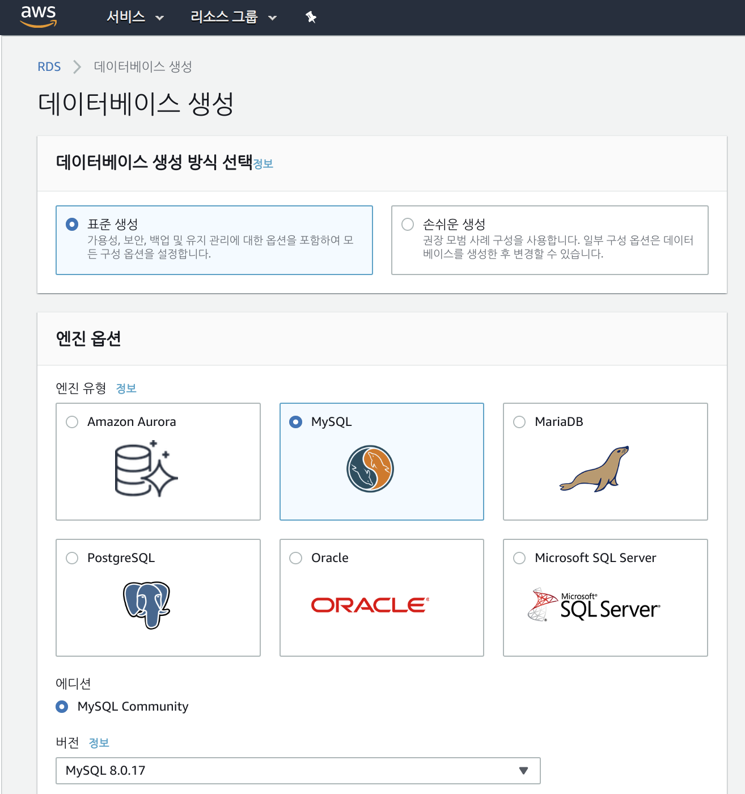
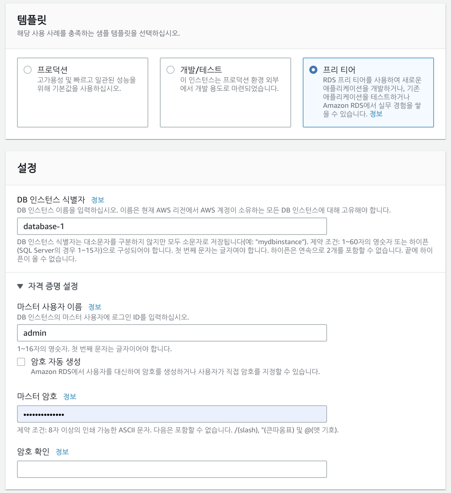
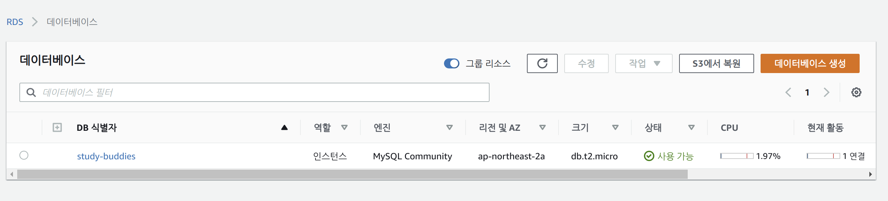

# Amazon RDS for MySQL

> 얼마 남지 않은 프리 티어를 즐기며 RDS를 사용해요

<br>

<br>

## RDS MySQL Database 생성 하기





<br>

- 주의 사항!
  - `마스터 사용자 이름` 과 `마스터 암호` 기억해두기
    - Database 생성 중에는 입력한 암호를 잠시 확인 할 수 있지만, 곧 사라지므로 잘 기록해두기!  

<br>

데이터베이스 생성까지 5분 정도 소요된다!

<br>

<br>

### 생성 완료



- DB 식별자 클릭하면 상세 정보를 볼 수 있다!
  - 상세 정보에서 `endpoint` 기억해두기
    - Local 에서 RDS - MySQL 접속 할 때 필요하다!

<br>

<br>


## MySQL CLI로 접속하기

<br>

```bash
$ mysql -u <MASTERUSER> --host 엔드포인트 -P <DBPORT> -p
```
