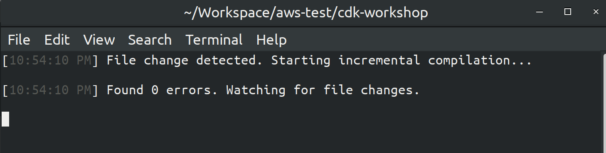

# AWS CDK Workshop

> AWS CDK 맛보기!!

<br>

<br>

## 0. Install AWS CDK

<br>

```bash
$ npm i -g aws-cdk
```

<br>

<br>

## 1. CDK INIT

<br>

> CDK INIT

```bash
$ cdk init sample-app --language typescript
```

- **Typescript**를 사용하는 CDK 프로젝트 생성하기

<br>

> 실행 결과

```bash
chloe@chloe-XPS-15-9570 ~/Workspace/aws-test/cdk-workshop
$ cdk init sample-app --language typescript
Applying project template sample-app for typescript
# Welcome to your CDK TypeScript project!

You should explore the contents of this project. It demonstrates a CDK app with an instance of a stack (`CdkWorkshopStack`)
which contains an Amazon SQS queue that is subscribed to an Amazon SNS topic.

The `cdk.json` file tells the CDK Toolkit how to execute your app.

## Useful commands

 * `npm run build`   compile typescript to js
 * `npm run watch`   watch for changes and compile
 * `npm run test`    perform the jest unit tests
 * `cdk deploy`      deploy this stack to your default AWS account/region
 * `cdk diff`        compare deployed stack with current state
 * `cdk synth`       emits the synthesized CloudFormation template

Initializing a new git repository...
Executing npm install...
npm WARN deprecated request@2.88.2: request has been deprecated, see https://github.com/request/request/issues/3142
npm WARN deprecated request-promise-native@1.0.9: request-promise-native has been deprecated because it extends the now deprecated request package, see https://github.com/request/request/issues/3142
npm WARN deprecated har-validator@5.1.5: this library is no longer supported
npm notice created a lockfile as package-lock.json. You should commit this file.
npm WARN optional SKIPPING OPTIONAL DEPENDENCY: fsevents@^2.1.2 (node_modules/jest-haste-map/node_modules/fsevents):
npm WARN notsup SKIPPING OPTIONAL DEPENDENCY: Unsupported platform for fsevents@2.1.3: wanted {"os":"darwin","arch":"any"} (current: {"os":"linux","arch":"x64"})
npm WARN cdk-workshop@0.1.0 No repository field.
npm WARN cdk-workshop@0.1.0 No license field.

✅ All done!
```

- 참고하면 좋은 명령어들이 출력됨

<br>

### Useful commands

- `npm run build`   compile typescript to js
 * `npm run watch`   watch for changes and compile
 * `npm run test`    perform the jest unit tests
 * `cdk deploy`      deploy this stack to your default AWS account/region
 * `cdk diff`        compare deployed stack with current state
 * `cdk synth`       emits the synthesized CloudFormation template

<br>

<br>

## 2. npm run watch

<br>

### TypesScript 코드 컴파일링

- TypeScript 코드는 JavaScript로 compile 되어야 하기 때문에 **소스 코드 변경 분**을 확인하려면 계속해서 `.js` 파일로 complile을 해주어야 한다
  - 프로젝트에는 `watch` 라는 이름의 **npm script**가 이미 설정되어 있어서, 이를 실행하면 매번 수동으로 complie 해줄 필요 없이 **자동**으로 변경분을 `.js` 파일로 complie 해준다!

<br>

<br>

###  코드 변경분 watch 하기

<br>

>프로젝트 Directory 로 이동

``` bash
chloe@chloe-XPS-15-9570 ~
$ cd Workspace/aws-test/cdk-workshop/
```

<br>

> `watch` script 수행

```bash
$ npm run watch
```

- 그러면 터미널 창의 내용이 지워지고 다음과 같은 결과가 출력된다

  

- 이 script는 TypeScript Compiler (`tsc`) 를 **watch** 모드로 시작해서, 프로젝트 디렉토리를 monitoring 하여 `.ts` 파일의 **변경분**을 `.js` 파일로 자동 complie 해준다!
  - 넘나 신기

<br>

<br>

