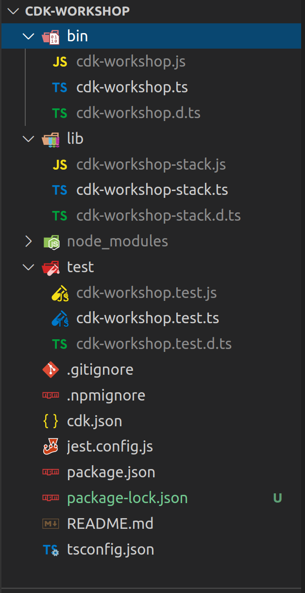
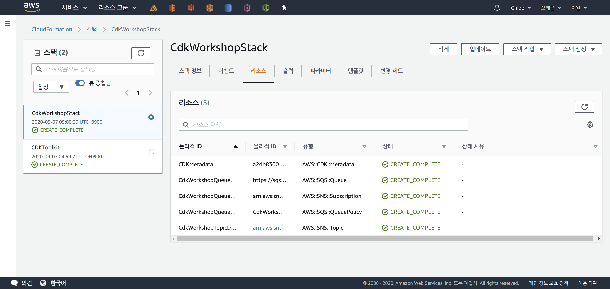

# AWS CDK Workshop

> AWS CDK 맛보기!!

<br>

<br>

## Before getting started

> Workshop을 시작하기 전에 AWS CDK가 뭔지 간단히 알아봅시당

<br>

### AWS CDK란?

- AWS CDK (Cloud Development Kit)는 현대적 프로그래밍 언어를 사용하여 Cloud Infra를 **code로 정의**하고, `AWS CloudFormation` 을 통해 배포하는 opensource software 개발 프레임워크

<br>

### AWS CDK CLI로 무엇을 할 수 있을까?

: AWS CDK CLI를 사용하여 CDK application과 상호 작용할 수 있다

- **CDK CLI**를 사용하면
  - CDK 앱에 정의된 stack을 나열하고,
  - Stack을 `CloudFormation` 템플릿에 합성하고,
  - 실행중인 stack instance와 CDK code에 정의된 stack 간의 CDK code 에 정의된 stack 간의 차이점을 확인하고,
  - 원하는 Public AWS Region 에 stack을 배포 할 수 있다

<br>

### AWS CDK는 어떻게 작동할까?

- AWS CDK 프레임워크를 사용하여 AWS CDK 프로젝트를 작성할 수 있으며, 이 프로젝트가 실행되어 `CloudFormation` 템플릿을 생성하게 된다.
- AWS CDK 프로젝트는 AWS CDK CLI 나 CD system에서 실행될 수 있다

<br>

<br>

## 0. Install AWS CDK

<br>

```bash
npm i -g aws-cdk
```

<br>

<br>

## 1. CDK INIT

<br>

> CDK INIT

```bash
cdk init sample-app --language typescript
```

- **Typescript**를 사용하는 CDK 프로젝트 생성하기

<br>

> 실행 결과

```bash
chloe@chloe-XPS-15-9570 ~/Workspace/aws-test/cdk-workshop
$ cdk init sample-app --language typescript
Applying project template sample-app for typescript
# Welcome to your CDK TypeScript project!

You should explore the contents of this project. It demonstrates a CDK app with an instance of a stack (`CdkWorkshopStack`)
which contains an Amazon SQS queue that is subscribed to an Amazon SNS topic.

The `cdk.json` file tells the CDK Toolkit how to execute your app.

## Useful commands

 * `npm run build`   compile typescript to js
 * `npm run watch`   watch for changes and compile
 * `npm run test`    perform the jest unit tests
 * `cdk deploy`      deploy this stack to your default AWS account/region
 * `cdk diff`        compare deployed stack with current state
 * `cdk synth`       emits the synthesized CloudFormation template

Initializing a new git repository...
Executing npm install...
npm WARN deprecated request@2.88.2: request has been deprecated, see https://github.com/request/request/issues/3142
npm WARN deprecated request-promise-native@1.0.9: request-promise-native has been deprecated because it extends the now deprecated request package, see https://github.com/request/request/issues/3142
npm WARN deprecated har-validator@5.1.5: this library is no longer supported
npm notice created a lockfile as package-lock.json. You should commit this file.
npm WARN optional SKIPPING OPTIONAL DEPENDENCY: fsevents@^2.1.2 (node_modules/jest-haste-map/node_modules/fsevents):
npm WARN notsup SKIPPING OPTIONAL DEPENDENCY: Unsupported platform for fsevents@2.1.3: wanted {"os":"darwin","arch":"any"} (current: {"os":"linux","arch":"x64"})
npm WARN cdk-workshop@0.1.0 No repository field.
npm WARN cdk-workshop@0.1.0 No license field.

✅ All done!
```

- 참고하면 좋은 명령어들이 출력됨

<br>

### Useful commands

- `npm run build`   compile typescript to js

- `npm run watch`   watch for changes and compile
- `npm run test`    perform the jest unit tests
- `cdk deploy`      deploy this stack to your default AWS account/region
- `cdk diff`        compare deployed stack with current state
- `cdk synth`       emits the synthesized CloudFormation template

<br>

<br>

## 2. npm run watch

<br>

### TypesScript 코드 컴파일링

- TypeScript 코드는 JavaScript로 compile 되어야 하기 때문에 **소스 코드 변경 분**을 확인하려면 계속해서 `.js` 파일로 complile을 해주어야 한다
  - 프로젝트에는 `watch` 라는 이름의 **npm script**가 이미 설정되어 있어서, 이를 실행하면 매번 수동으로 complie 해줄 필요 없이 **자동**으로 변경분을 `.js` 파일로 complie 해준다!

<br>

<br>

### 코드 변경분 watch 하기

<br>

>프로젝트 Directory 로 이동

``` bash
chloe@chloe-XPS-15-9570 ~
$ cd Workspace/aws-test/cdk-workshop/
```

<br>

> `watch` script 수행

```bash
npm run watch
```

- 그러면 터미널 창의 내용이 지워지고 다음과 같은 결과가 출력된다

  

- 이 script는 TypeScript Compiler (`tsc`) 를 **watch** 모드로 시작해서, 프로젝트 디렉토리를 monitoring 하여 `.ts` 파일의 **변경분**을 `.js` 파일로 자동 complie 해준다!
  
  - 넘나 신기

<br>

<br>

## 3. 프로젝트 구조

 <br>

### Project Directory 탐색



- `lib/cdk-workshop-stack.ts`
  - CDK application의 **main stack**이 저장되는 곳
- `bin/cdk-workshop.ts`
  - CDK application의 **entry point**
  - `lib/cdk-workshop-stack.ts` 에 정의된 stack을 load 한다
- `cdk.json`
  - toolkit이 어떻게 app을 실행해야 하는지 알려주는 파일
    - 이 프로젝트의 경우 "npx ts-node bin/cdk-workshop.ts" 가 들어간다!

<br>

<br>

### Entry Point

> Entry point인 `bin/cdk-workshop.ts` 파일 살펴보기

```typescript
#!/usr/bin/env node
import * as cdk from '@aws-cdk/core';
import { CdkWorkshopStack } from '../lib/cdk-workshop-stack';

const app = new cdk.App();
new CdkWorkshopStack(app, 'CdkWorkshopStack');
```

- 이 코드는 `CdkWorkshopStack` 을 **load**하고 **initiate** 한다
  - 어떤 stack을 load할 것인지만 정의되고 나면 더 이상 볼 일이 없는 파일

<br>

<br>

### Main Stack

> 중요한 부분이 정의되는 `lib/cdk-workshop-stack.ts` 파일 살펴보기

```typescript
import * as cdk from '@aws-cdk/core';
import * as sns from '@aws-cdk/aws-sns';
import * as sqs from '@aws-cdk/aws-sqs';
import * as subs from '@aws-cdk/aws-sns-subscriptions';

export class CdkWorkshopStack extends cdk.Stack {
  constructor(scope: cdk.App, id: string, props?: cdk.StackProps) {
    super(scope, id, props);

    const queue = new sqs.Queue(this, 'CdkWorkshopQueue', {
      visibilityTimeout: cdk.Duration.seconds(300)
    });

    const topic = new sns.Topic(this, 'CdkWorkshopTopic');

    topic.addSubscription(new subs.SqsSubscription(queue));
  }
}
```

- Application이 sample CDK stack (`CdkWorkshopStack`) 으로 이루어진 것 확인 가능
- 이 stack에는 아래의 세 가지 서비스 생성이 포함된다
  1. **SQS Queue**
     - `new sqs.Queue`
  2. **SNS Topoic**
     - `new sns.Topic`
  3. SNS Topic에서 발생하는 모든 **message**를 **수신**하도록 Queue 설정
     - `topic.addSubscription`

<br>

<br>

## 4. CDK Synth

<br>

### CDK 앱에서 `CloudFormation` Template 산출하기

- AWS CDK 앱은 **code**를 이용해서 **Infra**를 효과적으로 **정의**하도록 도와주는 도구이다
- CDK 앱이 실제로 실행될 때는 `AWS CloudFormation` template을 stack마다 생성하여 실제 **배포**를 한다
- CDK 앱에서 template을 산출하기 위해서는 `cdk synth` 명령어를 사용할 수 있다
  - **CDK CLI**는 `cdk.json` 파일이 있는 directory에서만 실행될 수 있는 점 유의하기!

<br>

#### Sample app에서 추출된 template 살펴보기

```bash
chloe@chloe-XPS-15-9570 ~/Workspace/aws-test/cdk-workshop
$ cdk synth
**************************************************
*** Newer version of CDK is available [1.62.0] ***
*** Upgrade recommended                        ***
**************************************************
Resources:
  CdkWorkshopQueue50D9D426:
    Type: AWS::SQS::Queue
    Properties:
      VisibilityTimeout: 300
    Metadata:
      aws:cdk:path: CdkWorkshopStack/CdkWorkshopQueue/Resource
  CdkWorkshopQueuePolicyAF2494A5:
    Type: AWS::SQS::QueuePolicy
    Properties:
      PolicyDocument:
        Statement:
          - Action: sqs:SendMessage
            Condition:
              ArnEquals:
                aws:SourceArn:
                  Ref: CdkWorkshopTopicD368A42F
            Effect: Allow
            Principal:
              Service: sns.amazonaws.com
            Resource:
              Fn::GetAtt:
                - CdkWorkshopQueue50D9D426
                - Arn
        Version: "2012-10-17"
      Queues:
        - Ref: CdkWorkshopQueue50D9D426
    Metadata:
      aws:cdk:path: CdkWorkshopStack/CdkWorkshopQueue/Policy/Resource
  CdkWorkshopQueueCdkWorkshopStackCdkWorkshopTopicD7BE96438B5AD106:
    Type: AWS::SNS::Subscription
    Properties:
      Protocol: sqs
      TopicArn:
        Ref: CdkWorkshopTopicD368A42F
      Endpoint:
        Fn::GetAtt:
          - CdkWorkshopQueue50D9D426
          - Arn
    Metadata:
      aws:cdk:path: CdkWorkshopStack/CdkWorkshopQueue/CdkWorkshopStackCdkWorkshopTopicD7BE9643/Resource
  CdkWorkshopTopicD368A42F:
    Type: AWS::SNS::Topic
    Metadata:
      aws:cdk:path: CdkWorkshopStack/CdkWorkshopTopic/Resource
  CDKMetadata:
    Type: AWS::CDK::Metadata
    Properties:
      Modules: aws-cdk=1.61.1,@aws-cdk/aws-cloudwatch=1.61.1,@aws-cdk/aws-iam=1.61.1,@aws-cdk/aws-kms=1.61.1,@aws-cdk/aws-sns=1.61.1,@aws-cdk/aws-sns-subscriptions=1.61.1,@aws-cdk/aws-sqs=1.61.1,@aws-cdk/cloud-assembly-schema=1.61.1,@aws-cdk/core=1.61.1,@aws-cdk/cx-api=1.61.1,@aws-cdk/region-info=1.61.1,jsii-runtime=node.js/v12.17.0
    Condition: CDKMetadataAvailable
Conditions:
  CDKMetadataAvailable:
    Fn::Or:
      - Fn::Or:
          - Fn::Equals:
              - Ref: AWS::Region
              - ap-east-1
          - Fn::Equals:
              - Ref: AWS::Region
              - ap-northeast-1
          - Fn::Equals:
              - Ref: AWS::Region
              - ap-northeast-2
          - Fn::Equals:
              - Ref: AWS::Region
              - ap-south-1
          - Fn::Equals:
              - Ref: AWS::Region
              - ap-southeast-1
          - Fn::Equals:
              - Ref: AWS::Region
              - ap-southeast-2
          - Fn::Equals:
              - Ref: AWS::Region
              - ca-central-1
          - Fn::Equals:
              - Ref: AWS::Region
              - cn-north-1
          - Fn::Equals:
              - Ref: AWS::Region
              - cn-northwest-1
          - Fn::Equals:
              - Ref: AWS::Region
              - eu-central-1
      - Fn::Or:
          - Fn::Equals:
              - Ref: AWS::Region
              - eu-north-1
          - Fn::Equals:
              - Ref: AWS::Region
              - eu-west-1
          - Fn::Equals:
              - Ref: AWS::Region
              - eu-west-2
          - Fn::Equals:
              - Ref: AWS::Region
              - eu-west-3
          - Fn::Equals:
              - Ref: AWS::Region
              - me-south-1
          - Fn::Equals:
              - Ref: AWS::Region
              - sa-east-1
          - Fn::Equals:
              - Ref: AWS::Region
              - us-east-1
          - Fn::Equals:
              - Ref: AWS::Region
              - us-east-2
          - Fn::Equals:
              - Ref: AWS::Region
              - us-west-1
          - Fn::Equals:
              - Ref: AWS::Region
              - us-west-2
```

- `cdk synth` 명령어를 `cdk.json` 파일이 있는 directory에서 실행하면 위와 같이 **CloudFormation template**이 출력된다

- 이 template은 아래의 4가지 자원을 생성한다

1. #### AWS::SQS::Queue

     - SQS 큐

2. #### AWS::SNS::Topic

     - SNS 토픽

3. #### AWS::SNS::Subscription

     - 큐와 토픽 사이의 subscription 정의

4. #### AWS::SQS::QueuePolicy

     - 토픽에서 큐로 `메시지`를 보낼 수 있는 **IAM** 정책

- **AWS::CDK::Metadata** 는 `CDK toolkit` 에 의해 모든 stack에 자동으로 생성되는 자원이다
  
  - CDK 팀이 보안 issue 파악 및 분석을 하는데에 사용된다고 함!

<br>

<br>

## 5. CDK Deploy

<br>

### 환경 Bootstrap

- AWS CDK 앱을 환경 (계졍/region)에 배포하기 위해서는 먼저 `bootstrap stack` 을 설치해야 한다
  - **bootstrap stack**에는 toolkit의 운영을 위해 필요한 자원들이 포함되어 있다
    - ex) `CFN` teamplate을 보관하고, 배포 process 동안 생성되는 asset들을 저장하는 **S3 bucket**
- `cdk bootstrap` 명령어를 이용해서 하나의 환경에 대한 bootstrap stack을 설치할 수 있다

```bash
chloe@chloe-XPS-15-9570 ~/Workspace/aws-test/cdk-workshop
$ cdk bootstrap
 ⏳  Bootstrapping environment aws://213888382832/us-west-2...
CDKToolkit: creating CloudFormation changeset...
[██████████████████████████████████████████████████████████] (3/3)


 ✅  Environment aws://213888382832/us-west-2 bootstrapped.
**************************************************
*** Newer version of CDK is available [1.62.0] ***
*** Upgrade recommended                        ***
**************************************************
```

- 만약 여기에서 **Access Denied** error가 발생하면,
  1. AWS CLI 가 제대로 설정되지 않았거나
  2. 사용중인 **AWS profile** 이 `cloudformation:CreateChangeSet` 작업을 수행할 권한이 없는 것
- 위의 명령어가 성공정으로 수행되고 나면 CDK 앱을 배포할 수 있다!

<br>

### 배포하기

- `cdk deploy` 명령어를 이용해서 CDK 앱을 배포한다

```bash
chloe@chloe-XPS-15-9570 ~/Workspace/aws-test/cdk-workshop
$ cdk deploy
This deployment will make potentially sensitive changes according to your current security approval level (--require-approval broadening).
Please confirm you intend to make the following modifications:

IAM Statement Changes
┌───┬─────────────────────────┬────────┬─────────────────┬─────────────────────────┬─────────────────────────┐
│   │ Resource                │ Effect │ Action          │ Principal               │ Condition               │
├───┼─────────────────────────┼────────┼─────────────────┼─────────────────────────┼─────────────────────────┤
│ + │ ${CdkWorkshopQueue.Arn} │ Allow  │ sqs:SendMessage │ Service:sns.amazonaws.c │ "ArnEquals": {          │
│   │                         │        │                 │ om                      │   "aws:SourceArn": "${C │
│   │                         │        │                 │                         │ dkWorkshopTopic}"       │
│   │                         │        │                 │                         │ }                       │
└───┴─────────────────────────┴────────┴─────────────────┴─────────────────────────┴─────────────────────────┘
(NOTE: There may be security-related changes not in this list. See https://github.com/aws/aws-cdk/issues/1299)

Do you wish to deploy these changes (y/n)?
```

- 위와 같은 경고는 배포하려는 앱에 **보안 점검**이 필요한 항목이 동반되는 경우 출력된다
  - Topic에서 Queue로 message를 보내줘야 하므로 **y**를 입력하여 stack을 배포하고 자원을 생성하자!

```bash
CdkWorkshopStack: deploying...
CdkWorkshopStack: creating CloudFormation changeset...
[██████████████████████████████████████████████████████████] (6/6)


 ✅  CdkWorkshopStack

Stack ARN:
arn:aws:cloudformation:us-west-2:213888382832:stack/CdkWorkshopStack/fa564140-f078-11ea-b665-0a050e07f862
```

- 실행 결과 설명
  - `us-west-2` 는 app을 생성한 **region** 이고,
  - `213888382832` 는 **account ID**이고,
  - `fa564140-f078-11ea-b665-0a050e07f862` 는 **stack ID** 이다

<br>

### CloudFormation Console

- CDK 앱은 AWS `CloudFormation` 을 통해 배포된다
- CDK stack은 `CloudFormation` stack과 1:1 로 매핑된다
  - 즉, Stack 을 관리하기 위해 CloudFormation을 이용할 수 있다!

> CloudFormation console


- `CdkWorkshopStack` 을 선택하고 **리소스** 탭을 클릭하면, 생성한 자원의 물리적 ID를 확인할 수 있다

> 물리적 ID 확인하기


