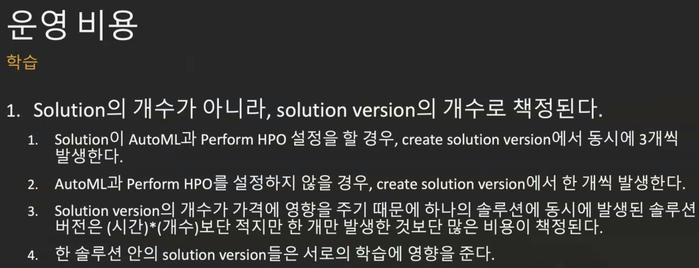
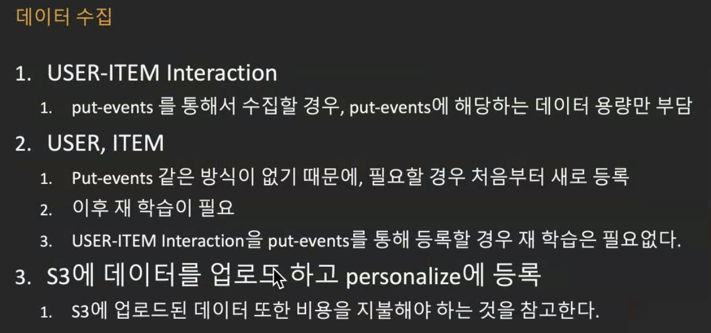
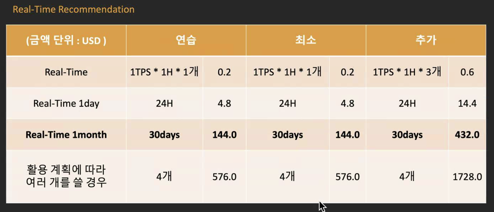
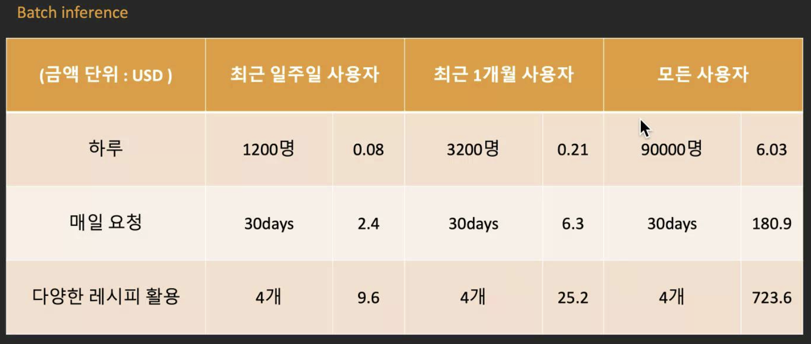

# AWS Data Science Meetup - 3/5

 

> Coronavirus 로 인해 Online meetup 으로 진행

 

 

## Amazon Personalize를 통한 개인화/추천 서비스 개발 노하우

> Speaker: 배현우님
>
> "*Amazon personalize를 연구하면서 겪은 경험을 공유합니다.*"

 

#### Table of Contents

- 공식 문서가 설명해주지 않은 것
- 데이터 전문가가 아니라면 궁금할 수 있는 것들
- personalize 활용 시 발생하는 오류
- AWS에 직접 문의하고 받은 답변

 

 

### Amazon Personlize 란?

> 개발자가 애플리케이션을 사용하는 고객에게 개별화된 추천을 손쉽게 생성할 수 있도록 하는 기계 학습 서비스

- Amazon.com에서 몇 년 동안 사용한 완벽한 기계 학습 기술을 사용하기 때문에 기계 학습 경험이 없는 개발자도 복잡한 `맞춤화 기능`을 애플리케이션에 쉽게 빌드할 수 있음
- Amazon Personalize를 사용하여 클릭, 페이지 보기, 가입, 구매 등과 같은 애플리케이션의 활동 스트림은 물론 기사, 제품, 비디오 또는 음악과 같이 추천하고자 하는 항목의 인벤토리를 제공할 수 있음
- 나이와 같은 사용자의 추가 **인구학적 정보**와 **지리적 위치**를 제공할 수 있음
- Amazon Personalize에서 데이터를 **처리** 및 **검토**하고, 유의미한 것을 **식별**하고, 올바른 알고리즘을 **선택**하며, 데이터에 대해 맞춰진 `맞춤화 모델`을 **교육** 및 **최적화**함
- 분석한 모든 데이터는 비공개로 안전하게 유지되며, 맞춤형 추천에 대해서만 사용됨
- 간단한 API 호출을 통해 `맞춤형 추천`을 시작할 수 있음
- **사용한 만큼만 비용을 지불**하면 되고, 최소 요금 및 사전 약정은 없음

 

*Amazon Personalize는 상시로 사용할 수 있는 Amazon.com 기계 학습 맞춤화 팀을 보유하는 것과 같다!*

 

 

### Newly Released

 

> ### Amazon Personalize, 추천 관련성 개선을 위해 10배 더 많은 항목 속성 사용 가능

 

#### Overview

[Amazon Personalize](http://docs.aws.amazon.com/personalize)는 기계 학습 경험이 없는 사용자도 Amazon Personalize에서 생성할 수 있는 `사용자 지정 기계 학습 모델`을 사용하여 웹사이트, 앱, 광고, 이메일 등을 맞춤 설정할 수 있게 해 주는 `기계 학습 서비스`입니다. AWS는 Amazon Personalize가 이제 **10배 더 많은 항목 속성을 지원**한다는 소식을 발표하게 되어 기쁩니다. 이전에는 Amazon Personalize에서 ML 모델을 구축하는 동안 **최대 5개**의 항목 속성을 사용할 수 있었습니다. 이제 이 한도가 **50개**로 늘어났습니다. 이제 항목에 대해 더 많은 정보(예: 카테고리, 브랜드, 가격, 기간, 크기, 작성자, 출시 연도 등)를 사용하여 추천 관련성을 높일 수 있습니다.

 

#### How?

Personalize에 항목 데이터를 추가하려면 먼저 스키마를 정의해 Personalize에 항목 데이터 세트의 열 이름과 범주형 값 또는 숫자 값 중 어떤 것을 보내려 하는지 알려줍니다. 그런 다음, 이 스키마를 이용해 데이터 세트를 생성하고 S3를 통해 CSV 파일로 항목을 가져올 수 있습니다. 동일한 단계에 따라 ‘사용자’ 및 ‘상호 작용’ 데이터 세트를 가져온 후 몇 번의 클릭으로 사용자 지정 프라이빗 개인화 모델을 교육할 수 있습니다.

 

####

항목 메타데이터에 대해 증가한 한도는 이제 미국 동부(버지니아 북부, 오하이오), 미국 서부(오레곤), 캐나다(중부), EU(아일랜드) 및 아시아태평양(시드니, 도쿄, 뭄바이, 싱가포르, **서울**) AWS 리전에서 사용할 수 있습니다. 자세한 내용은 Amazon Personalize [시작](https://docs.aws.amazon.com/personalize/latest/dg/getting-started.html) 안내서를 참조하십시오.

 

 

### Details

<nr>

 

 

 

 

Batch inference

- 확실히 비용 부담이 적은 방법
- 서비스의 성격, 활용하고자 하는 레시피에 따라서 Real-Time과 혼용해서 활용
