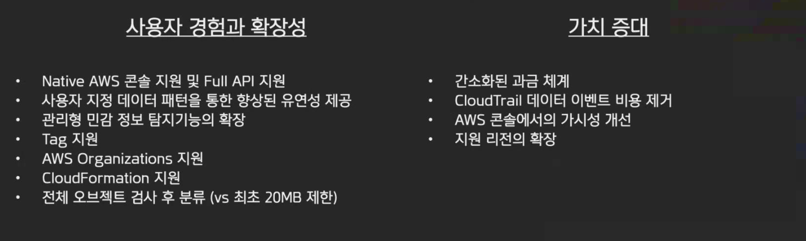

# AWS Security Meetup - 7/22/2020

 

## 1. AWS New WAF – 새로워진 AWS WAF 의 주요 기능에 대해 알려드립니다

> 발표자: 조이정 님(AWS Solutions Architect)

 

### AWS WAF (Web Application Firewall) 란?

- AWS WAF is a web application firewall that helps protect your web applications or APIs against common web exploits that may affect availability, compromise security, or consume excessive resources.
- AWS WAF gives you control over how traffic reaches your applications by enabling you to create security rules that block common attack patterns, such as SQL injection or cross-site scripting, and rules that filter out specific traffic patterns you define.

 

 

### AWS WAF Class vs. WAF

#### 새로운 API

- "wafv2" 라는 고유한 namespace
- "waf" 나 "waf-regional" 이 없어지고, 단일 API로 사용

 

#### 새로운 Rule 작성 방법

- 각 Tool type에 따른 개별 API 없음
- JSON format 의 Document-based rule 작성
- JSON 파일로 모든 rule을 구성하고 간편하게 `UpdateWebACL` API 를 call 해서 반영

 

#### 새로운 룰셋 용량: WAF Capacity Unit (WCU)

- 더 이상 WebACL 당 10개 룰로 제한되지 않음
- 다양한 서비스 제한 소멸
  - ex) 필터 개수 제한

 

#### 새로운 콘솔 경험

- 간편해지고 직관적으로 변화

 

#### 새로운 탐지 능력

- QR 로직, 다중 변형

 

#### Built-In 꽌리형 룰셋: AWS Managed Rules

- AWS 가 관리하고 유지하는 룰셋
- Amazon 내부에서 습득한 보안 지식과 위협 탐지 반영
- OWASP Top 10 및 anti-bot IP reputation list 포함

 

 

### Workshop URL

: <https://go.aws/2xx2XT9>

- 1시간 반 정도 걸린다고 함! 해봐야징

 

 

## 2. AWS New Macie/Detective – 새로워진 Macie 서비스와 신규 보안 서비스인 Detective 의 주요 기능에 대해 알려드립니다

> 발표자: 신은수 님(AWS Security Specialist Solutions Architect)

 

### 우리 Macie가 이렇게 달라졌어요

 

#### 1. Amazon Macie - 완전하게 새로운 서비스 (Upgrade 수준이 아님!)

- 기존 Macie 서비스의 이름 변경 - `Macie Classic`
- Macie Classic을 사용하는 고객도 새로워진 Macie를 동시에 사용 가능

 

#### 2. 지난 2년간의 고객 요구 사항을 반영하여 개선

- AWS에 저장되어 있는 데이터의 감시와 민감 정보 탐지에 최적화

 

#### 3. Macie Clasic 고객도 새로워진 Macie 사용이 가능하며 아래와 같은 저랓에 따라 전환 가능

- 기존의 분류 결과를 내보내기
- Macie Classic 비활성화

 

 

### Macie vs Macie Classic

> 주요 변화

- 이상행위 탐지 및 S3에 대한 CloudTrail 로그 분석은 GuardDuty로 이관

 

 

 

`+`

### 느낀점

AWS가 제공하는 서비스는 정말 다양하다는 것을 다시 한번 느꼈다...!

써봐야 할 제품, 써보고 싶은 제품이 너무 많다! 갈 길이 멀드아!!
