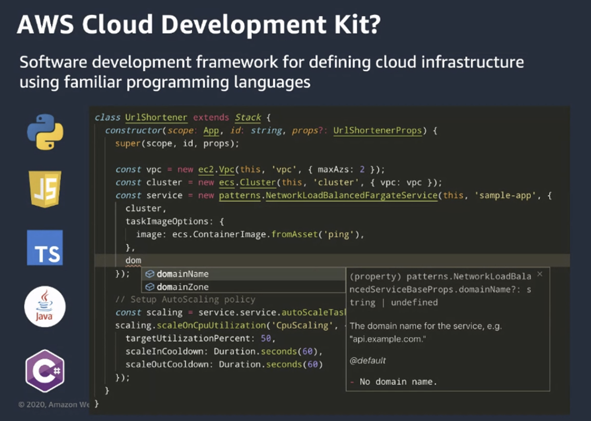

# DevAx Connect) CDK로 EKS Cluster Fullstack 관리하기 - 9/1/2020

> 발표자: AWS 솔루션스 아키텍트 염지원님
>
> 자료: [AWS workshop](http://demogo-multiregion-eks.s3-website.ap-northeast-2.amazonaws.com/ko/10-intro/100-for-whom/)

 

 

## 쿠버네티스 클러스터를 Fullstack으로 IAC 한다는 것

 

- Cloud에서 Infra를 코드로 정의하는 것 (Infrastructure as Code, IAC)은 선택이 아닌 필수이다

- 쿠버네티스 클러스터를 Cloud에 배포할 때 신경써야 하는 코드는 크게 세 가지 종류가 있다

   

  

### 1. Infrastructure

- AWS Cloud 상에 하나의 EKS Cluster를 배포할 때,
  - VPC 설정
  - 그 안의 Subnet
  - 보안그룹
  - 각종 IAM Role과 정책 등 여러가지 설정이 동반된다
- Region 확장, 계정 확장 등으로 사용 규모가 확대될 수록 **인프라 정의 코드**는 복잡해진다

 

### 2. Platform

- 이렇게 Infra를 code로 정의하고 나면, 그 위에 Cluster 차원에서 관리해주어야 하는 자원들이 있다
  - ex)
    - namespace를 구분하고 이에 대해 **[ResourceQuota](https://kubernetes.io/docs/concepts/policy/resource-quotas/)** 를 지정하거나 **auto-scaling**, **monitoring**, **logging 설정**을 하는 것 등

 

### 3. Application

- 조직에 따라 누가 하는지는 다를 수 있지만 **application layer** 에서도

  1. 배포 스크립트

  2. K8s manifest

     역시 코드로써 같이 관리되어야 한다

 

 

### 전체 스택에 대한 IaC 가 필요한 이유

 

1. 모든 **모델링 리소스**를 **단일 소스**로 관리하여, 조직 전체에서 사용되는 구성 요소들을 **표준화** 할 수 있다
   - 이를 통해 전사 규정을 준수하고 Issue 발생 시 더 빠르게 대처할 수 있다
2. 자동화 및 배포 애플리케이션 리소스를 **안전**하고 **반복 가능한 방식**으로 **프로비저닝**하므로, 수작업을 수행하거나 사용자 지정 스크립트를 작성할 필요 없이 Infra 와 application을 **구축** 및 **재구축** 할 수 있다
   - 이를 통해 휴먼 에러의 감소 역시 기대할 수 있다!

3. 코드처럼 버전 관리 인프라를 코드화하면 **인프라**를 **단순한 코드로 취급**할 수 있다.
   - Infra를 원하는 코드 에디터로 작성하고, 버전 제어 시스템에 체크인하고, Production에 배포하기 전에 팀원들과 파일을 검토할 수 있다
   - 각 **코드의 버전**이 **Infra의 상태**를 나타내게 되고, 변경 후 issue가 발생될 시 이전 코드를 사용하여 이전 버전의 Infra로 **빠른 원복**이 가능하다

 

 

## AWS CDK (Cloud Development Kit)

 

- AWS CDK 는 익숙한 프로그래밍 언어를 사용하여 Cloud application resource를 **모델링** 및 **프로비저닝** 할 수 있는 **오픈 소스 소프트웨어 개발 프레임워크** 이다!

- Cloud application provisioning은
  - 수동 작업을 수행하거나,
  - 사용자 지정 스크립트를 작성하거나,
  - Template을 유지 관리하거나,
  - 도메인별 언어를 배워야 하는 까다로운 Process 일 수 있다
- AWS CDK는 **프로그래밍 언어**의 **익숙함**과 **표현 능력**을 사용하여 application을 modeling 한다
- AWS CDK는 **검증된 기본값**으로 Cloud resource를 사전에 구성하는 개괄적인 구성 요소를 제공하므로, **전문가가 아니더라도** Cloud application을 구축할 수 있다

 

 

 

 

 

## CDK8S

 

 

*[여기](http://demogo-multiregion-eks.s3-website.ap-northeast-2.amazonaws.com/ko/10-intro/300-cdk/) 부터 다시 정리하면 된다...후후*
