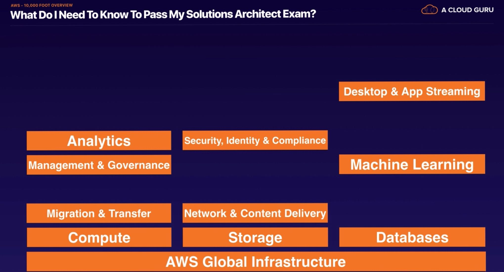

# AWS - 10,000 Foot Overview

 

 

### AWS Global Infrastructure

 

#### Availability Zone

- Think of an `Availability Zone` as a **Data Center**
  - A Data Center is just a building filled with Servers!
- An **Availability Zone** may be several **data centers**, but because they are so close together, they are counted as 1 Availability Zone 

 

#### Region

- A Geographical area
- Each `Region` consists of 2 (or more) **Availability Zones**
- `US East (N. Virginia)` is the region where all the new services come out!

 

#### Edge Locations

- `Edge Locations` are endpoints for AWS which are used for **caching content**
- There are many more **Edge Locations** than **Regions**
- Currently  there are 205 Edge Locations

 

 

### What to Know to Pass Solutions Architect Exam

 

 