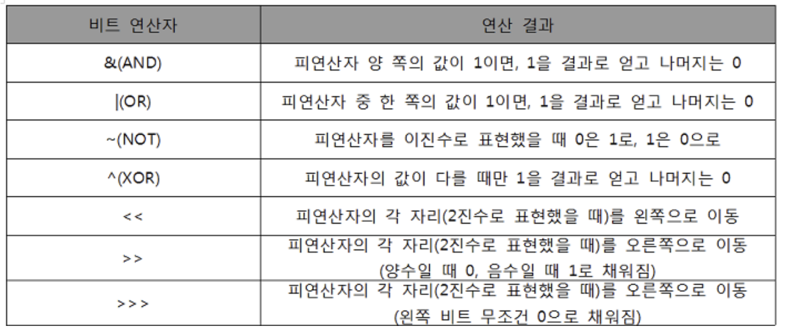

# Algorithm Basics

<br>

### SW 문제 해결 역량이란?

: 프로그램 작성을 위한 많은 제약 조건들과 요구사항들을 이해하고 최선의 방법을 찾아내는 능력

- 프로그래머가 사용하는 언어, 라이브러리, 자료구조, 알고리즘에 대한 지식을 적재적소에 연결하여 큰 그림을 만드는 능력

<br>

<br>

## 알고리즘의 효율

### 1. 공간적 효율성과 시간적 효율성

- 공간적 효율성은 얼마나 많은 메모리 공간을 요하는가를 말함
- 시간적 효율성은 얼마나 많은 시간을 요하는가를 말함
- 효율성을 뒤집어 표현하면 복잡도 (`Complexity`) 가 된다
  - 복잡도가 높을수록 효율성은 저하된다

<br>

### 2. 시간적 복잡도 분석

- 하드웨어 환경에 따라 처리시간이 달라진다
- 소프트웨어 환경에 따라 처리시간이 달라진다
- 그래서, 화이러한 환경적 차이로 인해 분석이 어렵다

<br>

### 3. 복잡도의 점근적 표기

- 시간 (또는 공간) 복잡도는 입력 크기에 대한 함수로 표기하는데, 이 함수는 주로 여러갷의 항을 가지는 다항식이다

<br>

<br>

## O (Big-Oh) 표기

### 1. 정의

- T(n): 실행시간
- T(n) <= c*f(n)이 되는 상수 c, n0가 존재할 때만 T(n) = O(f(n))이라고 한다
- 단, 상수 c와 초기값 n0는 n의 값에 독립적이다

<br>

### 2. 표기

- O-표기
  - 복잡도의 점근적 **상한**을 나타낸다
  - 복잡도가 T(n) = 2n^2 - 7n +4 이라면, T(n)의 O 표기는 O(n^2) 이다
  - T(n)의 단순화된 표현은 n^2이다
  - "최악의 경우에도 이만큼은 나온다"
- Big-Omega 표기
  - 복잡도의 점근적 **하한**을 의미한다
  - "최소한 이만큼은 걸린다"

<br>

*Omega < Theta < Big O*

<br>

<br>

### 자주 사용하는 O-표기

- `O(1)`
  - 상수 시간 (Constant time)
- `O(logn)`
  - 로그(대수) 시간 (Logarithmic time)
- `O(n)`
  - 선형 시간 (LInear time)
- `O(nlogn)`
  - 로그 선형 시간 (Log-linear time)
- `O(n^2)`
  - 제곱 시간 (Quadratic time)
- `O(n^3)`
  - 세제곱 시간 (Cubic time)
- `O(2^n)`
  - 지수 시간 (Exponential time)

<br>

<br>

## 비트 연산

<br>

### 비트 연산자



<br>

- 정수는 2byte로, 혹은 4byte로 표기하기도 한다
- 범위를 넘어 갈 때
  - 없애버리거나
  - 보정을 해준다
- 정수는 부호 비트가 가장 앞에 들어간다

<br>

### N & 1

- 변수에 저장된 양의 정수 값의 홀수 짝수 판별
  - N%2
- % 연산으로 마지막 비트 값이 1인지 0인지 판단, 짝수 홀수 판별

<br>

### 1 << n

- 2^n의 값을 갖는다
- 원소가 n개일 경우의 모든 부분집합의 수를 의미한다
- `Power set` (모든 부분 집합)
  - 공집합과 자기 자신을 포함한 모든 부분집합
  - 각 원소가 포함되거나 포함되지 않는 2가지 경우의 수를 계싼하면 모든 부분집합의 수가 계산된다

<br>

### i & (1 << j) = (i >> j) &1

- 계산 결과는 i의 j번째 비트가 1인지 아닌지를 의미한다

<br>

### 비트 연산자 ^를 두 번 연산하면 처음 값을 반환한다

<br>

### 비트 연산 예제 1

```python
def Bbit_print(i):
    output = ''
    for j in range(7, -1, -1):
        output += "1" if i&(1<<j) else "0"
    print(output)

for i in range(-5, 6):
    print("%3d = " %i, end='')
    Bbit_print(i)
```

<br>

<br>

## 엔디안 (Endianness)

- 컴퓨터의 메모리와 같은 1차원 공간에 여러 개의 연속된 대상을 배열하는 방법을 의미하며 HW 아키텍처마다 다르다
- `주의!`
  - 속도 향상을 위해 바이트 단위와 워드 단위를 변환하여 연산 할 때 올바로 이해하지 않으면 오류를 발생 시킬 수 있다

<br>

### 빅 엔디안 (Big-endian)

- 보통 큰 단위가 앞에 나옴
- 네트워크
  - ex) internet protocol, IBM z/architecture (대형 컴퓨터 일부만..)

<br>

### 리틀 엔디안 (Little-endian)

- 작은 단위가 앞에 옴
- 대다수 데스크탑 컴퓨터
  - ex) Intel, ARM processor

<br>

### 엔디안 확인 코드

```python
# ver1)
n = 0x00111111
if n&0xff: #0xff = 11111111 이다!
    print("little endian")
else:
    print("big endian")

print('-'*20)

#ver2) python sys library 활용
import sys
if sys.byteorder == "little":
    print("Little endian platform")
else:
    print("Big endian platform")
```

<br>

### Python 에서 엔디안 변환

```python
# Python에서 Endian 변환

import struct #c의 library

num = 27
print(bin(num))
res = struct.pack('i', num)
print('default :', res)

res = struct.pack('> i', num)
print('big endian :', res)

res = struct.pack('< i', num)
print('little endian :', res)

res = struct.pack('! i', num)
print('network :', res)
print('unpack :', struct.unpack('!i',res))
```

<br>

<br>

## 진수

> 2진수, 8진수, 10진수, 16진수

<br>

### 10진수 -> 타 진수로 변환

- 원하는 타 진법의 수로 나눈 뒤 나머지를 거꾸로 읽는다

<br>

### 컴퓨터에서 음의 정수 표현 방법

- 1의 보수
  - 부호와 절대값으로 표현된 값을 부호 비트를 제외 한 나머지 비트들을 0은 1로, 1은 0으로 변환
- 2의 보수
  - 1의 보수방법으로 표현된 값의 최하위 비트에 1을 더한다

<br>

<br>

## 실수

<br>

### 실수의 표현

- 컴퓨터는 실수를 표현하기 위해 **부동 소수점(floating-point)** 표기법을 사용한다
- 부동 소수점 표기 방법은 소수점의 위치를 고정시켜 표현하는 방식이다
  - 소수점의 위치를 왼쪼그이 가장 유효한 숫자 다음으로 고정시키고 밑수의 지수승으로 표현
    - ex) 10001.0011 -> 1.0010011x 2^3

<br>

### 실수를 저장하기 위한 형식

- 단정도 실수 (32비트)

  - float

    ```
    부호 1비트 | 지수 8비트 | 가수 23비트
    ```

- 배정도 실수 (64비트)

  - double

    - python은 float이라고 표현함

    ```
    부호 1비트 | 지수 11비트 | 가수 52비트
    ```

<br>

### 컴퓨터는 신수를 근사적으로 표현한다

- 이진법으로 표현 할 수 없는 형태의 실수는 정확한 값이 아니라 근사 값으로 저장되는데, 이때 생기는 작은 오차가 계산 과정에서 다른 결과를 가져온다

<br>

### 실수 자료형의 유효 자릿수

- 32 비트 실수형 유효 자릿수 (10진수 기준) -> `6`
- 64 비트 실수형 유효 자릿수 (10진수 기준) -> `15`

<br>

<br>

## 파이썬의 숫자 자료형

<br>

### 숫자형 (Number)

- 숫자형(Number)이란 숫자 형태로 이루어진 자료형

| 항목   | 사용 예                 |
| :----- | :---------------------- |
| 정수   | 123, -345, 0            |
| 실수   | 123.45, -1234.5, 3.4e10 |
| 8진수  | 0o34, 0o25              |
| 16진수 | 0x2A, 0xFF              |

<br>

### 정수형

- 정수형(Integer)이란 말 그대로 정수를 뜻하는 자료형을 말한다.

- ex) 양의 정수와 음의 정수, 숫자 0을 변수 a에 대입하는 예

```
>>> a = 123
>>> a = -178
>>> a = 0
```

<br>

### 실수형

- 파이썬에서 실수형(Floating-point)은 소수점이 포함된 숫자를 말한다.
- ex) 실수를 변수 a에 대입하는 예

> 일반적으로 볼 수 있는 실수형의 소수점 표현 방식

```
>>> a = 1.2
>>> a = -3.45
```

> "컴퓨터식 지수 표현 방식"
>
> - 파이썬에서는 4.24e10 또는 4.24E10처럼 표현한다

```
>>> a = 4.24E10
>>> a = 4.24e-10
```

- e와 E 둘 중 어느 것을 사용해도 무방

- 여기서 4.24E10은 4.24∗10104.24∗1010, 4.24e-10은 4.24∗10−104.24∗10−10을 의미함

<br>

### 8진수와 16진수

- 8진수(Octal)를 만들기 위해서는 숫자가 0o 또는 0O(숫자 0 + 알파벳 소문자 o 또는 대문자 O)로 시작하면 된다.

```
>>> a = 0o177
```

- 16진수(Hexadecimal)를 만들기 위해서는 0x로 시작하면 된다.

```
>>> a = 0x8ff
>>> b = 0xABC
```
