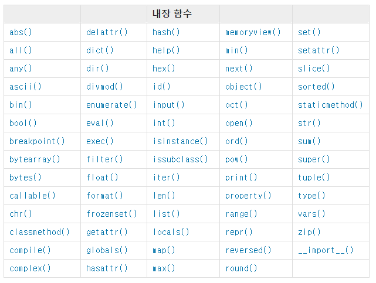

# Day 8 - Python (1/15)

> Python basics & Chatbot intro
>
> https://py.hphk.io/bots


## 1. 저장

`=`  를 사용하여 저장한다

`==` 는 같다는 의미


### 무엇을 저장하는가

1. 숫자

2. 글자 : 무조건 `" " ` 로 감싸서 사용

3. 참/거짓 : True, False 단 두가지


### 어떻게 저장하는가

#### 1) 변수 (Variable)

1. 저장된 값을 변경 할 수 있는 (variable) 박스 1개
2. 숫자, 글자 ,참거짓을 담을 수 있다.


#### 2) 리스트 (List)

1. 박스의 리스트

2. 박스가 순서대로 여러개 붙어있다.


ex) 

```python
import random
menu = ['양념치킨','뿌링클','연어유부초밥','트러플 리조또', '모닝글로리']

#random 모듈 안에 있는 choice 사용
food = ramdom.choice(menu)
#주어   동사

print(food)
```


#### 3) 딕셔너리 (Dictionary)

1. 견출지 붙인 박스들의 묶음


ex)

```python
import random #random 하게 출력할 수 있음

menu = ['양념치킨','뿌링클','연어유부초밥','트러플 리조또', '모닝글로리']

phone_book = {
  '양념치킨': '010-1234-5008',
  '뿌링클' : '010-1234-5600',
  '연어유부초밥' :'010-0034-5678',
  '트러플 리조또': '010-1000-5678',
  '모닝글로리': '010-1234-0000',
}

food = random.choice(menu)

print(food)
print(phone_book[food])
print(food, phone_book[food])
print(food + ' ' + phone_book[food])

# 합체
# => concatination
print(f"메뉴는 {food} 입니다. 전화번호는 {phone_book[food]} 입니다.")


# 수술 (구멍 뚫고 집어넣기) 

# Interpolation은 Python 3.6부터 가능해짐
print("메뉴는 {} 입니다. 전화번호는 {} 입니다.".format(food,phone_book[food]))

#3.6 이전 버전은 이랬음
print("메뉴는 %s 입니다. 전화번호는 %s 입니다." % (food, phone_book[food]))

```


## 2. 조건

#### if문

ex)

```python
import requests  #-> python request module import 하기
from bs4 import BeautifulSoup
url = 'http://openapi.airkorea.or.kr/openapi/services/rest/ArpltnInforInqireSvc/getCtprvnRltmMesureDnsty?serviceKey={}&numOfRows=10&pageNo=3&sidoName=서울&ver=1.6'.format(key)
request = requests.get(url).text
soup = BeautifulSoup(request,'xml')
item = soup('item')[5]
time = item.dataTime.text
dust = int(item.pm10Value.text)

# dust 변수에 들어 있는 값을 기준으로 상태 정보를 출력해보세요.
result = ""
if 0 < dust <= 30:
  result += "좋음"
elif 30 < dust <= 80:
  result += "보통"
elif 80 < dust <=150:
  result += "나쁨"
elif 150 < dust:
  result += "매우나쁨"
  
# dust 변수에 들어 있는 내용을 출력해보세요.
print('{} 기준 미세먼지 농도는 {}이며 {} 입니다.'.format(time, dust,result))  

```


> python requests module 사용 방법

```python
import requests 

URL = 'http://www.google.com' 
response = requests.get(URL) 
response.status_code 
response.text
```


> GET - requests.get() 요청 시 parameter 전달 방법

``` python
params = {'param1': 'value1', 'param2': 'value'} 
response = requests.get(URL, params=params)
```


> POST - requests.post() 요청 시 parameter 전달 방법

``` python
data = {'param1': 'value1', 'param2': 'value'} 
response = requests.post(URL, data=data)
```


## 3.  반복

#### for문 / while문

ex)

```python
greeting = '안녕하세요'

# 5번 반복

# while문 사용
n = 0
while n<5:
  print(greeting)
  n += 1

# for문 사용    
for i in range(5):
  print(greeting)
```


## 4. Web API 를 사용하여 데이터 가져오기

#### API (Application Programming Interface)

> API는 서비스와 서비스와의 대화


`A`  Application

`P`  Programming

`I`  Interface : 사용자와 사용자 사이에 공개되어있는 **전면**


#### 어떻게 Amazon이 성공했는가

> Service를 Micro Service Architecture 형태로 만들게 함
>
> = API 형태로 제공


### WEB에서의 커뮤니케이션 방식

> 요청 (Request) & 응답 (Response)


요청 :  URL 주소를 통해 요청

응답 : HTML 문서로 응답 받고, Browser가 예쁘게 보여줌


#### API 사용하기

>  오픈 소스 기술 + API 통신 = 쉬워진 프로그래밍


ex) 미세먼지 공공데이터

​		요청 : 주소 (URL)

​		응답 :문서 (XML)


> pip 설치

sudo apt install python3-pip python3-dev


## Python 함수

#### 1) 내장함수



 * docs : 

   https://docs.python.org/3/library/functions.html


#### 2) 외장함수

​	ex) random . [  ]

 		: import 해서 사용

​			" 주어 (random아) 동사 ([ ]) 해줘 "


​			random.choice

​			= 여러개 리스트중에 하나 뽑아줌

​			ramdom.sample 

​			= 비복원 추출


ex) random module 사용하여 로또 번호 추첨하기

```python
import random

#range(시작하는 숫자, 끝나는 숫자)
numbers = range(1,46) #-> 끝나는 숫자는 미만이라서 1~45

#sample(뽑을 통, 몇 개 뽑을지)
lotto = random.sample(numbers,6)

#sorted : 정렬
print(sorted(lotto))

#한줄로 출력하기
print(sorted(random.sample(range(1,46),6)))
```

