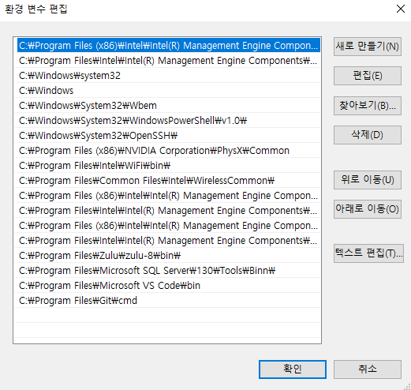
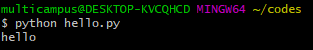
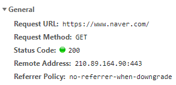
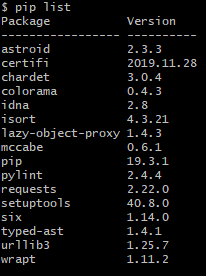
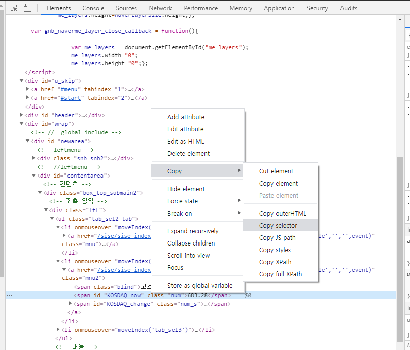

# Day 9 - Python (1/16) 


### Python IDLE

: Runtime에서 Python을 바로 사용 할 수 있게 해줌


### Shell Emulator 

: `Git Bash` 다운받기 

(default option으로 설치 하면 되나, 마지막에 Launch Git Bash check 하기!)

https://git-scm.com/download/win


`pwd` : print working directory

`ls` : list set

`cd` : change directory

​      ex) **cd** [이동하고자 하는 폴더 명]

​	  ex) **cd ..** => 상위 폴더로 이동

​	  ex) **cd ~** => Home Directory로 이동

`mkdir` : make directory

​		ex) **mkdir** [ 만들고자 하는 폴더명 ]


>환경 변수 편집하기




> 현재 위치에서 VS code 열기


> Git Bash에서 실행시키기




### Web Scraping

> **Web scraping, web harvesting, or web data extraction**
>
> : is data scraping used for extracting data from websites




### Data Scraping vs Data Crawling


### Python Package Installer  (PIP)

> pip 설치하기


```bash
$ pip install requests
$ python -m pip install --upgrade pip
$ pip list
```





> The HTTP **200**  
>
>  : OK success **status response code**


### Beautiful Soup

> python이 특정 문서를 검색하기 쉽게 parsing 해주는 parser 


```bash
$ pip install bs4 --user
$ pip install lxml --user
```

`bs4` : parser

`lxml` : 더 빨리 찾게 해줌


### HTML 문서 구조

> DOM Tree 
>
> : 원하는 정보를 더 빠르게 찾을 수 있는 구조로 HTML문서는 구성되어있다


ex)


> Copy selector를 활용하여 id 쉽게 찾기
>




### Lotto API 사용하기

https://www.dhlottery.co.kr/common.do?method=getLottoNumber&drwNo=819


### JSON Viewer

> Chrome extension JSON Viewer 설치하면 JSON 문서를 보기 좋은 형태로 변환해준다!


## Flask


> *What is Flask?* 
>
> : is a **micro web framework** written in Python. It is classified as a microframework because it **does not require particular tools or libraries**. It has no database abstraction layer, form validation, or any other components where pre-existing third-party libraries provide common functions


> Flask 설치

```bash
$pip install Flask --user
```


> Flask 실행시키기

```bash
$ flask run
 * Environment: production
   WARNING: This is a development server. Do not use it in a production deployment.
   Use a production WSGI server instead.
 * Debug mode: off
 * Running on http://127.0.0.1:5000/ (Press CTRL+C to quit)
127.0.0.1 - - [16/Jan/2020 14:56:35] "GET / HTTP/1.1" 200 -
127.0.0.1 - - [16/Jan/2020 14:56:35] "GET /favicon.ico HTTP/1.1" 404 -

```


## HTML

> Hyper Text Markup Language


### Python Faker

> Python Faker 설치하기

```bash
$ pip install Faker f --user
```


## Python Anywhere

> is an online integrated development environment and web hosting service based on the Python programming language.