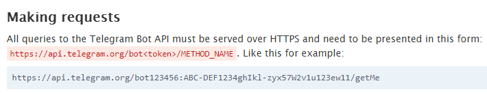
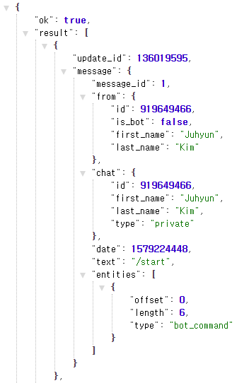
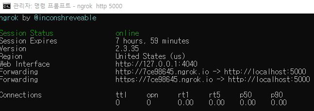
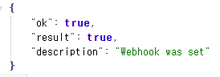
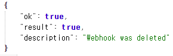
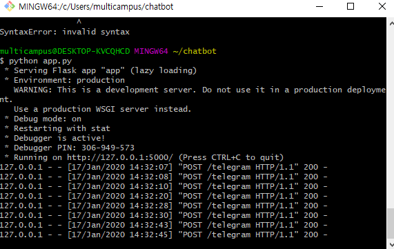
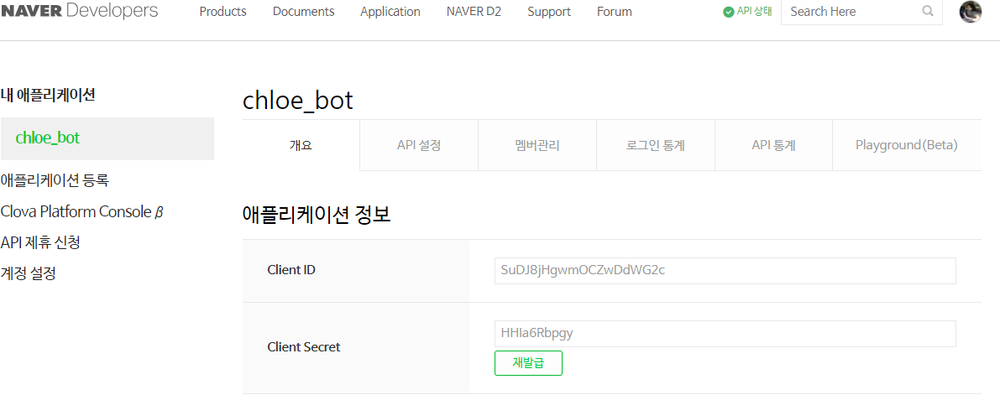
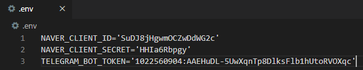
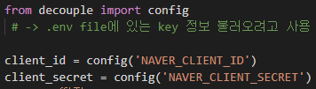

# Day 9 - Python (1/17) 

Flask 가 자동으로 찾는 파일 = `app.py`


> flask run 하지 않아도 debug=True 해놓으면 이렇게 실행 할 수 있다

```bash
$ python app.py
```


#### *render_template()*

> : app.py에서 return값을 render_template()로 하면 html file을 화면에 보여줄 수 있다


 

### 공공데이터 활용하여 미세먼지 데이터 가져오기

> 공공데이터 포털 활용


대기오염 정보 조회 서비스 API KEy

TME4WJ%2F%2FewaSd6jKW4O9EaV%2B%2F%2BLyIXM2PgOjTD7S83WzFA8t6j5cvO%2FDysdRki6yjeJf%2F%2BkBektfu%2BIYJjuAeQ%3D%3D


> 대기오염 정보 xml 문서 확인 가능

http://openapi.airkorea.or.kr/openapi/services/rest/ArpltnInforInqireSvc/getCtprvnRltmMesureDnsty?serviceKey=TME4WJ%2F%2FewaSd6jKW4O9EaV%2B%2F%2BLyIXM2PgOjTD7S83WzFA8t6j5cvO%2FDysdRki6yjeJf%2F%2BkBektfu%2BIYJjuAeQ%3D%3D&numOfRows=10&pageNo=3&sidoName=서울&ver=1.6


## Telegram으로 Chatbot 만들기

> BotFather 활용하기
>
>  => api key : 1022560904:AAEHuDL-5UwXqnTp8DlksFlb1hUtoRVOXqc





> 내가 만든 Chatbot 정보 확인하기 - **getMe**

```html
https://api.telegram.org/bot1022560904:AAEHuDL-5UwXqnTp8DlksFlb1hUtoRVOXqc/getMe
```


> Update 확인 - **getUpdates**




> Message 보내기 - **sendMessage**

``` 
sendMessage?chat_id=919649466&text=점심메뉴뭐임
```


## Web Hook으로 Telegram Chatbot의 상태변화 알아내기

> Server를 열어두고 Telegram의 상태변화가 발생하면 알리게 하기


` setWebhook` 에 어떤 server url로 요청을 보낼지를 명시해야함

 -> 우리는 flask를 server로 사용하므로, flask server 주소를 적어주면 됨


`ngrok` 을 활용하여 localhost에 방화벽으로 인해 접근 못하는 Telegram이 접근할 수 있게 할 것

 


> ngrok 설치하기

설치 후 root 경로에 압축 푼 파일 넣기

 -> 학원 컴퓨터 root는 C:\Users\multicampus


>  ngrok에 요청 보내기

``` bash
$ngrok http 5000
```


> Flask Server port number인 5000으로 Forwarding 하게 하기




https://7ce98645.ngrok.io

-> Telegram이 변경상황이 있는 것을 여기로 보냄

-> 여기서 다시 localhost:5000 으로 요청을 Forwarding함

-> Flask가 요청을 받아서 처리 할 수 있게 됨


###  setWebhook

https://api.telegram.org/bot1022560904:AAEHuDL-5UwXqnTp8DlksFlb1hUtoRVOXqc/setWebhook?url=https://chloecodes1.pythonanywhere.com/telegram


> Telegram에 Web Hook이 잘 연결 되었으면 위의 링크로 들어갔을 때 이렇게 출력됨




### deleteWebhook

https://api.telegram.org/bot1022560904:AAEHuDL-5UwXqnTp8DlksFlb1hUtoRVOXqc/deleteWebhook





> Telegram이 계속 request를 보내는 것 확인 가능




## Papago Translation API 사용하기



>내 API KEY

**Client ID** : SuDJ8jHgwmOCZwDdWG2c

**Client Secret** : HHIa6Rbpgy


`Header`

 : HTML 문서에 대한 정보가 들어 있는 곳


> Post 방식으로 requests 하기 

: requests.**post**(url,header 정보, data)


## Python Decouple


>  Python Decouple 설치하기

```bash
$pip install python-decouple --user
```


>  .env file에 환경변수 등록하기




> 적용하기




