# Day 11 - Python (1/20)


## Git 이란?

1. SCM (Source Code Management)

2. VCS (Version Control System)

   ->  Git은 Versioning을 통해 Source Code를 관리하는 것이다!


- Git은 Folder 기반 관리
- 


#### Git을 사용하는 이유

> 버전관리 / 소스 관리


#### TIL (Today I Learned)

>  오늘 내가 배운 내용을 업로드 하는 것


- jQuery를 만든 John Resig이 github에 TIL을 올리며 시작

  https://github.com/jeresig

​         -> 오늘부터 내가 시작 할 것!


## Git 시작하기


> Initialize Git

```bash
$ git init
```


> 숨김파일 보기

```bash
$ ls -a #보여줘라 모든것을
```


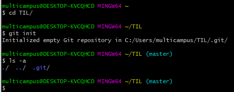


> 숨김파일 들여다보기

```bash
$ cat config
```


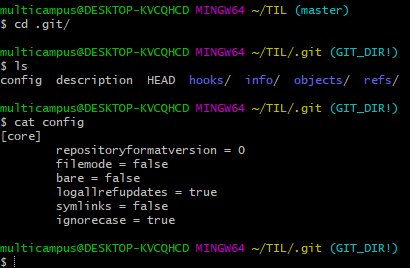


> Git File 지우기

```bash
$ rm -r .git/  #지워라 git 폴더를 
```


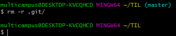


> Git 상태 확인하기

```bash
$ git status
```


​								-> 새로운 파일이 추가된 것 (Untracked file)을 Git이 알고있고, 우리에게 알려줌


>  Git Version 관리

1. snapshot을 찍는 사진대에 파일 올려놓기
2. snapshot을 찍어서 저장하기

​    


`` Commit `` :  저장하다 (로 일단 알고있기) 

​				-> 원래는 '하다' 인데 Git은 저장하는 도구이므로 commit이 저장하다!


> 사진대에 파일 올려놓기

``` bash
$ git add [파일명]
```


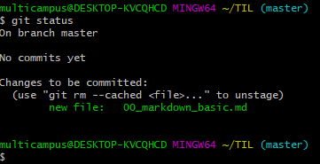

​													-> add 후에 파일 추가된 것 확인 가능


> Git에게 내가 누군지 알려주기

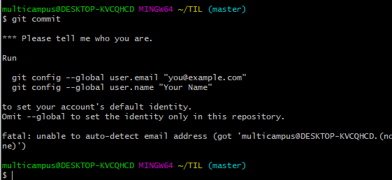

​							-> 처음 commit하면 누군지 알려달라는 메시지가 뜸


```bash
$ git config --global user.email "juhyun.kim@lindsey.edu"  #email 등록
$ git config --global user.name "Chloe Kim" 			   #username 등록
$ git config --globall --list							   #잘 등록되어 있는지 확인
```


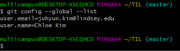

​													-> git에게 config 물어보기


> Git Snapshot 찍기

``` bash
$ git commit -m "Initial commit"   # -m : message 
```


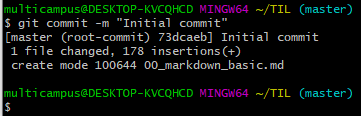


> Git의 commit / snapshot들의 log 확인하기

```bash
$ git log
```


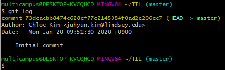


>File 추가하기

``` bash
$ touch [파일명]
```


> Commit Message 에는 주어 없이 **동사**로 입력 
>
> : why? 이미 metadata에 내가 누군지 올라가 있어서!


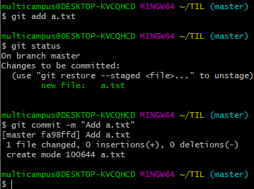

​														-> " Add a.txt"


> Git log 한줄로 보기

``` bash
$ git log --oneline
```


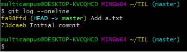


> 과거로 돌아가기

```basg
$ git checkout [돌아가고싶은 시점의 hexa code]
```


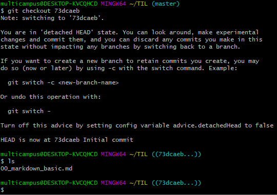

​								-> 두번째 commit인 [fa98ffd (HEAD -> master) Add a.txt] 가 사라진 것 확인 가능


> 다시 현재로 돌아오기

```bash
$ git checkout master
```


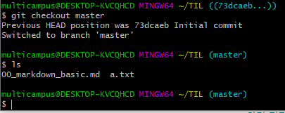

​												-> 다시 a.txt 추가됨


#### 내 PC에서만 작업중인 Git을 원격 저장소 (GitHub)에 Upload 하기


> Repository 만들기


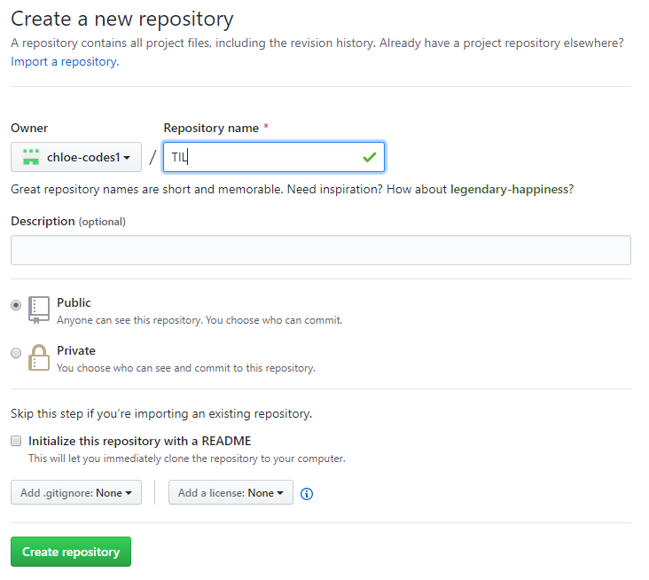


> 원격 저장소 추가하기

```bash
$ git remote add [저장소의 이름 (별명)] [저장소 주소]
# git remote add origin https://github.com/chloe-codes1/TIL.git
```


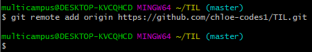

​										  -> 보통 origin이라고 함


> 원격 저장소 확인하기

```bash
$ git remote -v   # -v를 붙이면 자세한 정보 보여줌
```


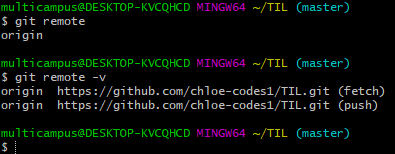


> Git Push

```bash
$ git push [저장소의 이름] [Branch 이름]
# git push origin master
```


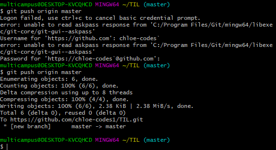


*** 과제 ***

https://drive.google.com/file/d/17S2-9BGPMkcoGAyhcPb2iUaeITYCDTBs/view

-> 내용을 마크다운으로 작성하여 commit & push 하기

​	(a.txt는 삭제하기)


> Staging Area

- 선택적으로 File을 Commit 할 수 있게 해줌


> 수정 이력 

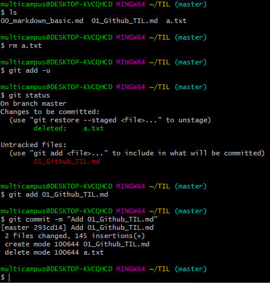


> Git Clone

```bash
$ git clone [repository url]
```


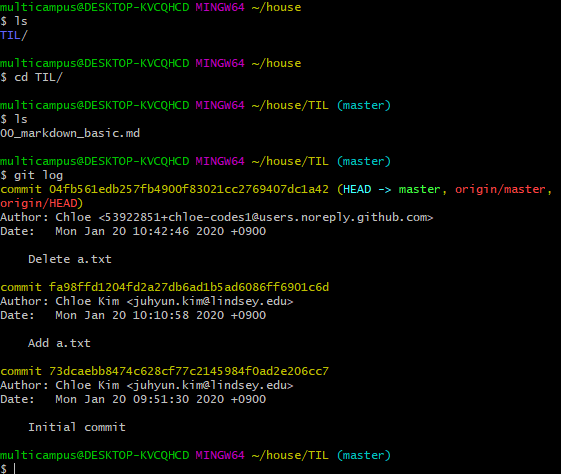


>Pull 당기기

``` bash
$ git pull origin master  #무조건 pull부터 하기
```


#### 집에 가면 할 것

- Pull 당기기
- 작업하면서 commit
- 컴퓨터 끄기 전 Push


> **Pull Request**

   : 변경사항을 가져가도록 요청하기


> Fork & Pull Request 해보기

   -> a.k.a Github flow


## Python 101

> File name alias 해서 clone 하기

``` bash
$ git clone https://github.com/edu-john/python.git master-python #파일명 alias
```


> File 복사 하기

```bash
$ cp [복사할 파일 주소] [복사할 장소]
# cp ~/master-python/01_python_intro.ipynb . 
```


## Jupyter Notebook 


> Install Jupyter Notebook 

```bash
$ pip install jupyter
```


> Launch Jupyter Notebook

```bash
$ jupyter notebook
```


- Markdown - 더블클릭하면 수정 가능 & 수정 후 ctrl + enter 누르기

- Code Cell - 더블클릭하면 수정 가능 & 실행은 ctrl  + enter


### PEP 8 -- Style Guide for Python Code

- **P** : Python
- **E** : Enhanced
- **P** : Proposal


> Jupyter Notebook Cell 삭제

   : dd


> Cell 아래에

  : b   => below


