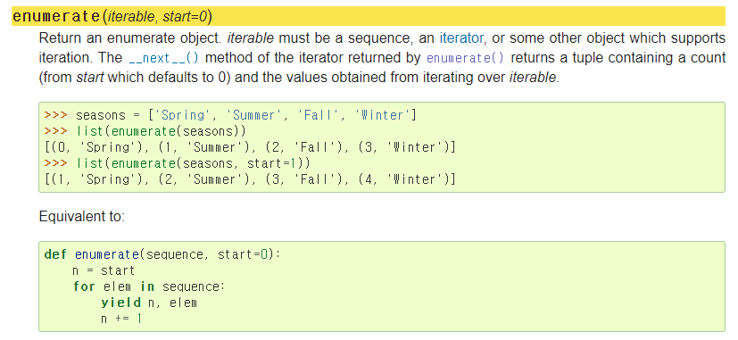

# Python Day 13 - 1/22


### Tips for the SW Test!!

- IM 은 SW Expert Academy D3 까지 잘 하면 된다

- D2 까지 이번 설 안에 끝내기

- 두 시간 이상 고민해서 답이 안나오면 제타위키 같은 곳에 검색해서 답 찾아보기


> Naming in Python


*02_control_of_flow*

- Python 은 Snake Case 로 under bar (_)를 활용하여 naming 함

- Python collection 안에 counter 의 methods 활용해보기


>  Sequence 는 iterable에 포함된다

sequence

- list
- tuple
- string
- range

​         -> 여기에 들어가지 않는 iterable한 객체 

​             = Dict + 순회가능한 객체


> enumerate()    - 열거하다




> List Comprehension

  : list를 순회하여, 특정 조건의 값들로 구성된 list 를 만들 때 사용


> Divide & Conquer
>
> (쪼개고 조지고..ㅎ_ㅎ)


> 폴더 전체를 복사하기    =>  `-r` 

```bash
$ cp -r problems/ ~/python/
```


> 우측정렬

```python
print(f'{i:2}', end=' ')    #우측 정렬 => {:>2} 에서 화살표 없어도 됨!!!! 
```


