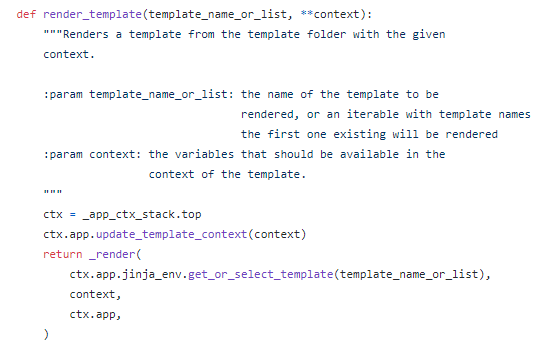

# Day 14 - Python (1/23)


> 프로그래밍의 기본

- 저장

- 조건

- 반복

  -> 이 세가지 만으로도 프로그래밍이 가능함


> Advanced

- 함수
- 객체 (OOP)


> 컴퓨터를 쓰는 이유

​    : 인간이 풀기 어려운 문제를 해결하기 위해


> 컴퓨터 공학의 최대의 적

​    : **Complexity (복잡성)**

​       -> 컴퓨터는 똑똑하고 단순하지만, 현실의 문제가 복잡하다

​					Problem    ===>   컴퓨터   ===>   Solution

​							    (이게 더 어렵다) 

​				-> 큰 문제를 어떻게 단순한 컴퓨터에게 잘 전달하는가가 프로그래밍의 문제

​					   => 문제를 잘게 쪼개서, 쪼개진 문제를 하나하나 따로 따로 해결한다

​								=> `Divide & Conquer`  (분할 정복)


## 함수 

> Complexity를 좀 더 간단하게 만들기 위해 사람이 편하려고 만든 것
>
> ​    => 절차(Procedure)를  모듈화 한 것


- Input과 Output을 정의하는 것 (들어가는것 & 나가는 것)

- 함수를 만들어 놓으면 사용자 입장에서 내부를 고민하지 않고 사용만 하면 되므로 편리하다

    -> 프로그래밍이 함수를 조립하는 compose화 되었음

- 파이썬 / 자바스크립트는 함수형 언어


​	-> 오늘날 프로그래밍/소프트웨어에서 추구하는 것

​             == **Abstraction (추상화 = `요약`)**

​					-> 요약해서 컴퓨터에 전달하고, 컴퓨터가 해결 할 수 있게 하는 것!


#### **parameter(매개변수) & argument(인자, 전달인자)**


1. **parameter**          ===> 만드는 시점에서의 정의
```python
def func(x):    # 이 함수에서 x를 어떻게 쓰겠다고 변수를 정의 한 것 과 같음
    return x + 2
```


* `x` 는 매개변수
* 함수의 **정의 부분**에서 볼 수 있다.


2. **argument**           ===> 활용되는 시점에서의 정의
```python
func(2)
```


* `2` 는 인자
* 함수를 **호출하는 부분**에서 볼 수 있다.


> 주로 혼용해서 사용하지만 엄밀하게 따지면 둘은 다르게 구분되어 사용된다!


### Built-in Functions

<center>
    
</center>

[출처: python 공식문서](https://docs.python.org/ko/3/library/functions.html)


우리가 주로 활용하는 `print()` 함수는 [파이썬 표준 라이브러리의 내장함수](https://docs.python.org/ko/3.6/library/functions.html) 중 하나이며, 다음과 같이 구성되어있습니다.
> <center>
> 
> </center>


> **kwargs 사용하는 render_template()



#### Tips for Git


> How to deal with "refusing to merge unrelated histories" error

```bash
$ git pull --allow-unrelated-histories
```


### 월말 평가

- return 값이 없는 함수 잘 봐두기