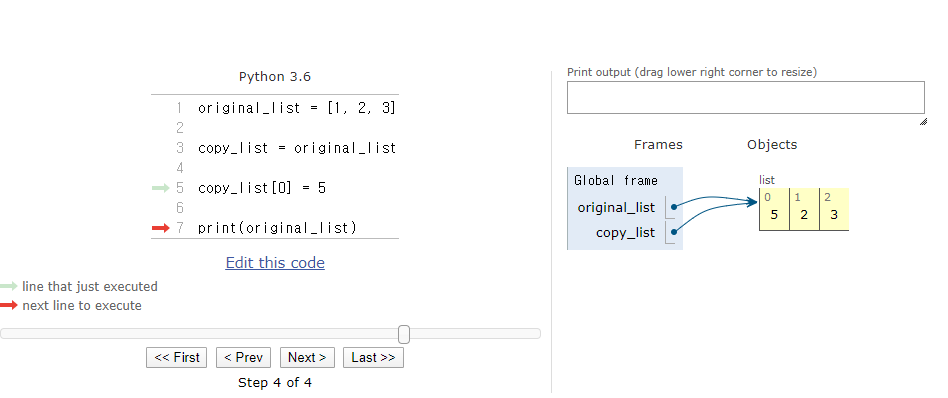
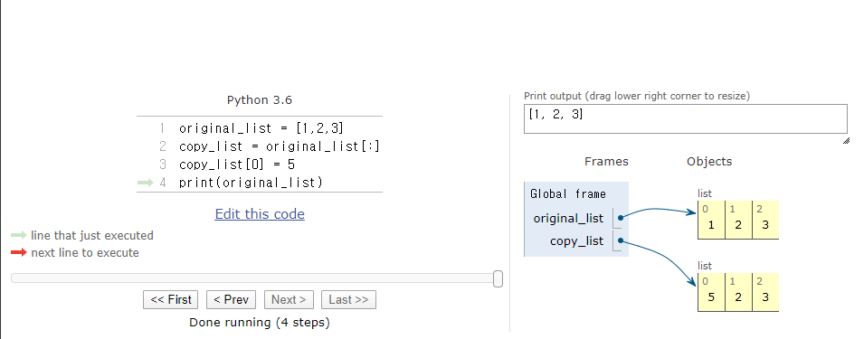
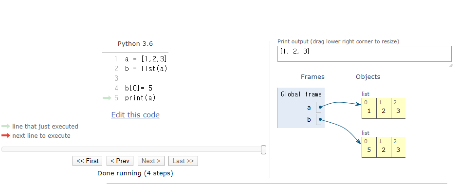
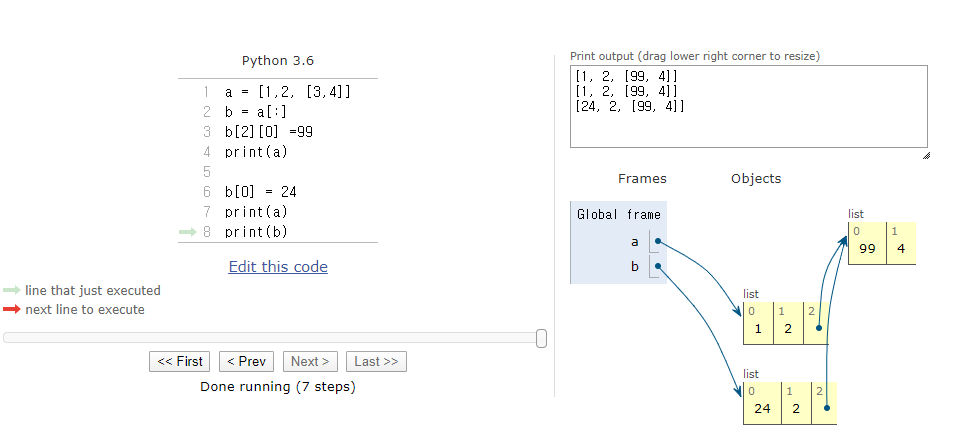
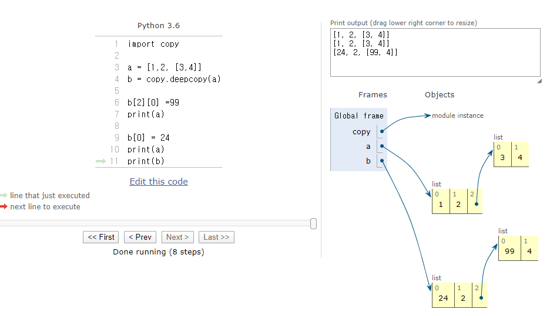

# Day 15 - Python (1/28)


> Built-in Function math 활용하기

```python
import math
math.ceil() #반올림
math.floor() #반내림
```

<br/>


> abs() 와 복소수

```python
# 절대값을 구하는 abs()의 내부는 이렇게 구현되어 있을 것이다!

import math

def my_abs(number):
    if type(number) == complex:
        return math.sqrt(number.real **2 + number.imag **2)
    else:
        if number >=0:
            return number
        else:
            return -(number)
```


<br/>


> all()

​	: 인자로 받는 iterable(range, list)의 모든 요소가 참이거나 비어있으면 True를 반환


``` python
# all() 함수의 내부는 이렇게 구현되어 있을 것이다!

def my_all(elem):
    # 비어있거나 모두 참이면 => True
    # 아니면 => False
    for e in elem:
        if not e:
            return False
    return True
        # 비어있어도 True를 return함 
        #  -> why? 비어있어서 for문을 돌지 않아서 바로 return True
```


<br/>


> any()

​    : 인자로 받는 iterable(range, list)의 요소 중 하나라도 참이면 True를 반환하고, 비어있으면 False를 반환


``` python
# all() 함수의 내부는 이렇게 구현되어 있을 것이다!

def my_any(elem):
    for e in elem:
        if e:
            return True
    return False
```


<br/>


### 다중 조건과 중첩 조건

###  

> 다중 조건

```python
if 방어
if 참치
if 연어
```

​	=>  각각 그물망을 던져서 덫을 깔아놓는 느낌

<br/>


> 중첩 조건

```python
if      
elif
```

  => 같은 그물에서 거른 애를 다시 거르는 것

​          -> 조건이 망라적일 때 (= exhaustive) 사요ㅏㅇ

​          ->  "여기를 통과하지 않는 고기는 없다!"

<br/>


> CSV File

  : comma-separated values

​     -> excel과 유사

<br/>


> Method

   : Object는 하나의 물건인데 물건을 조작하는 방법 (method) 는 여러가지가 있다 해서 method 라고 함


<br/>


.append() 로 넣고, .pop()으로 뺀다!!!!


## list 를 copy하기   (Mutable Object)


> copy가 되지 않는 모습

​    : mutable한 객체는 = 로 값이 복사되는게 아니라 주소만 복사되는 것을 알 수 있음



<br/>


> 방법 1) Slicing으로 새롭게 list를 만들어서 copy 하기





<br/>


> 방법 2) list 생성자로 copy 하기




<br/>


> Slicing은 shallow copy라서 중첩된 내용은 복사하지 못한다



​			-> 이차원 배열부분은 같은 list를 가리키고 있어서 중첩된 부분은 복사하지 못한다

<br/>


> copy.deepcopy() 로 deep copy 하기


 

​     -> deepcopy는 cost가 큼!  memory를 많이 차지함


<br/>


## Immutable한 객체를 copy 하기


> Immutable 객체는 = 로 copy 할 수 있다


## List Comprehension

> 리스트안에 식, for 문을 지정


```python
[식 for 변수 in iterable]

list(식 for 변수 in iterable)
```


## Dictionary Comprehension

> Dictionary는 python 3.6 이전까지는 순서가 없었음!


```python
{키: 값 for 키, 값 in 딕셔너리}

dict({키: 값 for 키, 값 in 딕셔너리})

{키: 값 for 키, 값 in 딕셔너리 if 조건식}

{키: 값 if 조건식 else 값 for 키, 값 in 딕셔너리}
```


