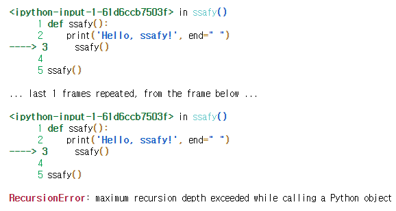
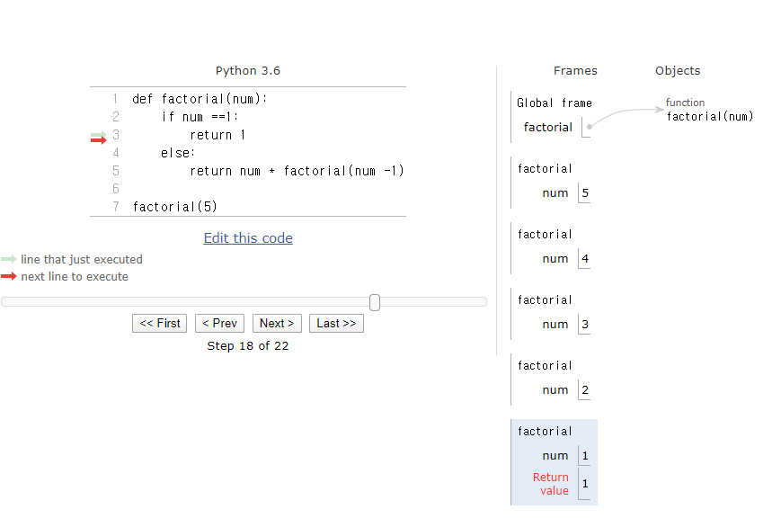

# Day 16 -Python (1/29)


## Dynamic Programming (DP)

> : breaking down an optimization problem into smaller sub-problems, and storing the solution to each sub-problems so that each sub-problem is only solved once.

​      => **Divide & Conquer**


> 조건

  -> '재귀적 구현이 가능한가'


### 재귀함수(recursive function)

: 함수 내부에서 자기 자신을 호출 하는 함수

   -> 일반적인 상황봐는 알고리즘을 구현할 때 유용하게 사용


>  함수 정의식 안에 스스로를 호출하는 함수가 들어가면 재귀함수

```python
def ssafy():
    print('Hello, ssafy!', end=" ")
    ssafy()

ssafy()
```

   -> 이렇게 짜면 이런 error 뜸



​                          	-> 종료 조건이 없기 때문


#### Infinite Loop를 방지하기 위한 조건

1. `base case` - 종료 조건 

2. `recursive step`  - 반복 조건

    => 큰 output이 점점 작게 쪼개지는 step

   


> 재귀를 이용한 팩토리얼 계산

```python
def factorial(num):
    if num ==1:
        return 1
    else:
        return num * factorial(num -1)
```



