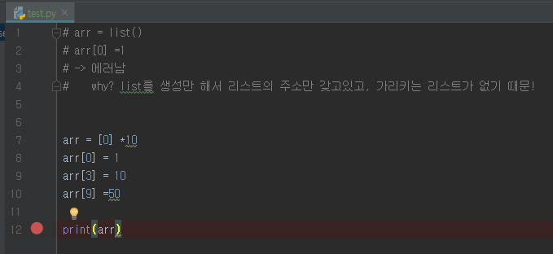
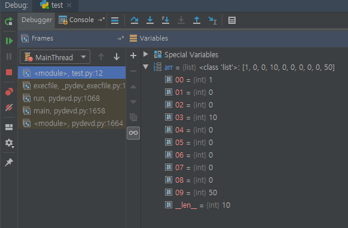
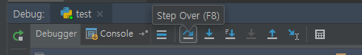
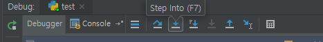

# Day 17 - Algorithm (1/30)

> Algorithm - 박영준 강사님


### Tips

- Python 수업 내용보다 깊게 공부해라
- Web쪽으로 가려면 Java를 추가로 공부해라
- IT 분야에 특화해서 커리어를 이어나가고 싶으면 Computer Science curriculum 보고 공부해라
- 네트워크 기초 / 자료구조 / 운영체제 공부하기


> Algorithm 월말평가 / 과목평가

- 전부 문제풀이 (computational thinking만 주관식)


## APS Python 기본


### 1. 배열 1 (Array 1)


> Algorithm

​	: 어떤 문제를 해결하기 위한 절차나 방법


> 무엇이 좋은 알고리즘인가?

1. 정확성
2. 작업량
3. 메모리 사용량
4. 단순성
5. 최적성


> 알고리즘의 성능은 무엇으로 측정하는가?

: `시간 복잡도 (Time Complexity)`

​    -> 입력 대비 연산 횟수


### 배열 

: 일정한 자료형의 변수들을 하나의 이름으로 열거하여 사용하는 자료구조

   -> list == array

<br/>


#### 1차원 배열

```python
Arr = list()
Arr = []

# 이 상태에서는 배열을 가리킬 주소공간만 확보하고, 실질적으로 배열을 가리키고 있지 않음
```

<br/>


#### 디버깅하기

: IDE (= Integrated Development Environment) Tool을 사용하여 디버깅


> Break Point 설정하기

​     -> Toggle 가능




> Debugger 실행 해보기

				


> 한 줄씩 실행시키기 1 - step over




> 한 줄씩 실행시키기 2 - step into

​	: 사용자 정의 함수 내부로 들어간다는 차이점이 있음




<br/>


#### 완전 검색 (Exhaustive Search = Bruce-force = generate-and-test)

: 우리가 생각 할 수 있는 모든 경우의 수를 확인하는 기법 (접근 방법)

- 모든 경우의 수를 고려하므로 수행 속도 느리지만, 답을 찾을 확률 높음
- A형은 완전 검색으로 가능 ㅎ_ㅎ


<br/>


### 순열 (Permutation)

> 서로 다른것들 중 몇 개를 뽑아서 한 줄로 나열하는 것


- 서로 다른 n개 중 r개를 택하는  순열

  ​	`nPr`

- nPr은 다음과 같은 식이 성립함

    `nPr = n * (n-1) * (n-2) * ... (n-r+1)`

- npn = n!이라고 표현하며 Factorial 이라고 부름

​         `n! = n * (n-1) * (n-2) * ... * 2 *1`


#### 탐욕(Greedy) 알고리즘

: 여러 경우 중 하나를 결정해야 할 때 그 순간에 최적이라고 생각되는 것을 선택해 나가는 접근 방식

- 각 선택 시점에서 이루어지는 결정은 그 순간에는 최적이지만, 그 선택들을 계속 수집하여 최종적인 해답을 만들었다고하여 그것이 최적이라고 보장 할 수 없음!
- 일반적으로 머리속에 떠오르는 생각을 검증 없이 바로 구현하면 greedy 접근


##### ex) 거스름돈 줄이기 

   "어떻게 하면 손님에게 거스름돈으로 주는 지폐와 동전의 개수를 최소한으로 할 수 있을까? 

​	 -> Greedy algorithm을 무작정 적용하면 안된다는 것을 보여주는 예 


####  탐욕 알고리즘 풀이

> 1의 자리 날리기

```python
num = 198

print(num - num%10)
#결과: 190
```


<br/>


### 정렬

> 2개 이상의 자료를 특정 기준에 의해 오름차순 (ascending) or 내림차순 (descending) 으로 재배열 하는 것


#### 버블 정렬 (Bubble Sort)

> 인접한 두 개의 원소를 비교하며 자리를 계속 교환하는 방식


- 정렬과정

  - 첫 번째 원소부터 인접한 원소끼리 계속 자리를 교환하면서 맨 마지막 자리까지 이동한다.
  - 한 단계가 끝나면 가장 큰 원소가 마지막 자리로 정려된다.

- 시간 복잡도

   : `O(n2)`


```python
numbers = [55,7,78,12,42]

for i in range(len(numbers)-1,0,-1 ): #범위의 끝 위치 지정하는 for 문
    for j in range (0,i):
        if numbers[j] > numbers[j+1]:
            numbers[j], numbers[j+1] = numbers[j+1] , numbers[j]

    print(numbers)

print('Bubble Sorted => ', numbers)
```


<br/>


#### 카운팅 정렬 (Counting Sort)

> 항목의 순서를 결정하기 위해 집합에 각 항목이 몇 개씩 있는지 세서 선형 시간에 정렬하는 효율적인 알고리즘


- 제한 사항

  - 정수나 정수로 표현할 수 있는 자료에 대해서만 적용 가능

    : 각 항목의 발생 회수를 기록하기 위해 정수 항목으로 index 되는 count들의 array를 사용하기 때문

  - count들을 위한 충분한 공간을 할당하려면 집합 내의 가장 큰 정수 max(array) 를 알아야 함!

- 시간 복잡도

  : `O(n+k)`

    -> n은 len(array)  /  k는 max(array)


```python
# Python program for counting sort 
  
# The main function that sort the given string arr[] in  
# alphabetical order 
def countSort(arr): 
  
    # The output character array that will have sorted arr 
    output = [0 for i in range(256)] 
  
    # Create a count array to store count of inidividul 
    # characters and initialize count array as 0 
    count = [0 for i in range(256)] 
  
    # For storing the resulting answer since the  
    # string is immutable 
    ans = ["" for _ in arr] 
  
    # Store count of each character 
    for i in arr: 
        count[ord(i)] += 1
  
    # Change count[i] so that count[i] now contains actual 
    # position of this character in output array 
    for i in range(256): 
        count[i] += count[i-1] 
  
    # Build the output character array 
    for i in range(len(arr)): 
        output[count[ord(arr[i])]-1] = arr[i] 
        count[ord(arr[i])] -= 1
  
    # Copy the output array to arr, so that arr now 
    # contains sorted characters 
    for i in range(len(arr)): 
        ans[i] = output[i] 
    return ans  
  
# Driver program to test above function 
arr = "geeksforgeeks"
ans = countSort(arr) 
print ("Sorted character array is %s"  %("".join(ans)))
```

