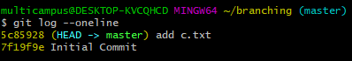

# Day 21 - Algorithm (02/05)


## itertools


#### itertools를 이용해 순열, 조합, 곱집합 구하기


A, B, C 라는 세 개의 문자가 있을 때,

`순열 (permutation)` 은  AB, AC, BA, BC, CA, CB

`조합 (combination)` 은 AB, AC, BC


두 String 'ABCD', 'xy' 이 있을 때,  

`곱집합 (cartesian prodcut)` 은 Ax Ay Bx By Cx Cy Dx Dy 


```python
import itertools

data = ['A', 'B', 'C']

cartesian1 = [1,2,3,4]
cartesian2 = ['chloe', 'camila', 'bella']


permutation = itertools.permutations(data,2)
combination = itertools.combinations(data,2)
product =itertools.product(data, cartesian1, cartesian2)


print(list(permutation))
"""
[('A', 'B'), ('A', 'C'), ('B', 'A'), ('B', 'C'), ('C', 'A'), ('C', 'B')]
"""

print(list(combination))
"""
[('A', 'B'), ('A', 'C'), ('B', 'C')]
"""

print(list(product))
"""
[('A', 1, 'chloe'), ('A', 1, 'camila'), ('A', 1, 'bella'), ('A', 2, 'chloe'), ('A', 2, 'camila'), ('A', 2, 'bella'), ('A', 3, 'chloe'), ('A', 3, 'camila'), ('A', 3, 'bella'), ('A', 4, 'chloe'), ('A', 4, 'camila'), ('A', 4, 'bella'), ('B', 1, 'chloe'), ('B', 1, 'camila'), ('B', 1, 'bella'), ('B', 2, 'chloe'), ('B', 2, 'camila'), ('B', 2, 'bella'), ('B', 3, 'chloe'), ('B', 3, 'camila'), ('B', 3, 'bella'), ('B', 4, 'chloe'), ('B', 4, 'camila'), ('B', 4, 'bella'), ('C', 1, 'chloe'), ('C', 1, 'camila'), ('C', 1, 'bella'), ('C', 2, 'chloe'), ('C', 2, 'camila'), ('C', 2, 'bella'), ('C', 3, 'chloe'), ('C', 3, 'camila'), ('C', 3, 'bella'), ('C', 4, 'chloe'), ('C', 4, 'camila'), ('C', 4, 'bella')]
"""
```


> Python Generator Object 

```python
# 그대로 출력하면 generator object인 것 확인 가능
odd = (1 for n in range(1, 11) if n%2)

print(odd)
#<generator object <genexpr> at 0x0000016D11CC09A8> 


# list로 형변환 해서 값 출력 가능
odds = list(1 for n in range(1,11) if n%2)

print(odds)
#[1, 1, 1, 1, 1]
```


### Binary Search

- Divide & Conquer 와 유사함

- 가능성을 절반씩 줄여가면서 답을 찾아가는 방식
- 재귀적으로 짤 수 있는 algorithm


> Newton-Raphson

  : Binary search 사용하면 훨씬 빨라짐

http://www.mozartreina.com/binary-search.html


## GitLab Shared Repository

> 우리반 코드 공유용 Repository 만들기

https://lab.ssafy.com/03/seoul01/golden_bell


### Ground Rules

1. 다른 폴더를 건드리지 않는다

2.  master 에서 작업하지 않는다

3. 본인의 branch에서 작업한다
4. 작업 이후 merge request를 보낸다
5. 권한이 있는 사람이 특정 시점에 merge를 한다


> Fast foward merge 실습

```bash
# branch 확인
$ git branch

# 새 branch 만들기
$ git branch [branch 명]

# 다른 branch로 이동하기
$ git switch [이동하고자 하는 branch 명]

# 다른 branch 이동 ver2)
$ git checkout [이동하고자 하는 branch 명]


# branch 삭제하기
$ git branch -d [지우고자 하는 branch 명]

# FF(=Fast Forward) merge 하기
# : 주체가 되는 branch로 이동 후 진행 (ex. master로 이동 후 chloe 만들기)
$ git merge [병합할 branch 이름]

# 새 branch 만들면서 이동하기
$ git switch -c [새로 만들 branch]

# 새 branch 만들면서 이동 ver2)
$ git checkout -b ashley  # -b는 branch 뜻함


# git log graph로 보기
$ git log --oneline --graph


```


 ###  Branch는 일회용이다 !!!!

: Feature branch 는 기능 하나를 담당하는 일회용 branch


### Branch는 평등하다 !!!

: master도, 그 후에 만든 다른 branch 도 모두 평등하다!


#### Git Flow

우아한 형제들 기술블로그 참조

http://woowabros.github.io/experience/2017/10/30/baemin-mobile-git-branch-strategy.html


- hotfixes : 급하게 고쳐야 하는 경우
- release/staging/test branches : 해당 코드의 테스트가 가능한 가상 서버에 연결
- develop : 대부분의 큰 단위 개발이 이루어짐
- feature branches : 한 단위/기능별 개발


> 새로운 branch 만들기 전에는 master가 git log의 끝 단에 있음을 확인하기




#### Auto-merge

> 개별 branch들의 작업들이 충돌하지 않을 때 Git이 알아서 merge 해줌


<br/>


#### Conflict merge


- Git switch /checkout은 working tree가 clean 할 때만 하기


- merge로 인해상충되는 부분이 있을 경우엔 auto merge 가 실패하게 되고, git이 유저에게 의견을 묻는다.

  - Accept Current Change (master 작업내용을 지킨다.)
  - Accept Incoming Change (branch 작업내용을 따른다.)
  - Accept Both Changes (master 와 branch 작업내용을 모두 지킨다. )

  

- master 와 branch 의 작업내용 중 어떤 것을 선택할지 결정 후, 새롭게 git add, commit 을 진행한다. (commit message convention "Resolve conflicts")