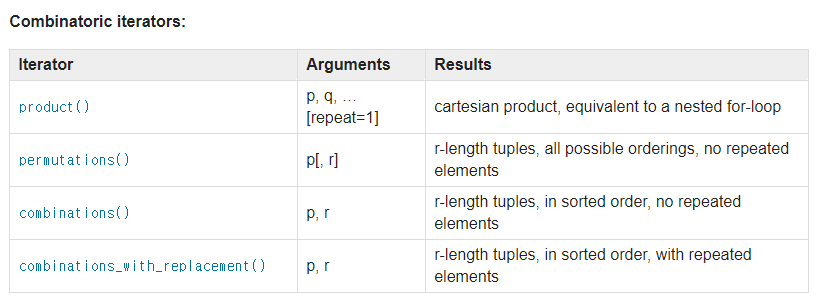
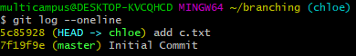
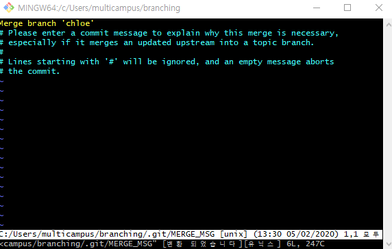
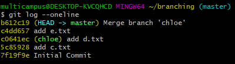
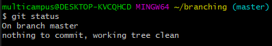

# Day21 - Algorithm (02/05)





> Python Generator Object 

```python
# 그대로 출력하면 generator object인 것 확인 가능
odd = (1 for n in range(1, 11) if n%2)

print(odd)
#<generator object <genexpr> at 0x0000016D11CC09A8> 


# list로 형변환 해서 값 출력 가능
odds = list(1 for n in range(1,11) if n%2)

print(odds)
#[1, 1, 1, 1, 1]
```


### Binary Search

- Divide & Conquer 와 유사함

- 가능성을 절반씩 줄여가면서 답을 찾아가는 방식
- 재귀적으로 짤 수 있는 algorithm


> Newton-Raphson

  : Binary search 사용하면 훨씬 빨라짐

http://www.mozartreina.com/binary-search.html


## GitLab Shared Repository

> 우리반 코드 공유용 Repository 만들기

https://lab.ssafy.com/03/seoul01/golden_bell


```bash
# branch 확인
$ git branch

# 새 branch 만들기
$ git branch [branch 명]

# 다른 branch로 이동하기
$ git switch [이동하고자 하는 branch 명]

# 다른 branch 이동 ver2)
$ git checkout [이동하고자 하는 branch 명]


# branch 삭제하기
$ git branch -d [지우고자 하는 branch 명]

# FF(=Fast Forward) merge 하기
# : 주체가 되는 branch로 이동 후 진행 (ex. master로 이동 후 chloe 만들기)
$ git merge [병합할 branch 이름]

# 새 branch 만들면서 이동하기
$ git switch -c [새로 만들 branch]

# 새 branch 만들면서 이동 ver2)
$ git checkout -b ashley  # -b는 branch 뜻함


# git log graph로 보기
$ git log --oneline --graph


```





 ###  Branch는 일회용이다 !!!!

Feature branch 는 기능 하나를 담당하는 일회용 branch


### Branch는 평등하다!!!


### Branch는 어렵다!


우아한 형제들 기술블로그 참조

http://woowabros.github.io/experience/2017/10/30/baemin-mobile-git-branch-strategy.html


> log 확인 시 master가 항상 끝 단에 있어야함


#### Auto-merge

> : 개별 branch들의 작업들이 충돌하지 않을 때 Git이 알아서 merge 해줌







> Git switch /checkout은 working tree가 clean 할 때만 하기




Clone 받은 폴더에