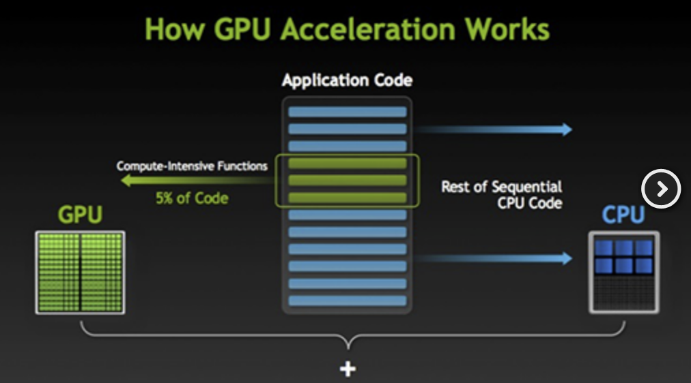

# Infra Structure Basics

> IT 인프라에 대해 알아보다가 너무 정리가 잘 되어있는 글을 찾아서 공부하며 다시 정리!
>
> References: [futurecreator.github.io](https://futurecreator.github.io/2018/11/09/it-infrastructure-basics/)

 

## 1. What is IT Infrastructure?

 

### IT Infrastructure 란?

- Application을 가동시키기 위해 필요한 `하드웨어`, `OS`, `미들웨어`, `네트워크` 등 시스템의 기반

- **비 기능적 요구사항**과 관련이 있다

 

#### 기능적 요구사항과 비기능적 요구사항

1. `기능적 요구사항 (functional requirement)`
   - 해당 시스템이 어떤 기능을 하고, 무엇을 할 수 있는지
2. `비 기능적 요구사항 (non-functional requirement)`
   - 시스템의 성능, 안정성, 보안 등과 같은 요구사항

 

 

### Infra의 구성요소

- **하드웨어 (Hardware, HW)**
  - Server 장비 본체나 데이터를 저장하기 위한 storage, 전원장치 등
    - 넓은 의미에서는 하드웨어를 설치하는 data center의 설비도 포함된다
- **네트워크 (Network)**
  - 사용자가 원격으로 접근할 수 있도록 server를 연결하는 도구들
    - ex) 
      - 라우터, 스위치, 방화벽 등의 네트워크 장비
      - 이를 연결하는 케이블 배선
      - 사용자가 단말에서 무선으로 연결하는데 필요한 access point (AP)
- **운영체제 (Operating System, OS)**
  - `하드웨어` 와 `네트워크 장비` 를 제어하기 위한 기본적인 소프트웨어
  - resource 와 process를 관리
    - `Client OS`
      - 사용자가 사용하기 쉽도록 하는데 초점
      - ex) Windows, macOS
    - `Server OS`
      - system을 빠르고 안정적으로 실행하는데 초점
      - ex) Linux, Unix, Wiindows Server
- **미들웨어 (middleware)**
  - server 상에서 server가 *특정 역할*을 하도록 기능을 제공하는 소프트웨어

 

 

## 2. On-premises vs Cloud

 

### 2-1. On-premises

- Data center나 server실에 server 를 두고 **직접 관리**하는 전통적인 방식
- Server, Network 장비, OS, Storage, 각종 solution 등을 직접 사서 설치하고 관리해야 했음

#### On-premises 의 단점

- 장비들이 고가이기 때문에 **초기 투자비용**이 크다
- **사용량을 가늠**하기 힘들어서 한번 구축하면 사용량이 적어도 유지 비용은 그대로 나간다

 

### 2-2. Public Cloud

- 인터넷을 통해 불특정 다수에게 **서비스 형태**로 제공되는 시스템
  - `서비스 형태` 란?
    - 사용자는 원하는 option을 선택하고, 사용한만큼 비용을 지부라면 된다는 것을 의미
    - ex) Iaas (원하는 사양의 VM이나 Storage를 선택하고, 이용한 시간이나 data 양에 따라 비용을 지불), Paas, SaaS
- AWS, Microsoft Azure, GCP 등 **Cloud Provider**가 Data center와 Infra를 보유하고 있다

 

### 2-3. Private Cloud

- Public cloud에서 이용자를 한정한 형태
- ex) 기업 내 서비스 - 보안이 좋고, 독자적 기능 or 서비스를 추가하기 쉽다

 

### 2-4. Pros of Cloud

- Traffic의 변동이 많은 시스템은 Cloud 가 유리하다
  - why?
    - 대외 서비스는 traffic을 예상하기가 쉽지 않기 때문!
    - 이렇게 traffic 양에 따라 server 사양이나 network 대여을 가늠하는 것을 **Sizing** 이라고 하는데 상당히 어려운 작업임
      - Cloud system에서는 Traffic의 증감에 따라 자동으로 증설해주는 `Auto Scaling` 이 있어 On-premises 보다 유리하다!

- 자연 재해로 인해 Data system이 다운되더라도 다른 곳에서 시스템을 운영 할 수 있다
  - how?
    - Cloud의 data center는 전 세계에 퍼져 있기 때문!
- 빨리 서비스를 제공하는 시스템이나 PoC (Proof of Concept) 에도 Cloud 가 유리하다
  - 초기 투자금이 적은 스타트업 / 개인 개발자에게도 유리하다!

 

### 2-5. Pros of On-premises

- On-premises와 Cloud 모두 **가용성**을 보장하지만 개념에서 차이가 있다
  - `On-premises`
    - server가 죽지 않는 것을 목표로 함
  - `Cloud`
    - 다수의 instance로 이루어진 분산 환경에서 Instance가 죽으면 다른 instance가 빠르게 대체하는 것을 의미
      - 즉, Cloud를 사용한다고 해서 가용성이 보장되는 것이 아니라, 가용성을 높이도록 직접 설계 해야함
      - 따라서 잠시라도 끊어지면 안되는 시스템이나 클라우드 업체가 보장하는 것 이상의 가용성이 필요한 시스템에서는 On-premises 가 유리하다....
        - 라고 적혀있지만 나는 이부분에 대해서는 공감 못하겠다..!
          - Amazon RDS를 예로 들자면, 다중 AZ 배포를 사용해서 장애조치하고, 다른 가용 영역에 동기식 예비 복제본을 프로비저닝하고 유지하는 방법 등 가용성을 높일 수 있는 방법이 지금 떠오르는 것만 해도 많은데!! 
          - Cloud가 보장할 수 있는 것 이상의 가용성을 On-premises에서 보장 할 수 있을 지 궁금하다! 찾아봐야징
- **기밀성**이 높은 데이터의 경우 On-premises까 유리하다
  - 물론 자사의 보안보다 Cloud Provider까 제공하는 보안이 더 좋을 수 있지만, 물리적인 저장 장소를 명확히 알 필요가 있을 때에는 On-premises가 유리하다
  - 또한 multi-cloud를 사용한다면 각 Cloud provider마다 보안 정책이 다르기 때문에 보안 표준을 구축하기 어렵다.....
    - 이번에 새로 하게 된 오픈 소스 컨트리뷰톤에서 Multicloud 프로젝트에 참여하게 되었는데 이 부분이 정말 어려운 것인지 컨트리뷰톤에서 알아보면 좋겠다! 알아봐야징

 

### 2-5. Hybrid Cloud

- On-premises와 Cloud 각각 장단점이 있기 때문에 **두 가지를 함께 사용**하기도 함
  - 각 system의 특성에 맞게 두 가지를 함께 사용하는 것!
- Cloud provider들도 각각의 장단점이 달라서 여러 클라우드를 함께 사용하기도 함
- 이것을 잘 결정하기 위해 각각의 특성을 잘 알고 있어야 하고, 선택의 기준이 명확해야 함!

 

 

## 3. Infra 관련 개념들

 

### 3-1. 하드웨어

- Infra에서 가장 low-level을 맡고 있는 것이 **하드웨어**와 **네트워크**이다
- **On-premise** system에서는 여러 대의 server 장비로 구성된다
- **Cloud**에서는 instance의 하드웨어 성능을 필요에 따라 선택하게 된다

 

### 3-2. CPU

- CPU의 성능은 **Core**와 **Cache**의 영향을 받는다
  - **Core**가 많을 수록 동시에 처리하는 연산이 늘어나고,
  - 메모리와 처리속도를 완화하기 위한 **Cache** 는 크기가 클수록 성능이 좋다
  
- **GPU**

  - Graphic을 처리하는데 특화된 Processor

  - `CPU`가 **직렬 처리**에 최적화된 몇 개의 코어로 구성된 반면,

    - `GPU`는 **병렬 처리**에 최적화된 작고 많은 코어로 이루어져 있다

    

  - Deep learning이나 수치 해석 등 대량의 Data를 고속으로 처리해야하는 분야에서는 CPU와 GPU를 함께 사용해서 처리 성능을 높이는 **GPU Computing** 방식이 사용된다

    - 이 방식은 연산이 많이 필요한 부분을 GPU에게 넘기고, 나머지 코드만을 CPU에서 처리하는 방식이다!  오호..

    

 

### 3-3. Memory

- 주 기억장치인 메모리는 data 용량이 크거나 전송 속도가 고속일수록 고성능이다
- Server용으로는 전력 소모가 적고 **오류 처리**가 탑재되어 있는 것을 주로 선정한다

 

### 3-4. Data Storage

- Data를  저장하는 Device
- 보통 Storage의 속도가 제일 느리기 때문에 Storage의 용량이나 Read, Write 속도가 system 전체의 속도에 영향을 주는 경우가 많다
- `하드디스크`나 `SSD (Solid-State Drive)`등으로 이루어져 있다

#### Data 관리

- IT에서 가장 중요한 것은 data라고 할 수 있다
- 이러한 data가 손실되면 안되기 때문에 대부분 **고가용성**(High Availability, HA, 오랜 기간동안 지속적으로 운영될 수 있음)을 위해 **이중화(redundancy)** or **다중화**로 구성한다

 

*계속  공부중...*

