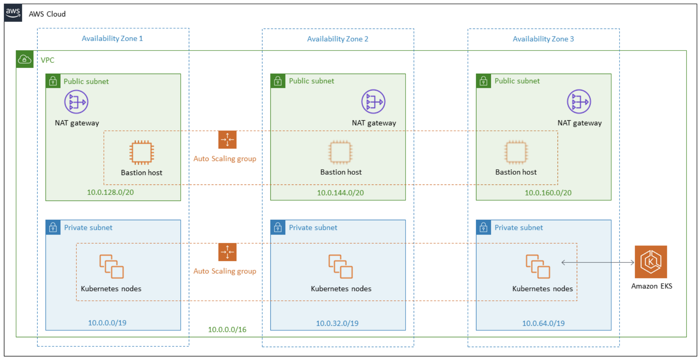

# EKS for Kubernetes

 

 

 

 

## Managed node groups

> Amazon EKS Cluster의 node provisioning 및 수명 주기 관리를 자동화

- Amazon EC2 instance를 별도로 provisining 하거나 등록할 필요 없음
- 최근 Launch Template 및 Custom AMI 지원하게 됨
- 특정 버전이 release 되면 이전 버전은 deprecated 됨
-   .....

 

### Fargate

- Pod manifest만 작성하여 올리면, control plane 이 알아서 관리해준다
- 보안에 대한 걱정이 있을 수 있는데, 아예 별도로 하드웨어 레벨까지 분리해줌

 

#### Fargate 사용 시 장점

- 조직별로 다른 과금 측정 가능
- Pod 단위의 과금
  - 관리의 단위가 pod단위가 된다!
    - Pod 별 접근 제한
    - Pod 별 네트워크 제한 가능!
- ...

 

### Amazon VPC CNI Plugin

- ...

 

 

### Amazon EKS Ingress Controller

- Traffic 처리 시  IP Mode, Instance Mode를 구분해서 사용해야 한다
  - Amazon VPC CLI가 IP를 직접적으로 찍어서 사용하기 때문에 가능한 일!

 

 

### Pods 를 위한 IAM

- Pod level 에서 IAM 권한 가능
  - Pod 별로 권한을 관리 할 수 있다!
- ...

 

 

## Logging and Monitoring

- Control Plane은 VPC 에서 접근할 수 없기 때문에 ..

 

### AWS App Mesh

- 서비스 간 통신을 관리하는 서비스 메시

 

### Amazon CloudWatch Container Insights

https://docs.aws.amazon.com/AmazonCloudWatch/latest/monitoring/ContainerInsights.html

  

## Hands-on

https://www.eksworkshop.com/020_prerequisites/k8stools/

