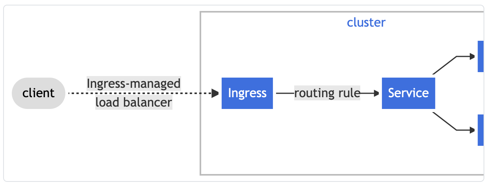

# What is Ingress?

> Kubernetes의 Ingress에 대해 알아보아요
>
> Reference: [Kubernetes docs](https://kubernetes.io/ko/docs/concepts/services-networking/ingress/)

<br>

<br>

## 인그레스 (Ingress)

<br>

- 일반적으로 Network traffic은 `ingress` 와 `engress` 로 구분된다
  - Ingress는 외부로부터 서버 내부로 **유입되는 network traffic**
  - Engress는 서버 내부에서 외부로 **나가는 network traffic**
- Cluster 내의 서비스에 대한 외부 접근을 관리하는 API Object
  - 일반적으로 `HTTPS` 를 관리한다
- Ingress는 **부하 분산**, **SSL 종료**, **명칭 기반의 가상 호스팅** 을 제공할 수 있다

<br>

### Terms

- **Node**
  - Cluster의 일부
  - Kubernetes에 속한 worker machine
- **Cluster**
  - Kubernetes에서 관리되는 **container화 된 application**을 실행하는 **node의 집합**
    - 대부분의 Kubernetes 배포에서 cluster에 속한 node는 `Public Internet`의 일부가 아니다
-  **Edge Router**
  - Cluster에 방화벽 정책을 적용하는 router
    - Cloud provider or physical hardware의 일부에서 관리하는 `Gateway` 일 수 있다
- **Cluster Network**
  - Kubernetes networking model에 따라 cluster 내부에서 통신을 용이하게 하는 논리적 또는 물맂거 링크의 집합
- **Service**
  - `Label selecter`를 사용해서 `pod` 집합을 식별하는 Kubernetes service
    - 달리 언급하지 않으면 service는 `Cluster network` 내에서만 routing 가능한 가상 IP를 가지고 있다고 가정한다

<br>

### What is Ingress?

- Cluster 외부에서 cluster 내부 서비스로 **HTTP** 와 **HTTPS** 경로를 노출한다
- **Traffic routing** 은 Ingress resource에 정의된 규칙에 의해 control 된다



- Ingress는 외부에서 service로 접속이가능한 **URL**, **Load balance traffic**, **SSL/TSL** 종료, 그리고 이름 기반의 virtual hosting service를 제공하도록 구성할 수 있다
  - `Ingress controller` 는 일반적으로 load balancer를 사용해서 ingress를 수행할 책임이 있으며, traffic을 처리하는데 도움이 되도록 **edge router** 나 **additional frontend** 를 구성할 수 있다
- Ingress는 임의의 port 또는 protocol 을 노출시키지 않는다
  - HTTP와 HTTPS 이외의 service를 인터넷에 노출하려면 일반적으로 `Service.Type=NodePort` 또는 `Service.Type=LoadBalancer`를 사용한다

<br>

### Prerequisites

- `Ingress Controller` 가 있어야 `Ingress` 를 충족할 수 있다
  - Resource만 생성하는 것은 효과가 없다! controller 가 필요하다
- `ingress-nginx` 같은 **ingress controller** 를 배포해야 하는데, ingress controller의 종류는 다양하다

<br>

### The Ingress resource

> A minimal Ingress resource example

```yaml
# service/networking/minimal-ingress.yaml

apiVersion: networking.k8s.io/v1
kind: Ingress
metadata:
  name: minimal-ingress
  annotations:
    nginx.ingress.kubernetes.io/rewrite-target: /
spec:
  rules:
  - http:
      paths:
      - path: /testpath
        pathType: Prefix
        backend:
          service:
            name: test
            port:
              number: 80
```

- 다른 모든 Kubernetes resource와 마찬가지로 ingress에는 `apiVersion`, `kind`, `metadata` field가 필요하다
- Ingress object의 이름은 유효안 **DNS subdomain name** 이어야 한다
- Ingress는 종종 annotation을 이용해서 ingress controller에 따라 몇 가지 option을 구성하는데, **rewrite-target annotation** 을 얘로 들 수 있다

- 서로 다른 ingress controller는 각각 다른 annotation을 지원한다
- `Ingress spec` 에는 Load Balancer 또는 proxy server를 구성하는데 필요한 모든 정보가 있다
  - 가장 중요한 것은, 들어오는 request와 일치하는 규칙 목록을 포함하는 것이다
    - Ingress resource는 **HTTP(S) traffic** 을 지시하는 규칙만 지원한다

<br>

### Ingress rules

: 각 HTTP 규칙에는 다음의 정보가 포함된다

- **선택적 host**
  - 만약 host가 제공되면, 규칙이 해당 host에 적용된다
- **경로 목록**
  - 경로 목록에는 각각 `service.name`, `service.port.name` or `service.port.number` 가 정의되어 있는, 관련 backend를 가지고 있다
    -  Load balancer가 traffic이 참조된 서비스로 보내기 전에 **host**와 **path** 는 incoming request와 내용이 match 되어야 한다
- **Backend**
  - Backend는 service docs 또는 사용자 정의 resource backend에 설명된 것 처럼 **service** 와 port 이름의 조합이다.
    - Host와 규칙 경로가 일치하는 ingress에 대한 HTTP(S) 요청은 backend 목록으로 전송된다

<br>

### DefaultBackend

- 규칙이 없는 ingress는 모든 traffic을 하나의 **default backend**로 전송한다
- DefaultBackend는 `ingress controller` 의 구성 option이고,  `ingress resource` 에 지정되어 있지 않다
- 만약 `ingress object` 의 HTTP 요청과 일치하는 host or path가 없으면, traffic은 **default backend**로 **routing** 된다

<br>

### Resource Backend

- `Resource backend` 는 ingresss object의 동일한 namespace 내에 있는 다른 Kubernets resource에 대한 **ObjectRef** 이다
- `Resource` 는 **service**와 **상호 배타적**인 설정이며, 둘 다 지정하게 되면 **유효성 검사** 를 통과 할 수 없다
  - 유효성 검사에 실패한다
- `Resource backend` 의 일반적인 용도는 static asset이 있는 **object storage backend**로 data를 수신하는 것 이다

<br>

> Resource backend example

```yaml
# service/networking/ingress-resource-backend.yaml

apiVersion: networking.k8s.io/v1
kind: Ingress
metadata:
  name: ingress-resource-backend
spec:
  defaultBackend:
    resource:
      apiGroup: k8s.example.com
      kind: StorageBucket
      name: static-assets
  rules:
    - http:
        paths:
          - path: /icons
            pathType: ImplementationSpecific
            backend:
              resource:
                apiGroup: k8s.example.com
                kind: StorageBucket
                name: icon-assets
```

- 위의 yaml file 처럼 ingress 를 생성하고, 아래의 명렁으로 생성된 ingress를 확인 할 수 있다

  ```bash
  $ kubectl describe ingress ingress-resource-backend
  ```

  - 결과

    ```bash
    Name:             ingress-resource-backend
    Namespace:        default
    Address:
    Default backend:  APIGroup: k8s.example.com, Kind: StorageBucket, Name: static-assets
    Rules:
      Host        Path  Backends
      ----        ----  --------
      *
                  /icons   APIGroup: k8s.example.com, Kind: StorageBucket, Name: icon-assets
    Annotations:  <none>
    Events:       <none>
    ```

    


<br>

<br>`+`

- Kubernetes의 서비스는 `L4 layer` 로 `TCP` 단에서 **Pods** 를 balancing 한다

