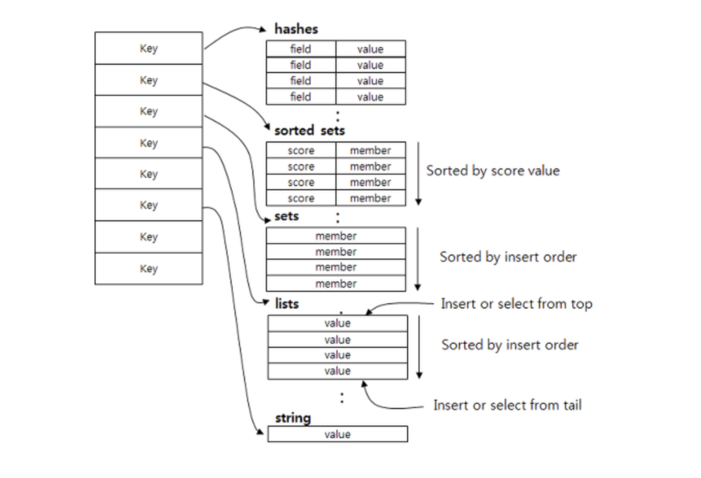

# Redis 101

> Redis에 대해 알아보아요
>
> Reference: [redis.io](https://redis.io/topics/introduction)

 

 

### Redis 란?

- In-Memory Data Structure Store
  - `Key-value` 기반의 In-Memory data 저장소
    - key-value 기반이기 때문에 따로 query를 할 필요없이 결과값을 가져올 수 있다
  - Disk가 아닌 `memory` 기반의 data 저장소
    - Disk에서 data를 쓰는 도구가 아니라, **memory**에서 data를 처리하기 때문에 속도가 상당히 **빠르다**
    - Memory에만 의존하지 않기 때문에 server가 **shutdown** 되더라도 정보가 유실되지 않는다
      - 중간에 **disk**에 저장하는 `snapshot` 방식을 사용하고,
      - 모든 **log**를 기록해 server가 재시작 할 때 **log**를 기준으로 data를 **복구**한다
- Open Source (BSD 3 Licencse)
  - 삼성전자, 네이버, 라인 등 여러 기업에서 사용되고있는 검증된 open source solution

 

### DataTypes

> Redis는 다양한 data type을 지원한다

- **Strings**
  - 가장 기본적인 Redis value
  - 단순한 `key-value` mapping 구조
- **Lists**
  - Array 형식의 data structure
  - List를 사용하면 맨 처음과 끝에 data를 넣고 빼는 것은 속도가 빠릦만, 중간에 data를 삽입할 때는 어려움이 있다
- **Sets**
  - 순서가 없는 String data 집합
  - 중복을 불허한다
    - 중복된 data를 하나로 처리한다
- **Sorted sets**
  - `Sets` 와 같은 구조이지만, **score**를 통해서 순서를 정할 수 있다
  - `Sorted sets`를 사용하면 **Learderboard**와 같은 기능을 쉽게 구현할 수 있다
- **Hashes**
  - `key-value` 구조를 여러개 가진 **object type**을 저장하기 좋은 구조

 

### Redis 사용 사례

#### 1. Caching

- `In-Memory data structure store`  이기 때문에 **cache**의 역할을 수행할 수 있다
- DB의 부하를 막아주는 역할을 한다

#### 2. Session 관리

- User의 정보관리 등 session으로서 `Redis`를 사용할 수 있다

#### 3. 실시간 순위표

- Redis의 `sorted set` data type을 이용하여 원하는 값으로 **자동 정렬된** 순위표를 구성할 수 있다

#### 4. 대기열

- Redis의 `list` type을 사용해서 대기열을 쉽게 구현할 수 있다

#### 5. 채팅

- 실제 채팅 서비스에서도 Redis를 많이 사용하고 있다
- 기본적으로 `PUB/SUB` 표준을 지원하기 때문에 **고성능 채팅방**, **서버 상호 통신** 등을 구현할 수 있다

