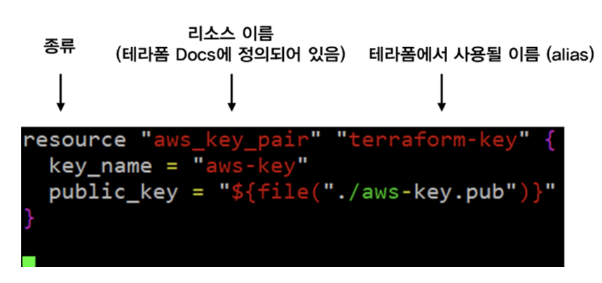

#  Introduction to Terraform

> Reference: [Terraform docs](https://www.terraform.io/intro/index.html), [blog.naver.com/alice_k106](https://blog.naver.com/PostView.nhn?blogId=alice_k106&logNo=221489260596&parentCategoryNo=&categoryNo=24&viewDate=&isShowPopularPosts=false&from=postView), [인프런] DevOps : Infrastructure as Code with Terraform and AWS 강좌 by 송주영님

<br>

<br>

## Before getting started

> 인프런 강좌를 듣고 추가한 내용

<br>

### IaC (Infrastructure as code)

- 인프라를 이루는 서버, 미들웨어, 서비스 등 인프라 구성요소들을 코드를 통해 구축하는 것
  - IaC는 코드로써의 장점
    - 작성용이성
      - 작성하는 것이 빨라진다!
    - 재사용성
    - 유지보수 등의 장점을 가진다

<br>

### Terraform by Hashicorp

> Terraform is a tool for building, changing, and versioning infrastructure safely and efficiently

- Terraform은 인프라를 만들고, 변경하고 기록하는 IaC를 위해 만들어진 도구로써
  - 문법이 쉬워 비교적 다루기 쉽고, 사용자가 매우 많아 참고할 수 있는 예제가 많다
- `.tf` 형식의 파일 확장자를 갖는다
- AWS, Azure, GCP 같은 Public Cloud 뿐만이 아닌 다양한 Provider를 지원한다

<br>

### Terraform 기본 구성 요소

- **provider**

  - Terraform으로 생성할 Infra의 종류

  - 보통 `provider.tf` 로 파일을 생성한다

  - ex)

    ```yaml
    provider "aws" {
    	region = "ap-northeast-2"
    	version = "~> 3.0"
    }
    ```

    - Provider 안에서 다양한 argument를 가진다
    - AWS resource를 다루기 위한 파일들을 다운로드하는 역할을 한다

<br>

- **resource**

  - Terraform으로 실제로 생성할 인프라 자원

  - 원하는 형태로 파일 이름을 사용한다

  -  ex)

    ```yaml
    resource "aws_vpc" "example" {
    	cidr_block = "10.0.0.0/16"  # cidr_block 외에도 수많은 인자가 존재한다
    }
    ```

    - Terraform으로 VPC를 생성하는 코드이다
    - VPC 역시 다양한 argument와 다른 구성요소가 존재한다

<br>

- **state**

  - Terrafrom을 통해 생성한 자원의 상태

    - 실제로 Terraform 코드를 실행한 결과물
    - `terraform.tfstate` 라는 파일명을 가짐
      - 실제로는 코드가 굉장히 길어질 수 있음

  - ex)

    ```yaml
    {
    	"version": 4,
    	"terraform_version": "0.12.24",
    	"serial": 3,
    	"lineage": "3c77xxxx-2de4-7736-1447-038974a3c187",
    	"outputs": {},
    	"resources": [
    		{...},
    		{...}
    	]
    }
    ```

    - Terraform의 state이다
      - 현재 인프라의 상태를 의미하는 것은 아님!!
        - Terraform 명령어를 사용해서 생성한 resource들의 결과물이고, 인프라의 실제 상태는 아님!!
          - 그래서 **state 파일**과 **현재 인프라의 상태**를 동일하게 유지하는 것이 중요하다!
    - state는 원격 저장소의 **backend**에 저장 될 수 있다
      - 현재 현업에서는 대부분 backend를 사용한다

<br>

- **output**

  - Terraform으로 만든 자원을 변수 형태로 state 파일에 저장하는 것

  - ex)

    ```yaml
    resource "aws_vpc" "default" {
    	cidr_block = "10.0.0.0/16"  # cidr_block 외에도 수많은 인자가 존재한다
    }
    
    output "vpc_id" {
    	value = aws_vpc.default.id
    }
    
    output "cidr_block" {
    	value = aws_vpc.default.cidr_block
    }
    ```

    - vpc id 나 cidr값을 참조해서 `vpc_id` 라는 변수를 **state** 파일로 저장하는 것
    - remote를 활용해서 재사용 할 수 있다

<br>

- **module**

  - 공통적으로 활용할 수 있는 code를 말그대로 module 형태로 정의하는 것

    - 재사용 하는데 강점이 있다

  - ex)

    ```yaml
    module "vpc" {
    	source = ":./_modulesvpc"
    	
    	cidr_block = "1.0.0.0/16"
    }
    ```

    - 한 번 만들어진 Terraform 코드로 같은 형태를 반복적으로 만들어낼 때 주로 사용

<br>

- **remote**

  - 다른 경로의 state를 참조하는 것

    - 원격 참조 개념
    - `output`  변수를 불러올 때 주로 사용

  - ex)

    ```yaml
    data "terraform_remote_state" "vpc"{
    	backend = "remote"
    	
    	config = {
    		bucket		= "terraform-s3-bucket"
    		region		= "ap-northeast-2"
    		key				= "terraform/vpc/terraform.tfstate"
    	}
    }
    ```

    - remote state 는  key 값에 명시한 **state** 에서 output을 통해 생성된 변수를 가져온다

<br>

### Terraform  기본 명령어

- **init**
  - Terraform 명령어 사용을 위한 각종 설정을 진행
- **plan**
  - Terraform으로 작성한 코드가 실제로 어떻게 만들어질지에 대한 예측 결과를 보여줌
- **apply**
  - Terraform 코드로 인프라를 생성하는 명령어
    - 실제 인프라에 영향을 끼치는 명령어이기때문에 주의깊게 실행해야함!
      - 그래서 `apply` 전에 꼭 `plan` 을 해야함!
- **import**
  - 이미 만들어진 자원을 Terraform state 파일로 옮겨주는 명령어
    - 이미 만들어진 자원을 code로 옮기고 싶을 때 사용
- **state**
  - Terraform state를 다루는 명령어
    - 하위 명령어로 mv, push 같은 명령어가 있음
- **destroy**
  - 생성된 자원들을 state 파일 기준으로 모두 삭제하는 방법

<br>

<br>

## What is Terraform?

> Terraform docs와 블로그를 참고하여 정리한 내용

<br>

- Infrastructure를 안전하고 효율적으로 **빌드**, **수정**하고 **versioning** 할 수 있는 tool
- Terraform이 `Ansible` 이나 `Chef` 와 비슷하다고 생각할 수 있으나, Terraform은 **특정 Cloud 환경** 에 초점이 맞춰져 있다는 것이 다르다
  - `Ansible` 은 일반 서버, 가상 머신, 심지어 라즈베리파이에서도 SSH를 통해 **동일한 환경** 을 배포할 수 있는 반면,
  - `Terraform` 은 AWS, GCP 등의 Cloud platform 위에서 환경을 배포할 때 주로 사용한다
    - Code 로서 Infra를 정의한다는 개념 자체는 `Ansible` 과 같은 환경 배포 tool과 동일하며,
    - 일반 **Bare Metal Server** 가 아닌 특정 **Cloud Platform** 에 맞는 환경을 code로서 배포한다는 점이 다르다

<br>

### Code로서 Infra를 정의하기 & 재현 가능한 Infra

- 테라폼의 웹페이지에서 강조하는 것이 
  - **Infrastructure as a Code (코드로서 인프라를 정의하기)**
  - **Reproducible Infrastructure (재현 가능한 인프라)** 이다
- AWS든, GCP든, Azure든 Cloud Infra 환경을 코드로서 정의해 사용함으로써 **동일한 인프라**를 재현할 수 있다는 뜻이다
  - 동일 클라우드 내에서!

- 클라우드 인프라를 코드로 명시적으로 정의하니 수십번을 실행해도 **동일한 환경**이 생성될것이다.

<br>

### Terraform 도입 시  workflow

- 미리 준비한  Terraform template들을 사용하면 원하는 환경을 cloud에 배포할 수 있다
  - 예를들어 VPC는 `vpc.tf` 라는 파일에, EC2 instance는 `instance.tf` 파일에, subnet은 `subnet.tf` 파일에 저장한 뒤 **Terraform** 을 실행시키기만 하면 동일한 환경을 cloud에서 완벽하게 재현할 수 있다
  - 이러한 cloud 환경 설정은 사람이 직접 일일이 작업하는 것이 아니라, **HCL (Hashicorp Configuration Language)** 라는 언어로 작성된 코드를 Terraform에 입력함으로써 구성된다
- 모든 cloud 설정은 code에 의해 명시적으로 작성되기 때문에 cloud infra를  **동일하게 배포**하는 것이 가능해진다
- 다양한 요구사항에 맞도록 여러 version의 code를 작성해 cloud infra의 **revision** 을 관리할 수도 있다
  - 미리 준비해둔 Terrafrom 설정 파일을 Terraform에서 사용하기만 하면 복잡한 AWS cloud 환경을 한꺼번에 생서앟고 한꺼번에 삭제할 수도 있다


<br>

<br>

## Terraform Quickstart

<br>

### 0. Terraform 파일의 구성

- Terraform 파일인 `.tf` 파일은 일반적으로 아래와 같이 구성된다



- **resource**
  - Terraform 파일에서 사용되는 object 종류
    - 변수를 나타내는 `resource`
    - Data를 나타내는 `data` 등이 있다
- **aws_key_par**
  - AWS의 SSH key pair를 위한 resource 이름
    - AWS에서 사용되는 object를 terraform에서 부르는 이름
    - 이러한 이름들은 Terraform 공식 docs 에 정리되어 있다
- **terraform-key**
  - Terraform 파일에서 이 object를 고유하게 식별하게 될 이름
    - 가능하면 모든 파일 내에서 고유한 이름을 사용하는 것이 좋다

<br>

### 1. tf init

- terraform project의 root에서 실행한다

- Terraform을 사용하기 위해서는 Terraform **초기화** 작업이 필요하다

  - **terraform init** 명령어를 사용해 terraform directory를 초기화한다

- 사용하는 경우

  1. 처음 프로젝트를 시작한 경우
  2. `module` 이 변경된 경우

- ex)

  ```bash
  ~/workspace/monocoque/dev-musinsa-main master* ⇣ 17s
  ❯ tf init        
  Initializing modules...
  
  Initializing the backend...
  
  Initializing provider plugins...
  
  Terraform has been successfully initialized!
  
  You may now begin working with Terraform. Try running "terraform plan" to see
  any changes that are required for your infrastructure. All Terraform commands
  should now work.
  
  If you ever set or change modules or backend configuration for Terraform,
  rerun this command to reinitialize your working directory. If you forget, other
  commands will detect it and remind you to do so if necessary.
  ```

<br>

### 2. tf workspace

- 마찬가지로 해당 프로젝트의 root 경로에서 실행한다

- Commands

  - `tf workspace list`

    - workspace 목록 보기

      ex)

      ```bash
      ~/workspace/monocoque/dev-musinsa-main master* ⇣
      ❯ tf workspace list
      * default
        main
      ```

  - `tf workspace select main`

    - workspace 선택하기

      ex)

      ```bash
      ~/workspace/monocoque/dev-musinsa-main master* ⇣
      ❯ tf workspace select main
      Switched to workspace "main".
      ```

<br>

### 3. tf plan

- 마찬가지로 해당 프로젝트의 root 경로에서 실행한다

- Terraform project directory 내의 모든 `.tf` 파일의 내용을 실제로 적용 가능한지 **확인**하는 작업을 계획 이라고 한다

- **terraform plan** 명령어를 실행하면

  - 어떤 resource가 생성되고
  - 수정되고
  - 삭제될지 계획을 보여준다

- ex)

  ```bash
      ~/workspace/monocoque/dev-musinsa-main master*
      ❯ tf plan
      Refreshing Terraform state in-memory prior to plan...
      The refreshed state will be used to calculate this plan, but will not be
      persisted to local or remote state storage.
  
  		...
      
      Plan: 6 to add, 0 to change, 0 to destroy.
  
      ------------------------------------------------------------------------
  
      Note: You didn't specify an "-out" parameter to save this plan, so Terraform
      can't guarantee that exactly these actions will be performed if
      "terraform apply" is subsequently run.
  ```
  
- 실행 결과를 보고, 계획한 대로 생성되는 지 확인한다

<br>

### tf apply

- 마찬가지로 프로젝트 root 경로에서 실행한다
- Terraform project directory 내의 모든 `.tf` 파일의 내용대로 resource를 **생성**, **수정**, **삭제** 하는일을 **적용**이라고 한다
- 이 명령어를 실행하기 전에 변경 예정 사항은 위의 **plan** 명령어를 사용해 확인할 수 있다