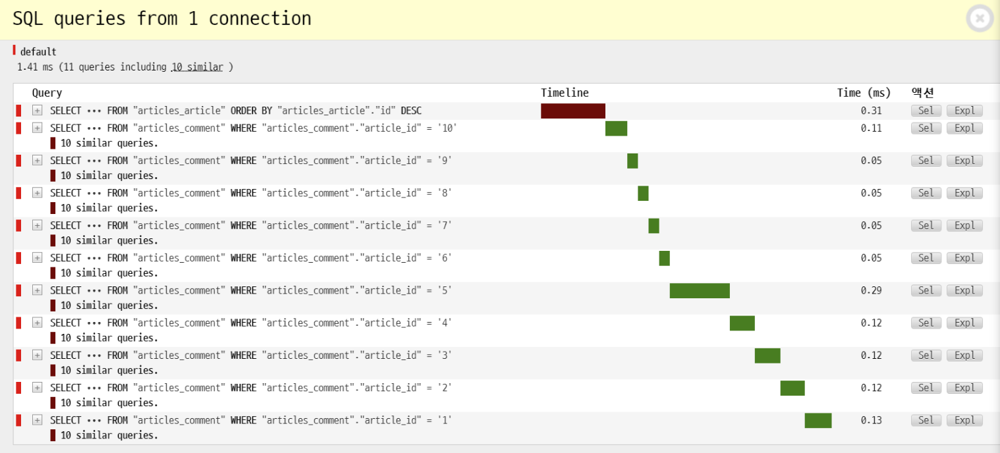
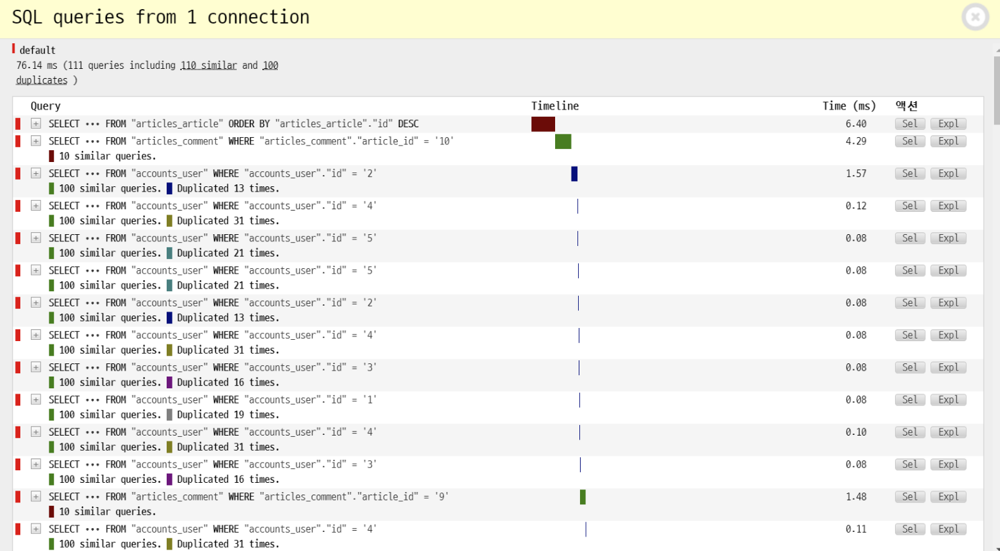

# Optimization

<br>

<br>

### SQL문 실행

- Iteration
- Slicing
  - 기본적으론 x
  - step을 활용할 때에만
    - [3:10:2]
- repr
- len
- bool

<br>

<br>

## Query 개선

<br>

### 필수 라이브러리 : [ django debug toolbar](https://django-debug-toolbar.readthedocs.io/en/latest/installation.html)

#### installation

```bash
$ pip install django-deug-toolbar
```

<br>

#### Prerequisites

> `settings.py`

```python
INSTALLED_APPS = [
    ...
    'debug_toolbar',
]
```

<br>

#### Setting up URLconf

> `urls.py` in the root directory

```python
from django.contrib import admin
from django.urls import path, include
from django.conf import settings
from django.conf.urls.static import static

if settings.DEBUG:
    import debug_toobar
    urlpatterns = [
        path('__debug__/', include(debug_toobar.urls)),
        path('admin/', admin.site.urls),
        path('posts/', include('posts.urls')),
        path('accounts/', include('accounts.urls')),
    ] + static(settings.MEDIA_URL, document_root=settings.MEDIA_ROOT)
```

<br>

#### Enabling middleware

> `settings.py`

```python
MIDDLEWARE = [
	...
    'debug_toolbar.middleware.DebugToolbarMiddleware',
    ...
]
```

<br>

#### Configuring Internal IPs

> `settings.py`

```python
INTERNAL_IPS = [
    ...
    '127.0.0.1',
    ...
]
```

<br>

<br>

### 0. 관련 문서

- #### 데이터베이스 최적화 

  : https://docs.djangoproject.com/en/3.0/topics/db/optimization/

  - QuerySet 실행에 관한 이해 : https://docs.djangoproject.com/en/3.0/topics/db/optimization/#understand-queryset-evaluation

    - lazy하여, evaluated 되는 시점에 실행되며, cache를 활용할 수 있음. (각각 문서 확인할 것)

  - #### `count` , `exists`

    - https://docs.djangoproject.com/en/3.0/topics/db/optimization/#don-t-overuse-count-and-exists
    - 일반적으로 활용하는 것이 좋으나, 예시의 코드의 상황에서는 cache된 값을 바탕으로 length를 구하는 방식으로 풀어나갈 수 있음

  - #### `select_related` 

    : https://docs.djangoproject.com/en/3.0/ref/models/querysets/#django.db.models.query.QuerySet.select_related

  - #### `prefetch_related` 

    : https://docs.djangoproject.com/en/3.0/ref/models/querysets/#prefetch-related

<br>

<br>

### 1. 댓글 수 출력 - `annotate()` 활용

> N+1 problem

<br>

#### 개선 전 (11번)

```python
# views.py
posts = Post.objects.order_by('-pk')
```

```html
<p>댓글 수 : {{ aritcle.comment_set.count }}</p>
```

<br>



<br>

#### 개선 후 (1번)

```python
# views.py
Post.objects.annotate(comment_set_count=Count('comment')).order_by('-pk')
```

```html
<!-- 주의! comment_set_count로 호출 -->
<p>댓글 수 : {{ post.comment_set_count }}</p>
```

<br>


<br>

<br>

### 2. 게시글 작성자 이름 출력 - `selected_related()` 활용

> `select_related`는 SQL JOIN을 통해 데이터를 가져온다
>
> 1:1, 1:N 관계에서 참조관계 (N -> 1, foreignkey가 정의되어 있는 곳)

<br>

#### 개선 전 (11번)

```python
# views.py
posts = Post.objects.order_by('-pk')
```

```html
<h3>{{ article.user.username }}</h3>
```

<br>


<br>

#### 개선 후 (1번)

```python
# views.py
Post.objects.select_related('user').order_by('-pk')
```

```html
<!-- 변경 없음 -->
<h3>{{ article.user.username }}</h3>
```

<br>


<br>

<br>

### 3. 게시글마다 댓글들 출력 - `prefetch_related()` 활용

> `prefetch_related`는 python을 통한 join으로 데이터를 가져온다
>
> M:N, 1:N 관계에서 역참조 관계 (1->N)

<br>

#### 개선 전 (11번)

```python
# views.py
posts = Post.objects.order_by('-pk')
```

```html

	<p>{{ comment.content }}</p>

```

<br>


<br>

#### 개선 후 (2번)

```python
posts = Post.objects.prefetch_related('comment_set').order_by('-pk')
```

```html
<!-- 변경 없음 -->

	<p>{{ comment.content }}</p>

```

<br>


<br>

<br>

### 4. 게시글마다 작성자 이름과 댓글들 출력

<br>

#### 개선 전 (111번)

```python
# views.py
posts = Post.objects.order_by('-pk')
```

```html

	<p>{{ comment.user.username }} : {{ comment.content }}</p>

```

<br>



<br>

#### 개선 후 (2번)

```python
# views.py
from django.db.models import Prefetch

posts = Post.objects.prefetch_related(
    	Prefetch('comment_set'),
		queryset=Comment.objects.select_related('user')
	).order_by('-pk')
```

```html

	<p>{{ comment.user.username }} : {{ comment.content }}</p>

```

<br>


<br>

<br>

## SQL Join

<br>


<br>

ex)

```mysql
-- 게시글(A) + 댓글(B)
SELECT * FROM article
LEFT OUTER JOIN comment
ON article.id = comment.article_id;

-- 게시글(A) + 사용자
SELECT * FROM article
INNER JOIN user
ON article.user_id = user.id;
```


<br>

<br>

`+`

## Gravata 활용하여 profile photo 설정하기

https://en.gravatar.com/site/implement/

<br>

### 방법 1) @property 설정

> accounts > models.py

```python
from django.db import models
from django.conf import settings
from django.contrib.auth.models import AbstractUser
import hashlib

# Create your models here.
# model은 필요없다! Django package에 있는 User를 사용할 것이기 때문!

# 사용자 정의 모델 만들기
class User(AbstractUser):
    followers = models.ManyToManyField(
        settings.AUTH_USER_MODEL,
        related_name = 'followings'
    )

    @property
    def gravatar_url(self):
        return f"https://s.gravatar.com/avatar/{hashlib.md5(self.email.encode('utf-8').strip().lower()).hexdigest()}?s=50&d=mp"
```

<br>

### 방법 2) templatetags 만들기

> accounts > templatetags > gravatar.py

```python
import hashlib
from django import template
from django.template.defaultfilters import stringfilter

register = template.Library()

@register.filter
@stringfilter
def profile_url(email):
    return f"https://s.gravatar.com/avatar/{hashlib.md5(email.encode('utf-8').strip().lower()).hexdigest()}?s=50&d=mp"
```

- `templatetags` directory 안에 `___init__.py` 만들어야 함!

<br>

<br>

### Templates

> templates > _nav.html

```html


...
<!--방법 1-->                  


<!--방법 2-->

          
...          
```

