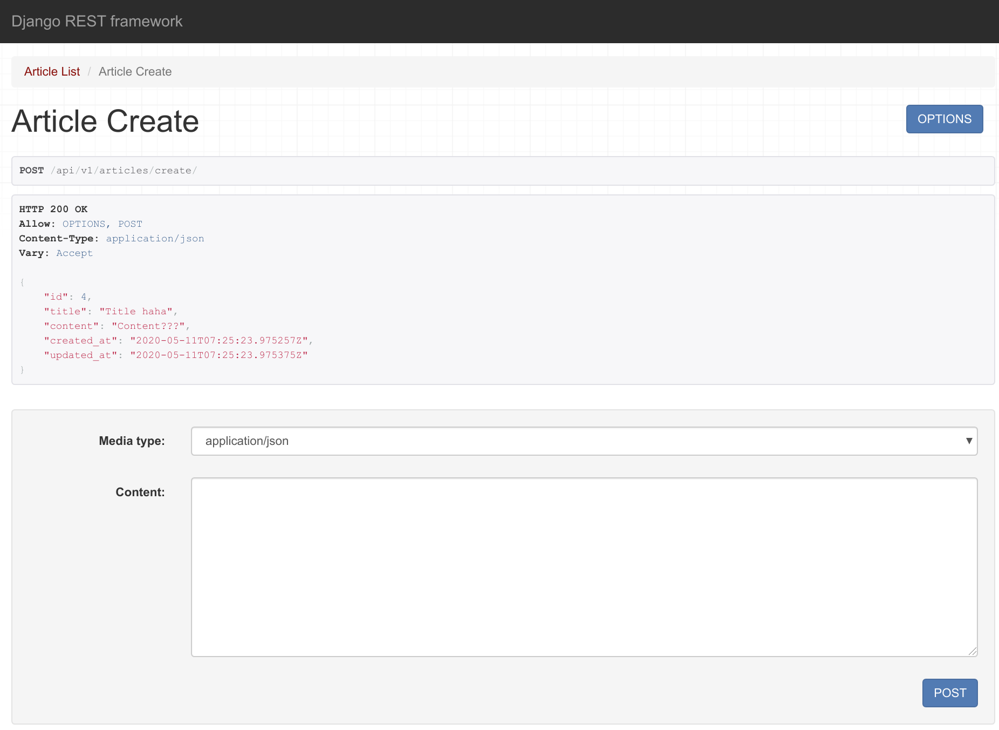
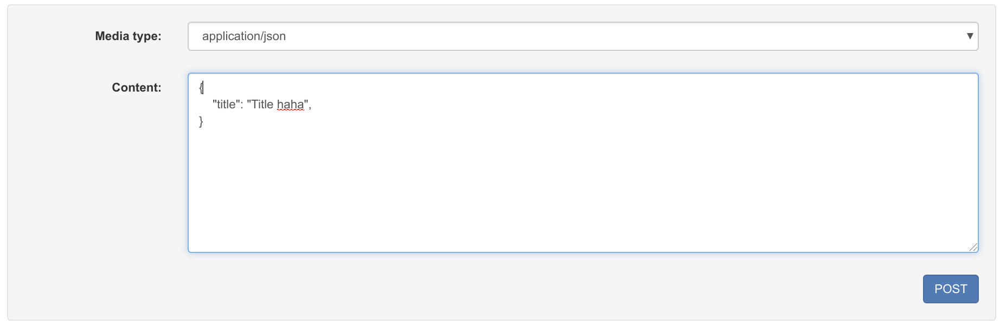

# Django REST Framework 

<br>

<br>

### MVT란?

Model: 데이터 구조화

View: 데이터가 흘러다니는 곳

Template: 데이터를 표시하는 곳

<br>

### API 란?

- Application Programming Interface
  - 개발자용 접점
    - 개발자는 **Data**만 필요함!

<br>

### Request

: 요청은 URL로 보낸다!

<br>

### Data의 표기법

: 약속

<br>

- JSON
  - JavaScript Object Notation
  - Javascript 객체식 **표기법**
- XML
  - eXtended Markup Language (W3C, 1996)

<br>

### Why not HTML?

: key값이 반영이 안 됨!

- 그래서 등장한 것이 `tag`를 내맘대로 정의할 수 있는 **XML**

<br>

### Why JSON

- XML이 닫는 tag 때문에 길이가 길다
  - 돈

<br>

### 우리가 할 일

: *Django 에서 JSON 형식에 맞춰서 Data만 제공한다!*

<br>

### JSON ... 그리고 나서는?


<br>

### Javscript & framewokr를 분리하는 이유

1. 좋은 유저 경험을 위해서

   - UX 안 좋으면 -> User X -> 돈 X

   - data -> 인간이 뭘 좋아할까?
   - 모바일 어플리케이션 (웹)
   - **churn (이탈율)**
   - JS 필수 (Adobe Flash)

2. 분리되어 있는 것이 편해서 

<br>

<br>

### Django 다시 깔기

```bash
$ pip uninstall django

$ pip install django==2.1.15
```

<br>

<br>

## Faker 사용하기

<br>

### faker 설치

```bash
$ pip install faker
```

<br>

### Dummy data 만들기

```shell
In [1]: from faker import Faker                                                                                     

In [2]: f = Faker()                                                                                                 

In [3]: f.text()                                                                                                    
Out[3]: 'Soldier live various argue many expect important once. Next possible whom I.\nSome national left wall score few else always. Action less culture spring any night.'

In [4]: f.name()                                                                                                    
Out[4]: 'Jenna Davis'

In [5]: f.paragraph()                                                                                               
Out[5]: 'Improve knowledge hot matter himself. Growth water act bill to can discuss there. Follow out person vote action someone.'

In [6]: f.paragraph(4)                                                                                              
Out[6]: 'Early program four bill. Comput
```

<br>

<br>

## RESTful API

> https://meetup.toast.com/posts/92 참고하기

: url을 깔끔하게 정리하는 방식 (공통의 rule / 약속)

<br>

### RESTful

1. HTTP verb (GET, POST)
2. 명사 (복수형)로 구정


<br>

### 규칙들

- 동사 URL에 집어 넣지마!  -> `HTTP method` 활용해
  - C (POST)
    - `(POST) / articles /`
  - R (GET)
    - index (모든 정보) - `(GET) / articles /`
    - detail (하나의 정보) - `(GET) / articles / <id>`
  - U (PUT/PATCH) 
    - `(PUT) / articles / <id>`
  - D (DELETE)
    - `(DELETE) / articles / <id>`
- 목적어만 URL에 집어 넣어 -> 복수형으로
  - Data 

<br>

<br>

### API 관련 URL

1. subdomain
   - ex)
     - lab.ssafy.com
     - api.gitbub.com
2. 분리 URL /api/
   - ssafy.com/api/lectures/
   - github.com/api/repos/

3. versionning
   - ssafy.com/api/v1/lectures/
   - POST /api/articles/1/like/
   - POST /api/articles/1/comments/like/

<br>

<br>

## Django REST Framework (DRF)

> djangorestframework 설치

```bash
$ pip install djangorestframework
```

<br>

> 설치되어 있는지 확인

```bash
$ pip show djangorestframework
Name: djangorestframework
Version: 3.11.0
Summary: Web APIs for Django, made easy.
Home-page: https://www.django-rest-framework.org/
Author: Tom Christie
Author-email: tom@tomchristie.com
License: BSD
Location: /home/chloe/.local/lib/python3.6/site-packages
Requires: django
Required-by: drf-serializer-cache
```


<br>

## Serialize (직렬화)

> 포맷의 변환 (데이터를 전송/이동)

<br>

dict -> JSON (**stringify**, `serialize`)

JSON -> dict (**parse**, `deserialize`)

<br>

### 직렬화  

### : Object(언어, database) -> String (JSON)

<br>

<br>


### CREATE



<br>

<br>

### `raise_exception`으로 Error 예쁘게 출력하기

ex)

```python
@api_view(['POST'])
def article_create(request):
    # 글을 생성
    serializer = ArticleSerializer(data=request.data)
    if serializer.is_valid(raise_exception=True):
        serializer.save()
    return Response(serializer.data)
```

<br>

> 하나만 보냄



<br>

> 에러메시지


<br>

<br>

### DRF yasg 설치하기

> https://drf-yasg.readthedocs.io/en/stable/readme.html

```bash
$ pip install drf-yasg
```

