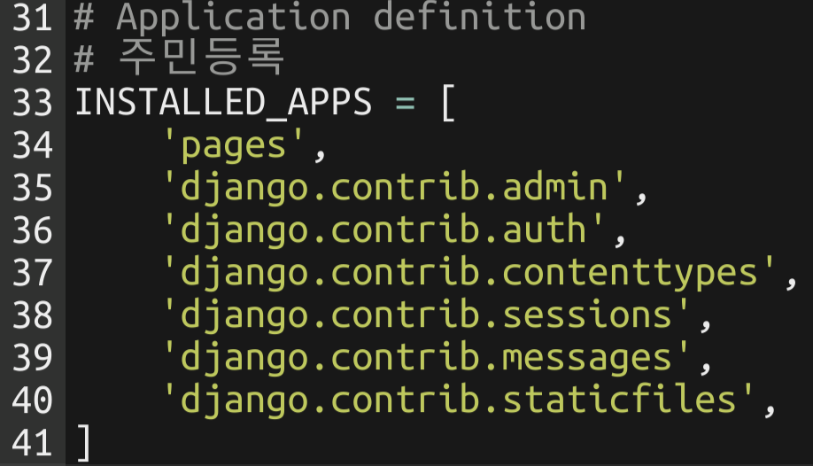
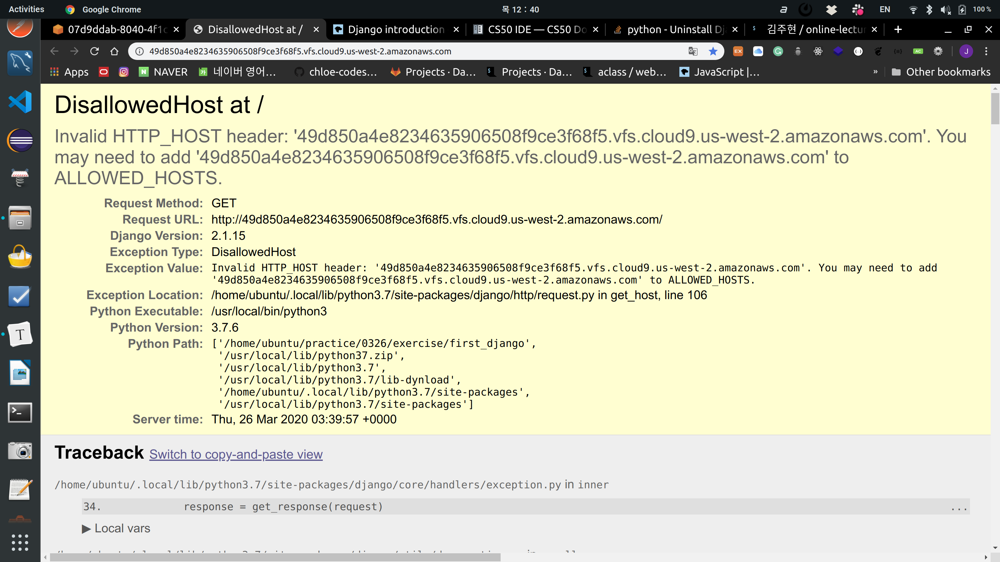

# Intro to Django

> https://developer.mozilla.org/en-US/docs/Learn/Server-side/Django/Introduction

<br>

<br>

### What is django?

: Python web framework

- High-level Python web framework that enables rapid development of **secure** and **maintainable** websites
- Free & open source

<br>

#### web framework

- web page 개발하는 과정에서 겪는  어려움을 줄이는 것이 목적

- 응용 프로그램의 표준 구조 를 구현하는 class와 library의 목록

<br>

#### Why do we have to learn django?

1. `Portable`
   - Python based which means it  runs on may platform
2. `Complete`
   - **Django** follows the *"Batteries included"* philosophy
     - Everything you need is part of the one *"product"*
     - Works seamlessly together
     - Follows consistent design principles
     - Has extensive and [up-to-date documentation](https://docs.djangoproject.com/en/stable/).
3. `Versatile`
   - Can be used to build almost any type of website
     - Can work with any **client-side** framework
     - Can deliver content in almost any format (including HTML, RSS feeds, JSON, XML, etc)
4. `Secure`
   - Provides a secure way to manage user accounts & passwords
     - By avoiding common mistakes like putting session information in cookies where it is vulnerable
       - Instead cookies just contain a key
       - And the actual data is stored in the db
     - By avoiding directly store passwords rather than **password hash**
5. `Scalable`
   - Uses a component-based *"shared-nothing"* architecture
     - each part of the architecture is independent of the others
     - can be replaced or changed if needed
   - Can scale for increase traffic by adding hardware at any level
     - caching servers
     - database servers
     - application servers
6. `Maintainable`
   - Follows DRY (Don't Repeat Yourself) principle
     - No unnecessary duplication
   - Promotes the grouping of related functionality into reusable
7. 많은 기업에서 활용중
   - Spotify
   - Instagram
   - Dropbox
   - Delivery Hero
   - etc.

<br>

<br>

#### 우리가 알고 있는 web 의 protocol

- 요청 (request)
- 응답 (response)

<br>

<br>

### django 는 어떻게 (how) 동작하는가?

- django는 **MVC (Model View Controller) pattern** 을 따르고 있다.

  - MVC: Software design pattern 중 하나

    | MVC Pattern |  django  |
    | :---------: | :------: |
    |    Model    |  Model   |
    |    View     | Template |
    | Controller  |   View   |

- **MTV**

  - **M**: 데이터 관리
  - **T**: 인터페이스 (화면)
  - **V**: 중간 관리 (상호 동작)


<br>

<br>

### Run django on CS 50 IDE

<br>

#### CS 50 IDE

: CS50 IDE is a **cloud-based** Integrated Development Environment powered by [**AWS Cloud9**](https://aws.amazon.com/cloud9/) that features a cloud-based Ubuntu environment, a browser-based editor that supports syntax highlighting and word completion, a GUI-based GDB debugging, themes, customizable layouts, keyboard shortcuts, and many more features. Since it’s cloud-based, you can continue working on your problem sets even if you use a different computer!

<br>

#### AWS Cloud 9

> Cloud 기반 IDE (통합 개발 환경)

- OS: Ubuntu 18.04.4 LTS
  - python 3.7.6
- 개발 local 환경에 영향이 없다는 장점이 있음

<br>


<br>

#### django 설치

```shell
$ pip install django==2.1.15
```

- 2.1.15 로 다운받기

<br>

#### django uninstall

```shell
$ pip uninstall django
```

<br>

#### 프로젝트 생성

```shell
$ django-admin startproject {프로젝트 명}
```

<br>

#### 서버 실행

-  settings.py 28 번째 줄 수정하기

```python
ALLOWED_HOSTS = ['*']
```

<br>


- 서버 실행 시 반드시 명령어가 실행되는 directory를 확인 할 것

```shell
$ cd djanggo_intro/
$ ls
$ python manage.py runserver 8080
```

- 실행된 서버는 우측 영역의 url을 click한다

  

- 서버 종료는 terminal에서 `ctrl + c`

<br>

> 서버 실행 된 화면


<br>

<br>

#### app 만들기

```shell
$ python manage.py startapp pages
```

<br>

<br>


<br>

#### Project 시작하기

```shell
$ django-admin startproject first_django
```

- `project` 는 django의 *atomic* 한 단위!

<br>

#### 생성된 project folder 구조

<br>


<br>

#### Pages 만들기

```shell
$ python manage.py startapp pages
```


#### Git

```shell
$ git init
$ ls -al
$ rm -rf .git
```


#### `INSTALLED_APPS`  

: 주민등록 



- 주민등록을 위해 `pages` 추가함

<br>


#### Server 가동

```shell
$ python manage.py runserver 8080
```

<br>




<br>

#### Port 번호 확인

```shell
$ echo $PORT
8080
```

- 80번과 8080으로 연결되어 있는 것 확인 가능

<br>

#### IP 확인

```shell
$ echo $IP
127.0.0.1
```

<br>


*django는 `DEBUG=True` 가 default*

<br>

<br>

### urls.py

> 문지기

```python
from django.contrib import admin
from django.urls import path

urlpatterns = [
    path('요청 URL/', handling 할 view(controller) 함수)
    path('admin/', admin.site.urls),
]
```

- `path('요청 URL/', handling 할 view(controller) 함수)`
  - url 끝에 `/` 가 붙는게 django의 특징!


<br>

### pages/views.py

```python
from django.shortcuts import render

# Create your views here.

def hello():
    return render(request,'HTML file name')
```

- hello() 가 불릴 때마다 함수를 부른 객체가 첫번째 인자로 들어감
  - view에서 함수를 정의하는 경우 항상 첫번째 인자를 `request`로 정의한다!

```python
def lotto(request):
    import random
    pick = random.sample(range(1,46),6)
    context = {'pick':pick}
    return render(request, 'lotto.html', context)
```

- 첫 번째 인자 - `request`
- 두 번째 인자 - 파일 명
- 세 번째 인자 - context
  - context는 항상 **dictionary** 로 해야함!

<br>

### pages/templates folder 만들기

- 이름이 꼭 `templates` 여야 한다

<br>

#### 돌고있는 python 파일 죽이기

```shell
$ killall python
$ killall python3
```


<br>

<br>

## Wrap-up

<br>

### App 생성

- django는 여러개의 앱을 가진 하나의 project로 구성된다
  - ex) 커뮤니티를 만든다
    - 회원과 관련된 app - `accounts`
    - 게시글과 관련된 app - `posts`

```shell
$ python manage.py startapp {app 이름}
```

- app을 생성하고 반드시 `settings.py`의 `INSTALLED_APPS`에 등록한다

  ```python
  INSTALLED_APS = [
      ...
      'pages',
  ]
  ```

  

<br>

<br>

### 기본 흐름

<br>

#### 1. URL 지정

- `url.py`

  ```python
  # django_intro/urls.py
  from pages import views
  
  urlpatters = [
      path('lotto/', views.lotto),
  ]
  ```

  - path 에 url은 항상 `/` 로 닫아준다

  <br>

#### 2. view 지정

- `views.py`

  ```python
  # pages/views.py
  
  import random
  def lotto(request):
      pick = random.sample(range(1,46),6)
      context = {
          'pick': pick
      }
      return render(request, 'lotto.html', context)
  ```

- 함수를 정의할 때, 항상 첫번 째 인자는 `request`로 작성해둔다

  - why? 내부적으로 요청을 처리 할 때, 함수 호출 시 요청 정보가 담긴 객체를 보내줘야 해서

- `render` 함수를 통해서 반환한다

  - 첫번째 인자: `reqeust`
  - 두 번째 인자: template file (`html`)
  - 세번째 인자
    -  dictionary type
    - template에서 활용 하려고 하는 값들을 전달

<br>

#### 3. `templates` 파일 생성

- 반환할 `html` file은 항상 `templates` folder 안에 생성한다

  ```html
  <!-- pages/templates/lotto.html -->
  <p>
      {{pick}}
  </p>
  ```

  - context dictionary의 key 값을 적으면 출력된다

<br>