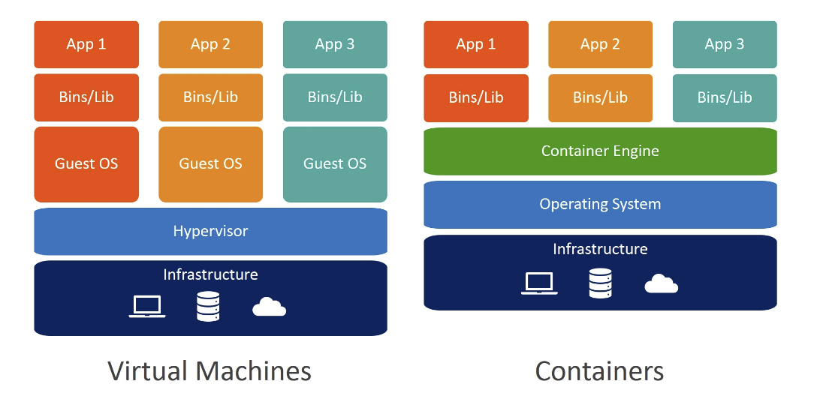
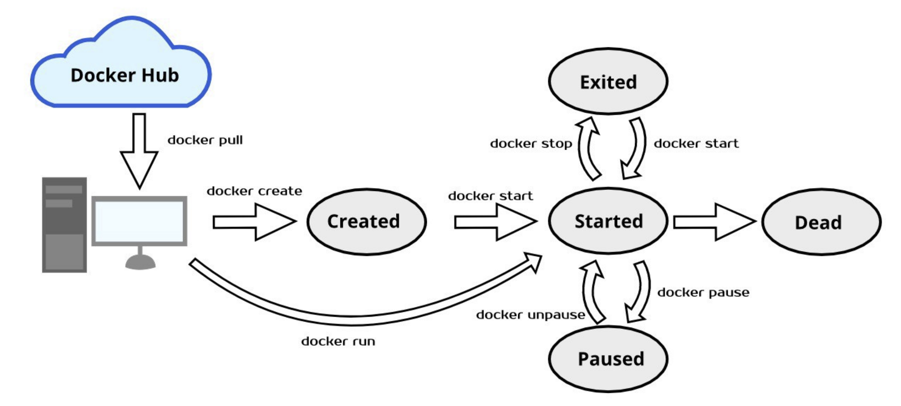

# Getting Started with Docker

> Docker 정복한다!!!!!!!
>
> References: [책] 트러블 슈팅 도커

<br>

## Container and Docker

- Docker는 엄청난 관심을 받고있는 Open source project
- Application을 `경량 컨테이너`로 packaging 해서 **배포** 하고 **구동**하는 기능을 제공한다
- **Docker Container**는 실제 화물 선박에서 사용하는 컨테이너처럼 application을 **일관성** 있게 표준화된 형태로 전달하는 기능을 제공한다!

<br>

### Container 란?



- Container는 application아을 **캡슐화**해 **독립적인 운영 환경**을 제공하는 기술
  - Virtual Machine의 대안으로 사용할 수 있다!
- Container는 Linux Kernel의 격리 기능에 대한 **User Space Interface** 인 **Linux Container**를 기반으로 만든 것!
  - 여기에 강력한 API와 간결한 도구를 제공함으로써 Linux 사용자가 application을 container로 만들어 관리 할 수 있다
- Container는 Host machine에서 구동하는 OS들이 Linux kernel을 서로 공유한다는 점에서 기존 `Hypervisor`와 다르다!
  - **Hypervisor** 란?
    - Virtual Machine을 생성하고 구동하는 소프트웨어
  - 즉, 다시 말해 같은 머신에서 여러 컨테이너를 구동해도 사용하는 Kernel은 모두 같다
    - 그래서 VM보다 **속도가 빠르고**, **성능 오버헤드**도 거의 없다!

<br>

### OS Container

- OS Container는 VM과 비슷하다
  - but, Host Machine OS의 **Kernel을 공유**하면서 **유저 스페이스 격리 기능**을 제공한다는 점이 다르다
- VM과 마찬가지로 Container에 **전용 리소스**를 할당할 수 있고, application과 library 등을 설치, 설정 및 구동 할 수 있다
- OS Container는 **확장성 테스트**를 할 때 유용하다!
  - 다양한 배포판으로 구성된 여러 컨테이너를 쉽게 배포할 수 있는데 VM보다 훨씬 **가볍다**
- Container는 구조와 내용물을 정의한 **이미지**나 **템플릿**을 통해 생성한다
  - 그래서 개발 환경을 구축할 때 다른 Container와 동일한 실행 환경과 버전, 패키지 환경을 갖추도록 구성하기가 쉽다!
- 현재 다양한 컨테이너 기술이 나와 있는데, 그 중 OS Container로 적합한 것은 `LXC`, `OpenVZ`, `Docker`, `BSD Jain` 등이 있다

<br>

### Application Container

- **OS Container**는 여러 개의 process 로 구성했다면, **Application Container**는 하나의 서비스를 package로 만들어서 구동한다
  - Appllication container는 하나의 process만 구동한다
    - 이 때 구동되는 process는 aaplication process로서 **OS Container** 가 하나의 OS 위에 여러 개의 서비스를 구동하는 방식과 대조적이다!
- Docker container는 계층 (layer) 방식을 사용하는데, 이를 통해 **중복을 최소화**하고 **재사용성**을 높일 수 있다
  - 즉, 모든 구성 요소에서 공통적으로 사용하는 `base image`에 대한 container를 먼저 구동하고,
  - 그 위에 원하는 요소를 파일 시스템에 별도의 layer로 추가하는 방식으로 구성한다
- Layer 기반 파일 시스템을 사용하면 원하는 시점에 언제든지 예전 레이어로 쉽게 되돌아갈 수 있다!
- **Dockerfile**에 명시된 `RUN`  명령이 실행될 때마다 container에 layer가 새로 생성된다
- Application Container의 주 목적으로는 application을 구성하는 다양한 컴포넌트들을 **별도의 컨테이너 형태의 패키지**로 만드는 데 있다
  - 이렇게 container 단위로 묶인 application의 구성 요소들은 API나 서비스를 통해 상호작용하는 방식으로 application을 구동한다
    - 이러한 **분산 멀티 컴포넌트 시스템** 형태의 배포 방식은 `마이크로서비스 아키텍처` 구현의 핵심이다!
      - 이렇게 하면
        - 개발자는 자신이 원하는 형태로 application을 container 형태의 package로 만들고,
        - 이를 수평적으로나 수직적으로 확장하기 위해 다양한 platform에 container를 배포하는 작업은 IT팀이 전담하게 할 수 있다

<br>

<br>

### OS Container vs Application Container

| OS Container                             | Application  Container                  |
| :--------------------------------------- | --------------------------------------- |
| 하나의 OS Container에 여러 서비스를 구동 | 하나의 Container에 하나의 서비스를 구동 |
| 레이어드 파일 시스템을 사용하지 않음     | 레이어드 파일 시스템 기반               |
| ex) LXC, OpenVZ, BSD 재일                | ex) Docker, 로켓                        |

<br>

<br>

### Docker 자세히 알아보기

- 도커는 다양한 Linux Kernel 기능을 파일시스템과 엮어서 image를 **module** 방식으로 구성한다
- 구성한 image를 통해
  - application 가상 환경을 마음껏 설정할 수 있으며,
  - **WORA (Write-Once-Run-Anywhere)** 원칙을 실현할 수 있다
- Application을 하나의 process 를 구동하는 수준으로 간략하게 만들 수 있으므로
- 여러 process가 협업하는 **분산 시스템**을 쉽게 구축할 수 있으며,
- 높은 **확장성**도 지원할 수 있다
- 도커는 application 개발에 있어서 중요한 네 가지 특징을 제공한다
  1. 자율성 (autonomy)
  2. 분산화 (decentralization)
  3. 병렬성 (parallelism)
  4. 격리성 (isolation)

- 도커 컨테이너는 개발 머신이나 베어메탈 서버, 가상 머신, 데이터센터 등 어디서나 자신과 똑같은 동작을 재현할 수 있다
  - Application 설계자의 입장에서 운영에 관한 사항은 모두 **DevOps**팀에 맡기고, 온전히 개발에만 집중할 수 있다..!
    - 이로 인해 팀의 workflow를 모듈화 할 수 있어서 생산성과 효율성을 높일 수 있다

<br>

#### Docker와 VM

- Docker는 OS를 공유하는 방식으로 Container에서 구동하는 application 수준의 격리와 보안 기능을 제공한다
  - 이처럼 OS 계층을 완벽히 **추상화**해 강력한 **격리**와 **보안 기능**을 제공함에도 불구하고 Docker의 리소스 사용량은 VM에 비해 상당히 적어서 성능과 효율이 뛰어나다!

<br>

<br>

### Benefits of Docker

Microservice Architecture에서 Docker Container를 사용하면 다음과 같은 장점이 있다

- **빠른 application 배포**
  - Container는 application에 관련된 부분만 담고 있어서 크기가 작기 때문에 최소한의 런타임으로 **빠르게 배포** 할 수 있다
- **이식성**
  - `Application`과 `운영 환경` (application에서 사용하는 library를 비롯한 dependency 정보) 을 하나의 Docker Container로 묶을 수 있는데, 이렇게 구성한 container는 OS 버전이나 배포 모델과 **독립적**이다
  - Docker Container는 호환성에 관련된 문제를 신경 쓰지 않고도 docker를 운영할 수 있는 머신에 전송해 곧바로 실행할 수 있따
- **쉬운 공유**
  - 미리 제작된 container image는 공용 repo나 내부 전용 사설 repo에 올려두고 쉽게 공유할 수 있다
- **적은 자원 사용량**
  - Docker image는 크기가 작으며 새로운application을 배포할 때 다른 container를 활용하기 때문에 자원 사용량도 적다
- **재사용성**
  - Docker container의 버전을 지속적으로 이어나가기 쉬울 뿐만 아니라 원할 때 언제든지 이전 버전으로 되돌아가기도 쉽다
  - 기존에 사용하는 layer에 담긴 component들을 재사용할 수 있기 때문에 엄청난 **경량화**가 가능하다

<br>

<br>

### Lifecycle of Docker Container

<br>



<br>

#### 1. Build

- Container를 package로 만드는 데 필요한 모든 명령을 `Dockerfile`에 작성하고, 이를 이용해 Docker image를 **build** 한다

  ```bash
  docker build
  ```

- Image에 tag를 달려면 **-t** option을 준다

  ``` bash
  docker build -t 사용자 이름/이미지 이름
  ```

- `Dockerfile`이 현재 directory가 아닌 다른 경로에 존재할 때는 **-f** option으로 Dockerfile의 경로를 지정한다

  ``` bash
  docker build -t 사용자 이름/이미지 이름 -f /경로/Dockerfile
  ```

<br>

#### 2. Run

- Image를 생성한 후에 Container를 배치할 때는 **docker run** 명령을 실행한다

  ``` bash
  docker run
  ```

- 구동한 container의 상태를 확인하려면 **docker ps** 명령을 실행한다.

  ```bash
  docker ps
  ```

  - 이 명령을 실행하면 현재 active 상태에 있는 container 목록이 나타난다

- 모든 프로세스를 일시정지 할 때는 **docker pauge** 명령을 실행한다

  ```bash
  docker pause
  ```

  - 이 명령은 `cgroups freezer` 를 이용해 현재 container에서 구동 중인 모든 process를 일시 정지한다
    - 내부적으로 **SIGSTOP** signal을 보낸다
  - 이 명령을 이용하면 언제든지 process를 일시정지 했따가 resume 할 수 있다

- 한 개 이상의 stop 상태에 있는 container를 실행 시킬때는 **docker start** 명령어를 사용한다

  ```bash
  docker start
  ```

<br>

#### 3. Stop / Kill

- Docker를 다 사용했다면 멈추거나(Stop) 종료(Kill)한다

  ```bash
  docker stop
  ```

  - **docker stop** 명령을 사용하면 현재 구동중인 container에 **SIGTERM** signal을 보낸 후 **SIGKILL** signal을 보내서 자연~스럽게 멈추게 한다
  - 이 명령으로 멈춘 후에도 **docker ps -a** 명령을 실행하면 목록에 container가 나타난다

  ```bash
  docker kill
  ```

  - **docker kill** 명령을 실행하면 현재 구동중인 container의 main process에 **SIGKILL** signal을 보낸다

<br>

#### 4. Commit

- Container를 실행 주엥 변경한 사항을 저장하려면 먼저 container를 멈춘 (Stop) 후에 **docker commit** 명령을 실행한다

  ```bash
  docker commit
  ```

  - 이 명령어를 실행하면 변경된 부분이 Image에 반영된다!

<br><br>

<br>

`+`

## 유니커널 (Unikernel)

- 유니커널은 불필요한 코드를 제거하고 단일 주소 공간 machine image를 생성하도록 application logic 에 필요한 기능만 포함하도록 **Custom OS** 로 compile 한 것
- 유니커널은 라이브러리 OS 를 이용해 build 한다

<br>

### Benefits of Unikernel

1. **빠른 부팅 시간**
   - 유니커널은 provisioning 작업을 매우 동적인 방식으로 처리하며 부팅 시간도 1초 이내다
2. **적은 메모리 사용량**
   - 유니커널의 코드베이스는 기존 OS에 비해 작으며 관리하기도 쉽다
3. **향상된 보안**
   - 불필요한 코드가 담겨 있지 않기 때문에 공격에 노출될 가능성을 크게 줄일 수 있다
4. **세밀한 최적화**
   - 유니커널은 compile tool chain을 통해 생성되며, device driver와 application logic에 최적화된다

<br>

- 유니커널은 source code와 그로부터 생성된 binary에 대한 버전 관리를 쉽게 할 수 있다
  - 다시 빌드하는 과정도 간단하기 때문에 **Microservice architecture**와 잘 어울린다
- 유니커널 활용 예
  - ex) 디스크 접근과 화면 출력 기능을 사용하지 않는 application을 제작할 때, 해당 디바이스 드라이버와 화면 출력 기능을 kernel에서 제거해 유니커널로 만들 수 있다
    - `Application`과 `runtime 환경`, `OS 기능` 만 담아서 실전에 배치할 시스템을 최소한으로 만들 수 있다
    - 이는 실전에 배치한 서버에서 application을 변경할 필요가 있을 때 새로운 Image를 생성하는 불변형 애플리케이션 배포 (immutable application deployment) 방식의 핵심 개념이다
- 컨테이너와 유니커널을 서로 궁합이 잘 맞는다
  - 유니커널이라는 또 다른 추상화 계층을 도입하면, docker 개발자는 기존 방식으로 docker container를 사용할 수도 있고, 실전 환경을 위한 유니커널 container 방식으로 활용할 수도 있다
