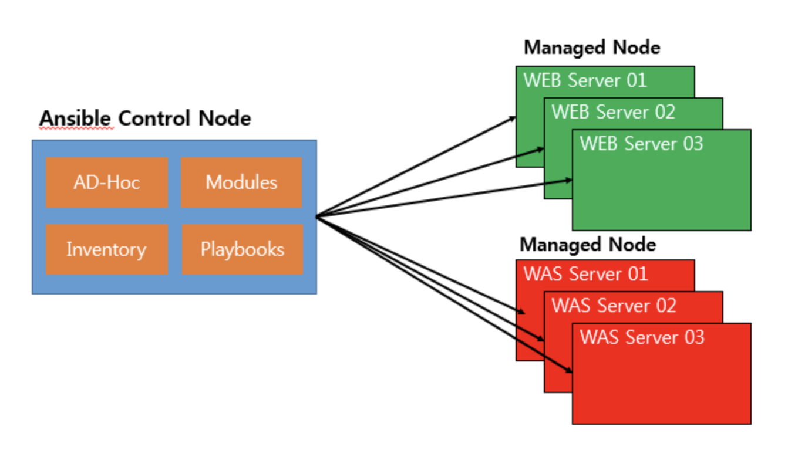

# Ansible Basics

> Ansible에 대해 알아보아요
>
> Reference: [brownbears.tistory.com](https://brownbears.tistory.com/358)

 

 

## What is Ansible?

- **IaC(Infrastructure as Code)**를 지향하는 자동화 관리 도구
- Open-source 기반으로 제작되었다
- Ansible을 구동하는 module 및 library는 Python 기반이다
- YAML format을 기반으로 **playbook**을 실행시켜서
  1. 원하는 자동화를 구현하거나,
  2. Ad hoc mode로 module을 실행시켜 상태를 조회해 볼 수 있따
- **SSH**를 기반으로 **Target Host**에 **agentless** 방식으로 자동화를 구성 및 관리한다

 

 

## Advantages of Ansible

 

### 1. Agentless

- 일반적으로 대부분의 IaC 도구들이 자동화 대상 장비들에 **agent**를 기반으로 구성하는 **pull** 방식인 것에 반해,
  - Ansible은 자동화 대상 장비들에 **agentless** 기반의 **push** 동작 방식으로 동작한다
- 대상 장비에 **agent**를 설치하지 않기 때문에, Data center 또는 IT Infra 담당자들이 상대적으로 거부감이 덜하다
- **SSH** 기반으로 대부분 동작하기 때문에, 기술적 **접근성**도 용이하다

 

### 2. 접근 용이성

- Ansible은 Python 기반으로 개발되었지만, Python에 대한 지식이 없어도 사용할 수 있을만큼 진입장벽이 낮은 편이다

 

### 3. 다양한 Module 지원

- Version이 지속적으로 patch되고, 넓은 사용자층을 확보하면서 많은 module을 지원하고 있다
- 다양한 cloud infra, 가상화, 서버 OS, Platform 및 Network 장비와 Storage까지 매우 폭넓은 module들을 version upgrade마다 확장하고 있따

 

### 4. 멱등성 (Idempotence)

- Ansible에서는 YAML script file로 작성된 **Playbook**을 여러 차례 반복 실행해도 동일한 결과를 출력시켜, `멱등성`을 일관되게 수행할 수 있다
  - 여러번 적용해도 결과는 바뀌지 않는다
    - 바뀌는 것이 없으면 당연히 배포되어도 바뀌지 않는다
    - 바뀌는 부분이 있으면 그 부분만 반영된다
  - Shell, command, file module은 보장되지 않는다
- Ansible을 실행하면 Task를 수행하기 전에 module의 상태를 먼저 체크하고,
  - Task를 수행 할때도 추가된 것과 변화된 부분에 대한 정보들을 제공하여 **일관성**있는 결과를 제공할 수 있다

 

 

## Ansible Architecture

 

### Control Node

- 중앙 제어 node이며, Ansible이 설치되는 node
  - Windows는 설치가 불가능하므로 `winrm` 을 사용해야 한다

 

### Managed Node

- Ansible **Control Node**에 의해 관리되는 서버
  - **hosts** 에 등록된 대상
- Ansible **Control Node**에서 **SSH**를 통해 **Managed Node**에 배포한다

 

### Inventory

- **Managed Node** 가 등록되어 있는 목록
  - 작업할 node 혹은 server들의 접속 정보를 가지고 있는 파일
  - Remote server에 대한 meta data를 기술하는 파일
- 기본 파일은 `/etc/ansible/hosts` 를 읽게 하거나, 따로 **Inventory** 파일을 만들고 option을 주어 동작하게 할 수 있다
  - 만약 고정 IP를 가지고 있고, **hosts** 파일 안에 들어가 있지 않는 server가 있다면 설정 파일을 만들 수 있고, 테스트 환경을 만들 때 유용하다

 

### Modules

- Ansible에서 실행되면서 작업하는 하나하나의 단위
- 다음과 같은 작업을 간단히 수행할 수 있게 도와줌
  - Package, service 설치
  - File에 대한 권한 설정
  - Database 작업
  - Cloud 작업
  - Network 작업

 

### Tasks

- Module의 집합
- 작업 단위

 

### Playbooks

- 계획된 작업을 순서대로 실행하기 위해 작성되는 YAML file
