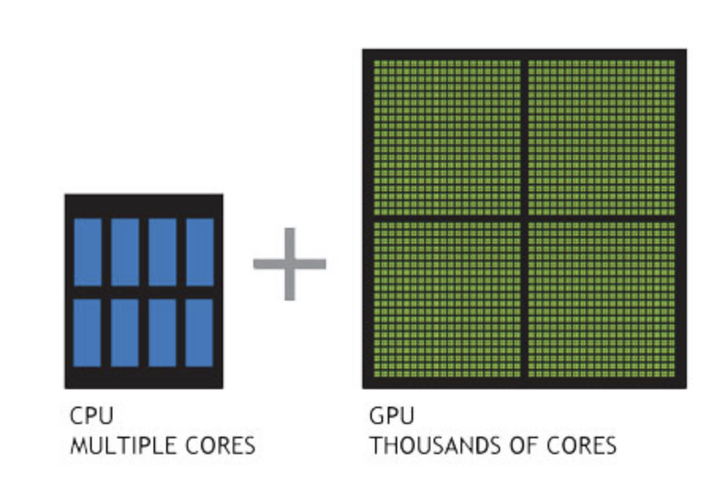
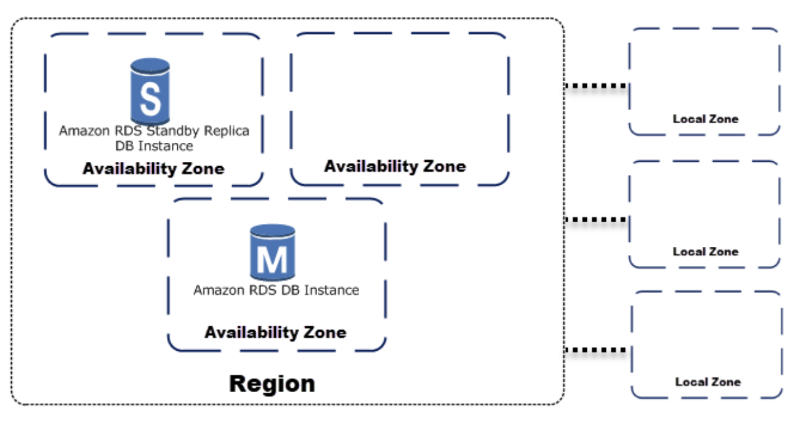
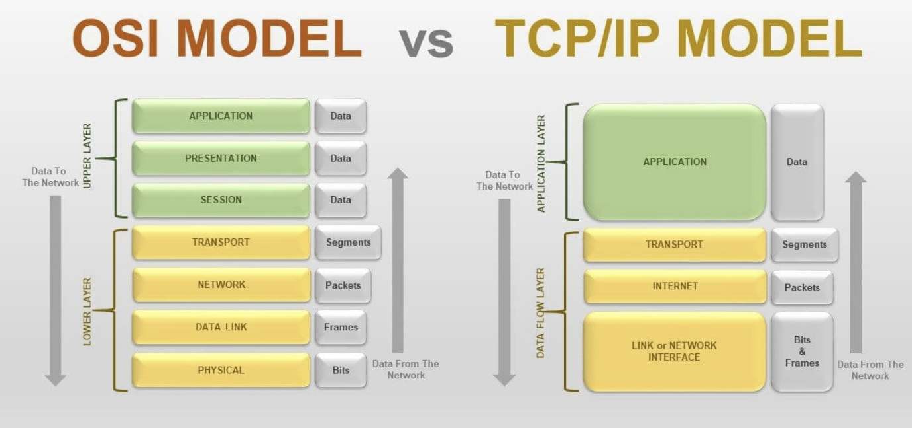
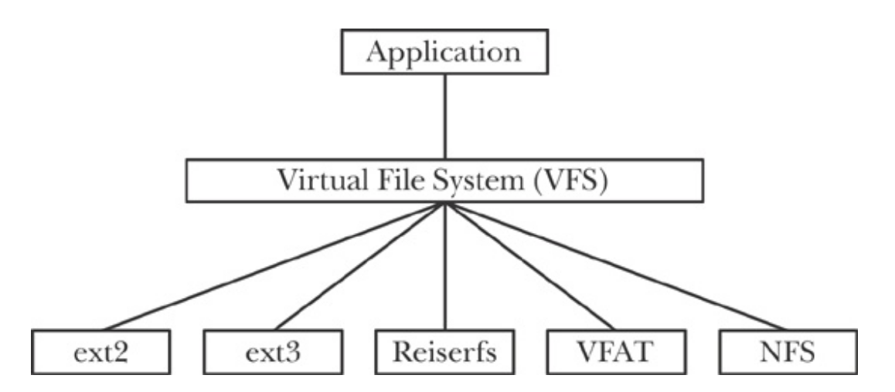

# Infra Structure Basics

> IT 인프라에 대해 알아보다가 너무 정리가 잘 되어있는 글을 찾아서 공부하며 다시 정리!
>
> References: [futurecreator.github.io](https://futurecreator.github.io/2018/11/09/it-infrastructure-basics/)

 

## 1. What is IT Infrastructure?

 

### IT Infrastructure 란?

- Application을 가동시키기 위해 필요한 `하드웨어`, `OS`, `미들웨어`, `네트워크` 등 시스템의 기반

- **비 기능적 요구사항**과 관련이 있다

 

#### 기능적 요구사항과 비기능적 요구사항

1. `기능적 요구사항 (functional requirement)`
   - 해당 시스템이 어떤 기능을 하고, 무엇을 할 수 있는지
2. `비 기능적 요구사항 (non-functional requirement)`
   - 시스템의 성능, 안정성, 보안 등과 같은 요구사항

 

 

### Infra의 구성요소

- **하드웨어 (Hardware, HW)**
  - Server 장비 본체나 데이터를 저장하기 위한 storage, 전원장치 등
    - 넓은 의미에서는 하드웨어를 설치하는 data center의 설비도 포함된다
- **네트워크 (Network)**
  - 사용자가 원격으로 접근할 수 있도록 server를 연결하는 도구들
    - ex)
      - 라우터, 스위치, 방화벽 등의 네트워크 장비
      - 이를 연결하는 케이블 배선
      - 사용자가 단말에서 무선으로 연결하는데 필요한 access point (AP)
- **운영체제 (Operating System, OS)**
  - `하드웨어` 와 `네트워크 장비` 를 제어하기 위한 기본적인 소프트웨어
  - resource 와 process를 관리
    - `Client OS`
      - 사용자가 사용하기 쉽도록 하는데 초점
      - ex) Windows, macOS
    - `Server OS`
      - system을 빠르고 안정적으로 실행하는데 초점
      - ex) Linux, Unix, Wiindows Server
- **미들웨어 (middleware)**
  - server 상에서 server가 *특정 역할*을 하도록 기능을 제공하는 소프트웨어

 

 

## 2. On-premises vs Cloud

 

### 2-1. On-premises

- Data center나 server실에 server 를 두고 **직접 관리**하는 전통적인 방식
- Server, Network 장비, OS, Storage, 각종 solution 등을 직접 사서 설치하고 관리해야 했음

#### On-premises 의 단점

- 장비들이 고가이기 때문에 **초기 투자비용**이 크다
- **사용량을 가늠**하기 힘들어서 한번 구축하면 사용량이 적어도 유지 비용은 그대로 나간다

 

### 2-2. Public Cloud

- 인터넷을 통해 불특정 다수에게 **서비스 형태**로 제공되는 시스템
  - `서비스 형태` 란?
    - 사용자는 원하는 option을 선택하고, 사용한만큼 비용을 지부라면 된다는 것을 의미
    - ex) Iaas (원하는 사양의 VM이나 Storage를 선택하고, 이용한 시간이나 data 양에 따라 비용을 지불), Paas, SaaS
- AWS, Microsoft Azure, GCP 등 **Cloud Provider**가 Data center와 Infra를 보유하고 있다

 

### 2-3. Private Cloud

- Public cloud에서 이용자를 한정한 형태
- ex) 기업 내 서비스 - 보안이 좋고, 독자적 기능 or 서비스를 추가하기 쉽다

 

### 2-4. Pros of Cloud

- Traffic의 변동이 많은 시스템은 Cloud 가 유리하다
  - why?
    - 대외 서비스는 traffic을 예상하기가 쉽지 않기 때문!
    - 이렇게 traffic 양에 따라 server 사양이나 network 대여을 가늠하는 것을 **Sizing** 이라고 하는데 상당히 어려운 작업임
      - Cloud system에서는 Traffic의 증감에 따라 자동으로 증설해주는 `Auto Scaling` 이 있어 On-premises 보다 유리하다!

- 자연 재해로 인해 Data system이 다운되더라도 다른 곳에서 시스템을 운영 할 수 있다
  - how?
    - Cloud의 data center는 전 세계에 퍼져 있기 때문!
- 빨리 서비스를 제공하는 시스템이나 PoC (Proof of Concept) 에도 Cloud 가 유리하다
  - 초기 투자금이 적은 스타트업 / 개인 개발자에게도 유리하다!

 

### 2-5. Pros of On-premises

- On-premises와 Cloud 모두 **가용성**을 보장하지만 개념에서 차이가 있다
  - `On-premises`
    - server가 죽지 않는 것을 목표로 함
  - `Cloud`
    - 다수의 instance로 이루어진 분산 환경에서 Instance가 죽으면 다른 instance가 빠르게 대체하는 것을 의미
      - 즉, Cloud를 사용한다고 해서 가용성이 보장되는 것이 아니라, 가용성을 높이도록 직접 설계 해야함
      - 따라서 잠시라도 끊어지면 안되는 시스템이나 클라우드 업체가 보장하는 것 이상의 가용성이 필요한 시스템에서는 On-premises 가 유리하다....
        - 라고 적혀있지만 나는 이부분에 대해서는 공감 못하겠다..!
          - Amazon RDS를 예로 들자면, 다중 AZ 배포를 사용해서 장애조치하고, 다른 가용 영역에 동기식 예비 복제본을 프로비저닝하고 유지하는 방법 등 가용성을 높일 수 있는 방법이 지금 떠오르는 것만 해도 많은데!!
          - Cloud가 보장할 수 있는 것 이상의 가용성을 On-premises에서 보장 할 수 있을 지 궁금하다! 찾아봐야징
- **기밀성**이 높은 데이터의 경우 On-premises까 유리하다
  - 물론 자사의 보안보다 Cloud Provider까 제공하는 보안이 더 좋을 수 있지만, 물리적인 저장 장소를 명확히 알 필요가 있을 때에는 On-premises가 유리하다
  - 또한 multi-cloud를 사용한다면 각 Cloud provider마다 보안 정책이 다르기 때문에 보안 표준을 구축하기 어렵다.....
    - 이번에 새로 하게 된 오픈 소스 컨트리뷰톤에서 Multicloud 프로젝트에 참여하게 되었는데 이 부분이 정말 어려운 것인지 컨트리뷰톤에서 알아보면 좋겠다! 알아봐야징

 

### 2-5. Hybrid Cloud

- On-premises와 Cloud 각각 장단점이 있기 때문에 **두 가지를 함께 사용**하기도 함
  - 각 system의 특성에 맞게 두 가지를 함께 사용하는 것!
- Cloud provider들도 각각의 장단점이 달라서 여러 클라우드를 함께 사용하기도 함
- 이것을 잘 결정하기 위해 각각의 특성을 잘 알고 있어야 하고, 선택의 기준이 명확해야 함!

 

 

## 3. Infra 관련 개념들

 

### 3-1. 하드웨어

- Infra에서 가장 low-level을 맡고 있는 것이 **하드웨어**와 **네트워크**이다
- **On-premise** system에서는 여러 대의 server 장비로 구성된다
- **Cloud**에서는 instance의 하드웨어 성능을 필요에 따라 선택하게 된다

 

### 3-2. CPU

- CPU의 성능은 **Core**와 **Cache**의 영향을 받는다
  - **Core**가 많을 수록 동시에 처리하는 연산이 늘어나고,
  - 메모리와 처리속도를 완화하기 위한 **Cache** 는 크기가 클수록 성능이 좋다
  
- **GPU**

  - Graphic을 처리하는데 특화된 Processor

  - `CPU`가 **직렬 처리**에 최적화된 몇 개의 코어로 구성된 반면,

    - `GPU`는 **병렬 처리**에 최적화된 작고 많은 코어로 이루어져 있다

    

  - Deep learning이나 수치 해석 등 대량의 Data를 고속으로 처리해야하는 분야에서는 CPU와 GPU를 함께 사용해서 처리 성능을 높이는 **GPU Computing** 방식이 사용된다

    - 이 방식은 연산이 많이 필요한 부분을 GPU에게 넘기고, 나머지 코드만을 CPU에서 처리하는 방식이다!  오호..

    

 

### 3-3. Memory

- 주 기억장치인 메모리는 data 용량이 크거나 전송 속도가 고속일수록 고성능이다
- Server용으로는 전력 소모가 적고 **오류 처리**가 탑재되어 있는 것을 주로 선정한다

 

### 3-4. Data Storage

- Data를  저장하는 Device
- 보통 Storage의 속도가 제일 느리기 때문에 Storage의 용량이나 Read, Write 속도가 system 전체의 속도에 영향을 주는 경우가 많다
- `하드디스크`나 `SSD (Solid-State Drive)`등으로 이루어져 있다

#### Data 관리

- IT에서 가장 중요한 것은 data라고 할 수 있다

- 이러한 data가 손실되면 안되기 때문에 대부분 **고가용성**(High Availability, HA, 오랜 기간동안 지속적으로 운영될 수 있음)을 위해 **이중화(redundancy)** or **다중화**로 구성한다

- ex)

  - AWS의 RDS를 같은 Region 내 다른 `가용 영역(Availability Zone, AZ)` 에 분산해서 **이중화** 를 구성하기

    

    - AWS에서는 이것을 **다중 AZ 배포**라고 한다
    - 같은 지역이라도 data가 나눠져 있어서 **Master**에서 문제가 생기면 **Slave**에서 이를 복구해서 Data를 유지한다

 

### 3-5. 방화벽

- 방화벽은 보안을 위해 내부 Network와 외부 Network의 통신을 **제어**하고, 불필요한 통신을 차단하는 것이다
- ex)
  - **패킷 필터형**
    - 통과하는 `패킷`을 `포트 번호`나 `IP 주소`를 바탕으로 필터링 한다
  - **애플리케이션 게이트웨이형**
    - Application protocol level에서 외부와의 통신을 제어하는 방식으로 일반적으로 `proxy server` 라고 부른다
    - Session에 포함되어 있는 정보를 검사하기 위해서 기존 session을 종료하고, 새로운 session을 만든다
    - 패킷 필터형에 비해 속도는 느리지만 많은 검사를 수행할 수 있다

 

 

## 4. Network

 

### 4-1. 네트워크 주소

> 네트워크에서는 각종 장비를 식별하기 위해 네트워크 주소(address)를 사용한다

#### 1. MAC 주소 (물리 주소 / 이더넷 주소)

: **물리적**으로 할당되는 48bit 주소

- 앞 24bit는 네트워크 부품의 `제조업체`를 식별한다
- 뒤 24bit는 각 제조업체가 `중복되지 않도록 할당`한다
- 16진수로 표기하며, 2byte씩 구분해서 표기한다

 

#### 2. IP 주소

: 인터넷이나 인트라넷 같은 네트워크에 연결된 장비에 할당되는 번호

- 주로 많이 사용하는 **IPv4**의 경우 8bit씩 4개로 구분된 **32 bit**주소
  - ex) 192.168.1.1
  - 각 자리는 0~255까지 표현이 가능하다
- **IPv4**는 하나의 네트워크에서 2^32 (약 42억대) 까지밖에 연결할 수가 없어서 인터넷에서 IP 주소가 고갈될 우려가 있다
  - 그래서 **IPv6**는 **128 bit**의  IP 주소를 사용하고 있다!!
- 사내 네트워크에서는 임의의 주소를 할당하는 **프라이빗 주소**를 사용하고 인터넷과의 경계에서 글로벌 주소로 변환하는 **NAT 장비**를 사용한다

 

 

### 4-2. OSI Model

- 통신을 할 때 서로 1) 어떻게 메시지를 주고 받고 2) 어떤 언어를 사용할지 등 **규칙**이 필요하다
  - 이런 규약을 **통신 프로토콜**이라고 한다

- `OSI (Open Systems Interconnection) Model` 은 국제 표준화 기구 (International Organization for Standarization, IOS) 에서 만든 컴퓨터의 **통신 기능**을 **계층 구조**로 나눈 모델이다
- OSI Model을 이용하면 특정 Networking System에서 일어나는 일을 계층을 활용해 시각적으로 이해할 수 있다
- OSI 계층은 총 **7계층**으로 이루어져 있다
  - 데이터 -> 네트워크로 **나갈 때**는 위층에서부터
  - 네트워크 -> 데이터를 **받을 때**는 아래층에서부터 들어온다

 

#### OSI Model vs TCP/IP Model

 

#### 1. 물리 계층 (Physical Layer)

- 전송 케이블이 **직접 연결**되는 계층으로 cable을 통해 전송하는 기능을 한다
  - 데이터를 보내고 받고 하는 기능!
- 전압 & 전류의 값을 할당하거나 cable이나 connector의 모양 등 통신 장비의 `물리적`, `전기적` 특성을 규정한다
  - ex) LAN cable로 사용되는 트위스트 페어 케이블 (STP/UTP)이나 이더넷(Ethernet) 규격인 100BASE-T or IEEE802.11 시리즈의 무선 통신 등

 

#### 2. 데이터 링크 계층 (Data Link Layer)

- 동일 네트워크 간 인접한 두 시스템(Node) 간 통신을 규정한다
  - 노드간 전달을 담당한다!
- 물리계층이 잘 동작하고 있는지 확인하는 역할
- 네트워크 계층에서 `데이터 패킷` 을 받아들여 **MAC 주소**와 각종 **제어 정보**를 추가한다
  - 이 때, 추가적인 정보를 가지고 있는 데이터 단위를 **프레임 (frame)** 이라 하고 물리 계층을 통해 전송된다

 

#### 3. 네트워크 계층 (Network Layer)

- 서로 다른 네트워크 간 통신을 위한 규정
- 특정 서버로 가는 경로를 효율적으로 처리하는 **라우팅 (routing)** 기능이 있다
- 데이터 링크 계층이 MAC 주소를 기반으로 한다면, 네트워크 계층은 **IP 주소**를 기반으로 한다
- 송신지에서 수신지까지 데이터를 안전하게 전달하는 것을 담당한다
  - 이를 위해
    - **패킷**의 이동량이 많을 때는 패킷의 흐름을 제어하는 **흐름제어 (flow control)** 기능
    - 전송 중 분실되는 패킷을 감지하고 재전송을 요구하는 **오류 제어** 기능을 가지고 있다
- 대표적인 장비로는 **라우터**나 **L3 스위치**가 있다
  - 이런 장비는 패킷을 어디에서 어디로 전송할지에 대한 정보를 저장하는 `라우팅 테이블 (routing table)` 을 관리한다
    - 라우팅 테이블을 기반으로 루트를 정하는 **정적 라우트 (static route)**
    - 라우팅 프로토코렝서 설정된 **동적 라우트 (dynamic route)**가 있따
  - `L3 스위치` 는 라우터와 동일한 기능을 하드웨어로 처리하는 장비다!

 

#### 4. 전송 계층 (Transport Layer)

- 데이터 전송을 제어하는 계층
- 보낼 데이터의 **용량**, **속도**, **목적지** 등을 처리한다
- 세션 게층에서 보낸 메시지를 Segment 로 나누고, 각 Segment의 순서 번호를 기록해서 네트워크 계층으로 보내면,  받는 쪽에서 이를 다시 조립한다
  - 이런 방식으로 **전송 오류의 검출**이나 **재전송**을 규정한다
- 대표적인 프로토콜로는 `TCP`와 `UDP`가 있다

 

#### 5. 세션 계층 (Session Layer)

- Application 간 `연결`을 **유지** 및 **해제**하는 역할
- **Connection 확립 타이밍**이나 **데이터 전송 타이밍** 등을 규정한다

 

#### 6. 프레젠테이션 계층 (Presentation Layer)

- Data를 application이 이해할 수 있도록 변환해주는 역할을 한다
- 데이터의 **저장 형식**, **압축**, **문자 인코딩** 등을 변환하고 데이터를 안전하게 전송하기 위해 `암호화` 및 `복호화` 하는 기능도 이 계층에서 처리한다

 

#### 7. 응용 계층 (Application Layer)

- 최상위 계층으로 web browser 나 outlook처럼 사용자가 직접 사용하는 Application을 의미한다

 

 

## 5. Linux

> 하드웨어와 네트워크를 알아보았으니 이제 OS를 알아보자

 

### What is Linux?

- Linux는 Linux Torvalds가 개발한 Unix 호환 서버 OS 이다
- Linux 재단에 따르면
- 퍼블릭 클라우드 워크로드의 90%
- 세계 스마트폰의 82%
- 임베디드 기기의 62%
- 슈퍼컴퓨터 시장의 99%가 리눅스로 동작한다고 한다

- Linux는 open source로 여러 기업이나 개인의 참여로 만들어지고 있다
  - 컴퓨터 역사상 가장 많은 인력이 들어간 open source projec라고 한다!

 

### 리눅스 커널 (Linux Kernel)

- Kernel이란 OS의 코어가 되는 부분을 말한다
- Linux Kernel의 역할
  - 메모리 관리
  - 파일 시스템
  - 프로세스 관리
  - 디바이스 제어

- Android 또한 Linux Kernel을 기반으로 만들어졌다

 

#### 1. 디바이스 관리

- Linux Kernel은 CPU, 메모리, 디스크, IO 등 하드웨어를 **디바이스 드라이버**라는 소프트웨어를 이용해 제어한다

 

#### 2. 프로세스 관리

- Linux는 프로그램 파일에 쓰여 있는 내용을 읽어서 메모리 상에서 처리하는데, 이렇게 실행된 프로그램을 **프로세스**라고 한다
- 프로세스를 식별하기 위해 **PID (Process ID)**를 붙여서 관리하고 각 프로세스에 필요한 자원을 효율적으로 할당한다

 

#### 3. 쉘 (Shell)

- 사용자는 Shell이라는 **Command Line Interface**를 통해 명령어를 kernel로 전달할 수 있다

- Shell에서 실행하고자 하는 명령을 모아놓은 것을 **쉘 스크립트 (Shell Script)** 라고 한다

  | Shell 이름 | 특징                                                         |
  | ---------- | ------------------------------------------------------------ |
  | bash       | - **명령 이력**, **Directory stack**, 명령이나 파일명의 **자동 완성 기능**을 지원한다 - 대부분의 Linux system이나 macOS(OS X)에 표준으로 탑재되어 있다 |
  | csh        | - C언어와 비슷한 Shell  - BSD 계열 OS에서 주로 사용한다   |
  | tsch       | csh 를 개선한 버전으로 명령이나 파일명 등의 **자동 완성 기능** 지원 |
  | zsh        | bash와 호환성이 있고 고속으로 동작하는 Shell                 |

 

#### 4. 파일 시스템

- 파일 시스템이란 파일에 이름을 붙여서 **어디에 저장할지** 나타내는 체계이다
  - 파일을 관리하는 시스템
- Linux Kernel은 **가상 파일 시스템(virtual File System, VFS)**을 사용한다
- 사용자의 입장에서 각 데이터가 저장되어 있는 위치 (하드디스크, 메모리, 네트워크 스토리지 등)와 상관없이 그냥 파일처럼 사용할 수 있도록 하는 것!
- 가상 파일 시스템 (VFS)에서는 각 device를 파일로 취급한다

- `ext2`
  - Linux 운영체제에서 널리 이용되던 파일 시스템
  - 초기 **ext** 파일 시스템을 확장했기 때문에 ext2라고 불림
- `ext3`
  - Linux에서 주로 사용되는 파일 시스템
    - Linux Kernel 2.4.16부터 사용 가능!
- `ext4`
  - ext3의 후속 파일 시스템
  - storage는 **1EiB**까지 지원한다
  - 파일의 **단편화**를 방지하는 **extent file writing**을 지원한다
- `tmpfs`
  - Unix 계열 OS에서 임시 파일을 위한 장치
  - 메모리상에 저장 가능하다
  - **/tmp** 로 마운트되는 경우가 많으며 메모리 상에 저장되어 있어 서버를 재시작하면 파일은 모두 사라진다!
    - 맞아..... 다 사라지더라..
- `UnionFS`
  - 여러 개의 directory를 겹쳐서 하나의 directory로 취급할 수 있는 파일 시스템
- `NFS`
  - Unix에서 이용하는 분산 파일 시스템 및 protocol

 

#### 5. Directory 구성

- Linux의 directory 목록은 **FHS (Filesystem Hierachy Standard)** 라는 규격으로 **표준화** 되어 있다
  - 대부분의 주요 배포판은 **FHS**를 기반으로 directory를 구성한다

| Directory | 설명                                                         |
| --------- | ------------------------------------------------------------ |
| `/`       | root directory                                               |
| `/bin`    | `ls`, `cp` 같은 기본 command를 저장하는 directory            |
| `/boot`   | Linux Kernel 등 OS 부팅에 필요한 파일을 저장하는 directory   |
| `/dev`    | 하드디스크, 키보드, 디바이스 파일을 저장하는 directory       |
| `/etc`    | OS나 application의 설정 파일을 저장하는 directory            |
| `/home`   | - 일반 사용자의 home directory  - root사용자는 `/root` 를 home directory로 사용한다! |
| `/proc`   | - Kernel이나 process에 대한 정보를 저장하는 directory - `/proc` 하위에 있는 숫자 폴더는 **process ID**를 의미한다! |
| `/sbin`   | System 관리용 mount를 저장하는 directory                     |
| `/tmp`    | - 일시적으로 사용하는 파일을 저장하는 directory - 서버를 재시작하면 사라진다 |
| `/usr`    | 각종 프로그램이나 Kernel source를 저장하는 directory         |
| `/var`    | System 가동과 함께 변하는 파일을 저장하는 directory          |

 

#### 6. 보안 기능

- **계정에 대한 권한 설정**
  - Linux는 사용자 계정에 권한을 설정할 수 있다
  - System 전체를 관리하는 `root` 사용자와 그 외 일반 사용자가 있다
    - Middleware와 같은 demon을 작동시키기 위한 system 계정도 있다
  - 계정은 그룹으로 묶을 수도 있다!
  - 계정과 그룹을 바탕으로 파일이나 directory에 대한 **액세스 권한 (Access permission)**을 설정할 수 있다
- **네트워크 필터링**
  - Linux는 원래 Network쌍에서 여러 사용자가 이용하는 것을 전제로 만든 OS이므로 Network관련 기능이 많다
  - `iptables` 는 Linux에 내장된 **패킷 필터링** 및 **NAT**를 설정할 수 있는 기능이다
- **SELinux (Security-Enhanced Linux)**
  - SELinux는 미국 국가안전보장국이 제공하는, Linux Kernel에 강제 access 제어 기능을 추가한 것이다
  - Linux는 root 사용자가 permission에 상관없이 모든 access가 가능해서 root 계정이 도난당하면 system에 치명적인 영향을 줄 수 있는 단점이 있따
    - SELinux는 process마다 access 제한을 거는 `TE (Type Enforcement)` 와 root를 포함한 모든 사용자에게 제어를 거는 `RBAC(Role-based Access Control)`  등으로 root에게 권한이 집중되는 것을 막아준다
      - 오호!!

 

#### 7. 리눅스 배포판 (Linux Distribution)

- 보통 Linux는 Kernel 위에 각종 command, library, application을 포함해 **배포판**이라는 패키지 형태로 배포된다
- 다양한 배포판이 있는데, 그 이유는 사람마다 원하는 프로그램이 다르고 Linux는 open source라서 개인 또는 기업이 직접 수정해서 사용할 수 있기 때문이다

- 배포판 종류

  - **Debian 계열**

    - Debian

      : GNU/Linux 커뮤니티에서 개발한 리눅스

    - KNOPPIX

      : CD 부팅으로 이용할 수 있는 리눅스

    - Ubuntu

      : 풍부한 Desktop 환경을 제공하는 리눅스   *우분투 쵝오*

  - **Red Hat 계열**

    - Fedora

      : Red Hat이 지원하는 커뮤니티 `Fedora Project` 의 리눅스

    - Red Hat Enterprise Linux (RHEL)

      : Red Hat이 제공하는 상용 리눅스

    - CentOS

      : RHEL과 완전한 호환을 지향하는 리눅스

    - Vine Linux

      : 일본에서 개발된 리눅스

  - **Slackware 계열**

    - `openSUSE`

      : Novell이 지원하는 커뮤니티에서 개발된 리눅스

    - `SUSE Linux Enterprise`

      : openSUSE를 기반으로 한 안정화된 상용 리눅스

  - **기타 배포판**

    - `Arch Linux`

      : 패키지 관리 시스템에 Pacman을 사용하는 Linux

    - `Gentoo Linux`

      : Portage라는 패키지 관리 시스템을 사용하는 Linux

 

 

## 6. 미들웨어 (Middleware)

- 미들웨어 OS와 비즈니스를 처리하는 application 사이에 들어가는 각종 Software를 말한다
  - ex) Web Server, DBMS, System monitoring 등이 있다

 

### 6-1. 웹 서버 (Web Server)

- Web Server는 Client가 보낸 HTTP 요청을 받아 Web Content를 응답으로 반환하거나, sever-side application을 호출하는 기능을 가진 server이다

| 이름                              | 설명                                                         |
| --------------------------------- | ------------------------------------------------------------ |
| **Apache HTTP Server**            | 폭 넓게 사용되는 전통적인 open source web server             |
| **Internet Information Services** | - Microsoft 에서 제공하는 web server - Window Server 시리즈와 같은 OS 제품에 들어 있음 |
| **Nginx**                         | 소비 메모리가 적으며                                         |

 

### 6-2. DBMS

- 데이터 베이스 관리 시스템 (Database Management System, DBMS) 은 **데이터베이스**를 관리하는 **미들웨어**이다
- 데이터의 CRUD (Create, Read, Update, Delete) 와 같은 기본 기능과 Transaction 처리 등 많은 기능을 포함한다
- 다양한 종류의 DBMS가 있다
- 벤더마다 구문이 상당히 다르기 때문에 `ANSI SQL` 이라는 표준이 있다
- DBMS 마다 지원하는 기능, 성능, 가격이 천차만별이므로 필요한 용도에 따라 선택하면 된다!

 

#### RDBMS

| 이름                     | 설명                                                         |
| ------------------------ | ------------------------------------------------------------ |
| **Oracle Database**      | - Oracle이 제공하는 상용 RDBMS - 주로 기업에서 많이 사용되는 데이터베이스로 글로벌 DB 시장 점유율 1위 - 상당히 고가인만큼 많은 기능을 제공 |
| **MySQL**                | - Oracle이 제공하는 오픈 소스 관계형 (Relational) DBMS - 가장 많이 사용되는 오픈소스 RDBMS - `MySQL AB`라는 제작사를 썬이 인수하고, 이후 오라클이 썬을 인수하면서 오라클이 소유주가 됨 - 무료인 **커뮤니티 버전**과 유료인 **상용 버전**으로 나뉘어져 있다 - 이후 오픈 소스 진영에서 MySQL을 기반으로 한 `MariaDB`를 만들었다 |
| **Microsoft SQL Server** | - Microsoft에서 제공하는 상용 RDBMS - Windows에 특화되어 있다 |
| **PostgreSQL**           | Oracle, MySQL, SQL Server에 이어 글로벌 점유율 4위인 오픈 소스 RDBMS |

 

#### NoSQL

- NoSQL은 SQL만을 사용하지 않는 DBMS를 말한다
- 데이터를 저장할 때 table 대신 다른 형태로 저장하는 방식이다
- RDB와 비교해서 어느 것이 더 좋다기 보다 용도에 맞게 사용하는 것이 중요하다!

| 형태                   | 설명                                                         | 종류                                                         |
| ---------------------- | ------------------------------------------------------------ | ------------------------------------------------------------ |
| **Key-value**          | - 단순한 형태의 NoSQL - 간단해서 속도가 빠르고 익히기 쉽다 - 값의 내용을 사용한 쿼리가 불가능해서 application level 에서 처리가 필요하다 | [Redis](https://redis.io/) [Amazon DynamoDB](https://aws.amazon.com/ko/dynamodb/) [Memcached](https://memcached.org/) |
| **Document**           | - Key-Value와 비슷하나 단순한 Value가 아닌 계층규조인 document로 저장된다 - 쿼리를 사용할 순 있으나 일반 SQL과는 다르다 | [MongoDB](https://www.mongodb.com/) [Couchbase](https://www.couchbase.com/) |
| **Wide column stores** | - table, row, column을 사용하지만 RDB와는 달리 column의 이름과 포맷은 같은 row라도 다를 수 있다 - 2차원 Key-value 형태이다 | [Cassandra](http://cassandra.apache.org/) [HBase](https://hbase.apache.org/) |
| **Graph**              | - Data를 graph처럼 연속적인 node, edge, property의 형태로 저장 - SNS나 추천 엔진, 패턴 인식 등 데이터 간의 간계를 위주로 할 때 적합 | [Neo4j](https://neo4j.com/)                                 |

 

### 6-3. 시스템 모니터링 (System Monitoring)

- 시스템 운영을 위해서는 여러 상태를 지속적으로 감시해야 한다
- Network, Server, Cloud, Application, Service, Transaction 등 다양한 레벨에서 모니터링을 하면서 이상 여부를 확인하고 원인을 분석한다

| 이름                                  | 설명                                                         |
| ------------------------------------- | ------------------------------------------------------------ |
| [Zabbix](https://www.zabbix.com/)     | - `Zabbix SIA`가 개발한 오픈 소스 모니터링 툴 - 다양한 서버의 상태를 모니터링 할 수 있다 |
| [Datadog](https://www.datadoghq.com/) | - `Datadog` 가 개발한 서버 모니터링 SaaS - 따로 서버를 도입할 필요 없이 web broser에서 모니터링 가능 - **멀티 클라우드** 환경에서도 손쉽게 모니터링 가능 |
| [Mackerel](https://mackerel.io/)      | - `Hatena` 가 개발한 서버 모니터링 Saas - 클라우드 서버 모니터링에 유용 |

 

 

## 7. 인프라 구성 관리

> 인프라 구성 관리란 인프라를 구성하는 하드웨어, 네트워크, OS, 미들웨어, 어플리케이션 등의 **구성 정보**를 **관리**하고, 적절한 상태로 **유지**하는 작업을 의미한다

 

### Immutable Infrastructure

- On-premise 환경에서는 인프라 환경을 구축하는 것도 큰 일이고, 일단 구축하면 변경 이력을 정리하면서 상당히 오랜 기간 사용한다
  - but, 클라우드는 가상 환경이기 때문에 필요하면 구축하고 불필요하면 바로 폐기해도 상관 없다!
    - 즉, 서비스가 업데이트되면 **기존 운영 환경**을 **변경**하는 대신 `image`를 새로 생성해 배포한다
      - 이를 변하지 않는다는 뜻인 **Immutable Infrastructure** 라고 한다

- Immutable Infra는 `image` 하나로 서버를 쉽게 찍어낼 수 있고, 해당 `image` 만 관리하면 되기 때문에 **관리**도 **용이**하다!
- **환경 자체를 배포**하는 것이기 때문에 **동일한 환경**에서 테스트도 쉽다

 

 

*계속  공부중...*
