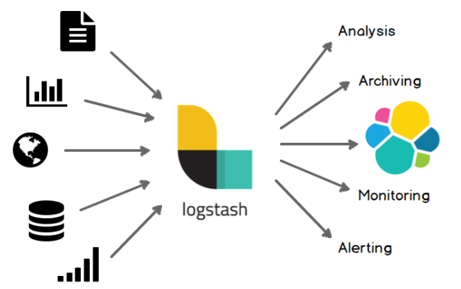

# Logstash Basics

> Logstash에 대해 알아보아요우
>
> Reference: [Logstash docs](https://www.elastic.co/guide/en/logstash/current/introduction.html)

 

 

## What is Logstash?

 

### Logstash

- **Real-time pipeline** 기능을 가진 open source data collection engine
- 서로 다른 data source를 dynamic하게 **통합**하고, 지정한 목적지로 data를 **정규화** 할 수 있다

- Data를 **cleanse**하고 **democratize** 할 수 있다

 

 

## The Power of Logstash

 

### 1. Elasticsearch 등을 위한 강력한 수집 기능

시너지 효과를 발휘하는 Elasticsearch와 Kibana를 활용한 수평 확장 가능한 data processing pipeline

 

### 2. Pluggable pipeline architecture

다양한 input, filter, output을 mix & match하고 조정하면서 pipeline에서 조화롭게 운용 가능

 

### 3. Community-extensible and developer-friendly plugin ecosystem

200여개의 plugin 사용 가능 & 직접 plugin을 만들어 제공할 수도 있는 유연성도 갖고 있음

 

 

 

## Logstash Loves Data

- 더 많은 data를 수집할수록 더 많이 알 수 있다
- Logstash는 모든 형태 및 규모의 data를 다룰 수 있다

 

### Logs and Metrics

모든것이 시작되는 곳

- 모든 유형의 **logging data** 처리 가능
  - 다양한 **web log** (ex. Apache)  및 **appliction log** (ex. log4j for Java) 를 수집한다
  - syslog, networking과 firewall log 등 여러 형식의 log를 수집한다
- [Filebeat](https://www.elastic.co/products/beats/filebeat)와 연계하여 **보안**을 유지하며 log를 전달할 수 있다

 

### The Web

World Wide Web의 진정한 효용성 실현

- [HTTP requests](https://www.elastic.co/guide/en/logstash/7.10/plugins-inputs-http.html)를 event로 변환
  - Social sentiment 분석을 위해 Twitter 등의 **firehose** 사용
  - Github, Jira를 비롯한 수많은 application을 위한 **webhook** 지원
  - 다양한 [Watcher](https://www.elastic.co/products/x-pack/alerting)알림 활용 사례 지원
- 필요에 따라 [HTTP 엔드포인트](https://www.elastic.co/guide/en/logstash/5.4/plugins-inputs-http_poller.html) polling으로 event 생성
  - web application interface로부터 **상태**, **성능**, **metric** 및 기타 데이터 유형을 수집한다

 

### Data Stores and Streams

이미 보유하고 있는 data에서 더 큰 가치를 발굴하기

- [JDBC](https://www.elastic.co/guide/en/logstash/5.4/plugins-inputs-jdbc.html) interface를 통해 관련 database 또는 NoSQL 저장소의 데이터를 더 정확히 이해할 수 있다
- Apache [Kafka](https://www.elastic.co/guide/en/logstash/5.4/plugins-outputs-kafka.html), [RabbitMQ](https://www.elastic.co/guide/en/logstash/5.4/plugins-outputs-rabbitmq.html), [Amazon SQS](https://www.elastic.co/guide/en/logstash/5.4/plugins-outputs-sqs.html), [ZeroMQ](https://www.elastic.co/guide/en/logstash/5.4/plugins-outputs-zeromq.html) 와 같은 messaging queue가 제공하는 각종 data stream을 통합할 수 있다

 

 

## Easily Enrich Everything

- 더 나은 data로 더 나은 knowledge를 얻기
  - 색인 또는 출력 시점에 거의 **실시간**으로 **insight**를 **확보**할 수 있도록 수집 과정에 데이터를 **정리**하고 **변환**한다
  - Logstash는 **pattern matching**, **geo mapping**, **dynamic lookup** 기능 등과 함께 다양한 집계 및 변이 기능을 제공한다
