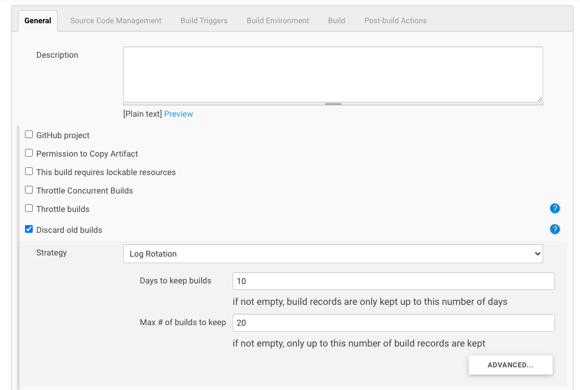
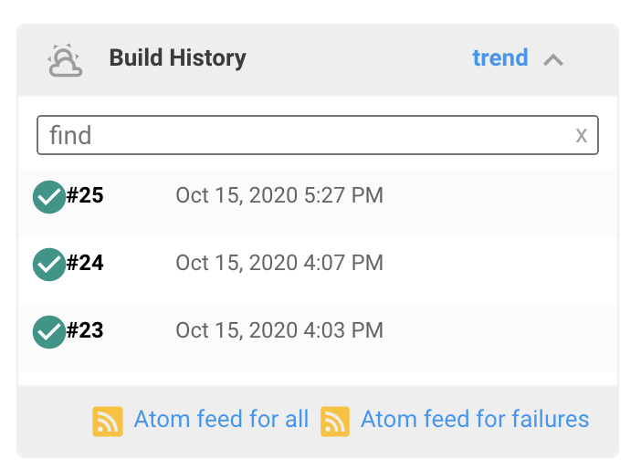
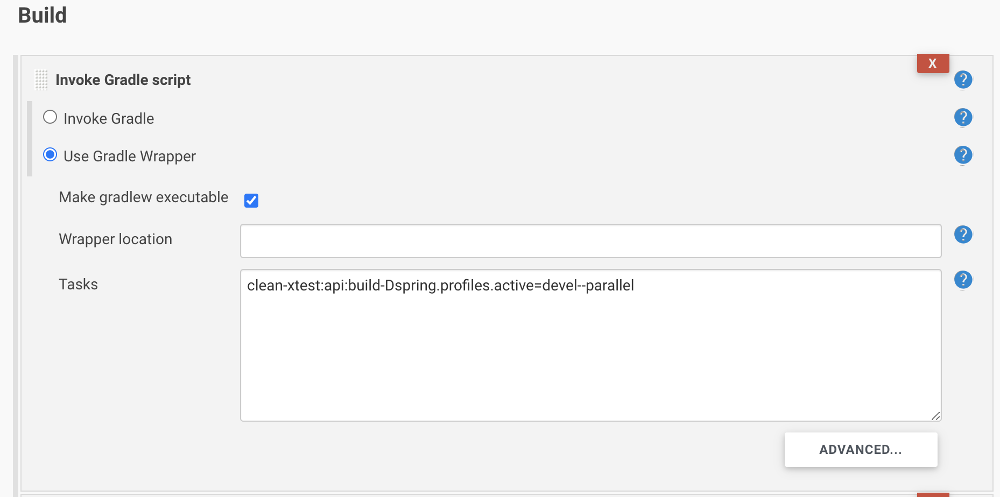
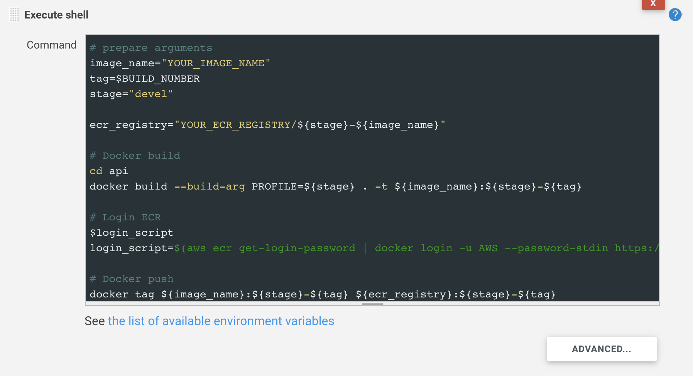
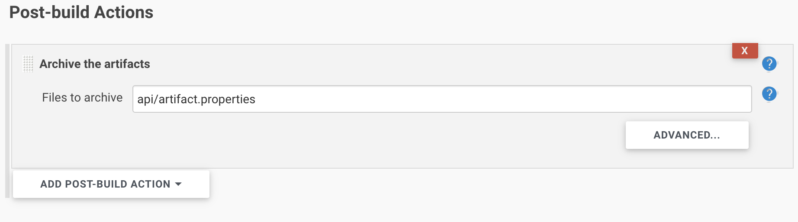

# Jenkins Build and ECR Push

> Jenkins로 Docker build 후 Amazon ECR에 Push 하기!

 

 

### Before getting started

- [Docker 알아보기](../../Docker/01_Getting_Started_with_Docker.md)
- [Amazon ECR 알아보기](../../AWS/AWS_Services/Amazon_ECR.md)

 

 

### Jenkins로 Docker build & Push 하기

 

#### 1. 해당 서비스의 소스에 `Dockerfile`을 포함시킨다

#### 2. `jenkins` 서버가 ECR에 접속할 수 있도록 설정을 해준다

#### 3. `jenkins`에 해당 서비스에 대한 배포 Job을 만들고, 해당 Job이 실행될 때 미리 포함 시켜놓은 Dockerfile을 사용하여 새로운 이미지를 빌드 하게 만든다

#### 4. `jenkins` 서버에서 새로운 docker 이미지를 빌드하고 나서 해당 이미지를 ECR에 push 한다

#### 5. 마지막으로 테스트 서버에서 ECR의 새로운 이미지를 pull 받은 후 해당 기존의 컨테이너는 삭제하고 새로운 컨테이너를 만들어준다

 

 

### Configure Jenkins job example

 

#### ex1) Discard old builds

- **Discard old builds**

  - 위의 예시처럼 설정하면 Build History 를 10일동안 저장하고, 최대 20개의 build history를 저장한다

    ex)

    

 

#### ex2) Invoke Gradle script

- Gradle로 build된 Java project의 경우, 위와 같이 Task를 지정할 수 있다

 

#### ex3) Execute shell

- 위와 같이 Jenkins job build 시 실행할 shell script를 작성할 수 있다

 

#### ex4) Post-build Actions

- Build 후 artifact를 저장하려면 다음과 같이 설정할 수 있다
