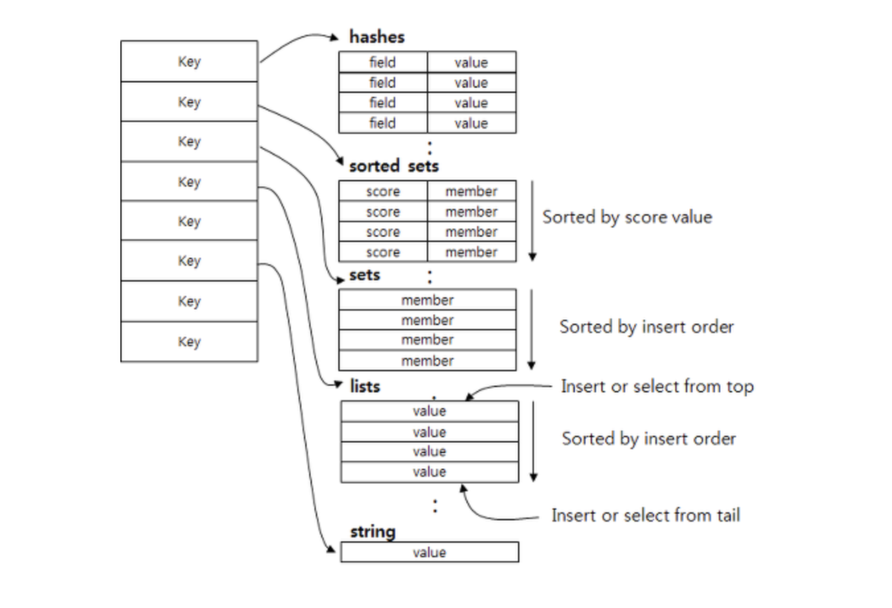

# Redis 101

> Redis에 대해 알아보아요
>
> Reference: [redis.io](https://redis.io/topics/introduction), <https://brunch.co.kr/@jehovah/20>

 

 

## Intro to Redis

 

### Redis 란?

- In-Memory Data Structure Store
  - `Key-value` 기반의 In-Memory data 저장소
    - key-value 기반이기 때문에 따로 query를 할 필요없이 결과값을 가져올 수 있다
  - Disk가 아닌 `memory` 기반의 data 저장소
    - Disk에서 data를 쓰는 도구가 아니라, **memory**에서 data를 처리하기 때문에 속도가 상당히 **빠르다**
    - Memory에만 의존하지 않기 때문에 server가 **shutdown** 되더라도 정보가 유실되지 않는다
      - 중간에 **disk**에 저장하는 `snapshot` 방식을 사용하고,
      - 모든 **log**를 기록해 server가 재시작 할 때 **log**를 기준으로 data를 **복구**한다
- Open Source (BSD 3 Licencse)
  - 삼성전자, 네이버, 라인 등 여러 기업에서 사용되고있는 검증된 open source solution

 

### DataTypes

> Redis는 다양한 data type을 지원한다

- **Strings**
  - 가장 기본적인 Redis value
  - 단순한 `key-value` mapping 구조
- **Lists**
  - Array 형식의 data structure
  - List를 사용하면 맨 처음과 끝에 data를 넣고 빼는 것은 속도가 빠릦만, 중간에 data를 삽입할 때는 어려움이 있다
- **Sets**
  - 순서가 없는 String data 집합
  - 중복을 불허한다
    - 중복된 data를 하나로 처리한다
- **Sorted sets**
  - `Sets` 와 같은 구조이지만, **score**를 통해서 순서를 정할 수 있다
  - `Sorted sets`를 사용하면 **Learderboard**와 같은 기능을 쉽게 구현할 수 있다
- **Hashes**
  - `key-value` 구조를 여러개 가진 **object type**을 저장하기 좋은 구조

 

### Redis 사용 사례

#### 1. Caching

- `In-Memory data structure store`  이기 때문에 **cache**의 역할을 수행할 수 있다
- DB의 부하를 막아주는 역할을 한다

#### 2. Session 관리

- User의 정보관리 등 session으로서 `Redis`를 사용할 수 있다

#### 3. 실시간 순위표

- Redis의 `sorted set` data type을 이용하여 원하는 값으로 **자동 정렬된** 순위표를 구성할 수 있다

#### 4. 대기열

- Redis의 `list` type을 사용해서 대기열을 쉽게 구현할 수 있다

#### 5. 채팅

- 실제 채팅 서비스에서도 Redis를 많이 사용하고 있다
- 기본적으로 `PUB/SUB` 표준을 지원하기 때문에 **고성능 채팅방**, **서버 상호 통신** 등을 구현할 수 있다

 

 

## 2. Redis 관리하기

 

- Redis의 대표적인 특징은 **Single Threaded** 라는 것이다
  - 즉, Redis는 한 번에 하나의 명령만 실행할 수 있다
    - 만약 명령어를 포함한 `Packet`이 **MTU(Maximum Transmission Unit)** 보다 크면 `packet` 이 쪼개져서 올 수 있다
      - Redis는 쪼개진 명령어를 합쳐서 하나의 명령어가 되는 순간 그 명령어를 실행한다
  - Redis가 **Single Thread** 라서 느리다고 생각할 수도 있지만,  평균적으로 `Get`/ `Set`  명령어의 경우 초당 **10만개** 정도까지 처리할 수 있다고 한다
    - 단, 유의해야할 점으로는 **처리시간이 긴 명령어**를 중간에 넣으면 그 뒤에 있는 명령어들은 전부 기다려야 한다는 것이다
      - ex) 전체 key를 불러오는 `Keys` 명령어가 처리하는데 상당히 오랜 시간이 걸리는데, 만약 중간에 `Keys` 명령어를 실행하면 그 뒤에 오는 `Get` / `Set` 명령어들은 **timeout**이 나서 요청에 실패할 수도 있따
- Redis를 사용하여 서비스를 운영하다보면 server의 **memory**가 한계에 도달할 수 있는데, memory의 한계는 `maxmemory` 값으로 설정할 수 있다
  - `maxmemory` 수치까지 memory가 다 차는 경우 Redis는 **Max memory policy**에 따라 추가로 memory를 확보한다

 

#### maxmemory-policy 설정값

1. **noeviction**
2. **allkeys-lru**
3. **volatile-lru**
4. **allkeys-random**
5. **volatile-random**
6. **volatile-ttl**
7. **allkeys-lfu**
8. **volatile-lfu**

 

#### eviction

- `maxmemory` 초과로 인해서 data가 지워지게 되는 것을 eviction이라고 한다
- Redis에 접속해서 **INFO** 명령어를 친 후 `evicted_keys` 수치를 확인하면 eviction 발생 여부를 알 수 있다
  - `eviction_keys` 값은 evicted 된 key들의 개수이므로 크면 클수록 많은 data가 memory에서 삭제되었다는 뜻이다
  - **Amazon ElastiCache**를 사용하는 경우에는 `monitoring tab`의 eviction graph를 통해 확인 가능하다
    - Evnction 여부에 대한 알람을 받을 수도 있다

 

#### used_memory_rss

- `used_memory_rss` 값은 data를 포함해서 실제로 Redis가 사용하고 있는 memory이다
  - 이 값은 실제로 사용하고 있는 `used_memory` 값보다 클 수 있다
    - 이러한 현상이 발생하는 이유는 OS가 memory를 할당할 때 **page size**의 배수만큼 할당하기 때문이다
      - ex) page size가 4096인데 요청 memory size가 10이면, OS는 4096만큼 memory를 할당한다
      - 이것을 **Fragmentation (파편화)** 현상이라고 하는데, 이것이 실제 사용 memory와 할당된 memory가 다른 원인이다

 

 

## Redis Replicaiton

 

- Redis를 구성하는 방법 중 **Read 분산**과 **데이터 이중화**를 위한 `Master/Slave` 구조가 있다
  - Master node는 읽기/쓰기를 모두 수행하고,
  - Slave node는 읽기만 수행할 수 있다
    - 이렇게 하려면 `slave`는 `master`의 data를 전부 가지고 있어야 한다
      - 이때 발생하는 것이 **Replication**이다
- Replication은 `master`에 있는 data를 **복제**해서 `slave`로 옮기는 작업을 뜻한다

 

### `Master-Slave` 간 replication 작업 순서

1. Slave configuration쪽에 `replicaof<Master IP><Master Port>` 설정을 하거나, `REPLICAOF` 명령어를 통해 master에 **data sync**를 요청한다
2. Master는 background에서 현재 memory상태를 담은 **RDB 파일** 생성을 위한 process를 진행한다
   - 이 때 master는 **fork**를 통해 memory를 복사한다
     - 그 후에 fork한 process에서 현재 memory정보를 disk에 **dump** 뜨는 작업을 진행한다
3. 2번 작업과 동시에 master는 이후에 들어오는 WRITE 명령들을 buffer에 저장해 놓는다
4. Dump 작업이 완료되면 `master`는 slave에 해당 **RDB 파일**을 전달해주고, `slave`는 disk에 저장한 후에 memory로 load 한다
5. 3번에서 모아두었던 WRITE 명령들을 slave로 보내준다

 

### Key Facts

- Replication is **asynchronous**
- Replication is **non-blocking** on the `Master`
- Replication can **block operations** on `Replica`
- `Master` can have any number of `Replicas`
- Generally `Replicas` are **read-only**
- `Replica` can be `Master` for other Replicas

 

### Need for replication

- High **availability**
- **Spread** the read load across replicas
- Replication in lieu of Persistence

 

### Types of Replication

#### 1. Full Sync

- Entire data is transferred to `Replica`
- Dump not saved on `Master` in diskless mode
- Used when
  - **Bootstraping** a new `replica`
  - Existing replica **too far** behind to do **patial sync**

#### 2. Partial Sync

 

*계속 추가 중*
