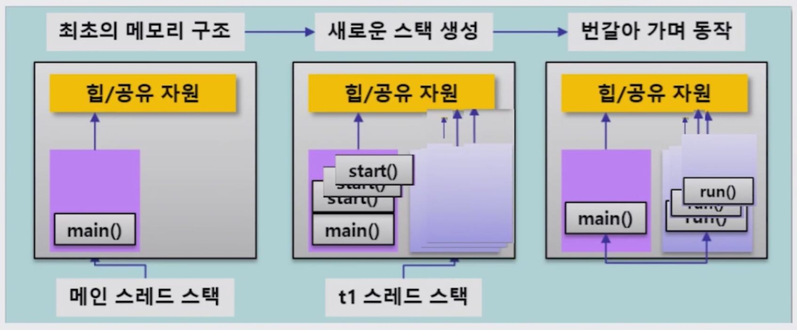

# Java Thread

<br><br>

### 동시성

<br>

- Concurrency
  - Logical
  - Single Core / Multi Core
- Parallel
  - Physical
  - Multi Core

<br>

*Java는 **JVM (Java Virtual Machine)** 위에서 동작하므로 물리적인 부분에 대해서는 고려하지 않아도 됨!*

<br>

<br>

### Java Thread 란?

<br>

- `Process`

  : 개별적으로 동작하는 프로그램 (Eclipse, Messenger, etc)

- `Thread`

  : Process를 구성하는 작은 실행 단위 (Messenger = chat + file transfer)

- `Multi-process`

  : 동시에 여러개의 process를 실행하는 것

- `Multi-thread`

  : 하나의 process에서 여러개의 thread가 동시에 동작하는 것

<br>

<br>

### Java Thread 생성

<br>

#### 방법 1) Runnable interface 생성

- Runnable interface

  ex)

  ```java
  package virus;
  
  public class CoronaRunnable implements Runnable{
  
  	int num;
  	public CoronaRunnable() {}
  	public CoronaRunnable(int num) {
  		this.num = num;
  	}
  	@Override
  	public void run() {
  		for (int i =0 ; i< 10000 ; i++) {
  			int j = i*100;
  		}
  		System.out.println(num);
  	}
  }
  ```

  <br>

- Test

  ```java
  package app;
  
  import virus.CoronaRunnable;
  
  public class CoronaThreadTest {
  	public static void main(String[] args) {
  		for (int i = 0 ; i <1000 ; i++) {
  			CoronaRunnable cr = new CoronaRunnable(i);
  			Thread t = new Thread(cr);
  			// Thread 동작시키기
  			t.start();
  		}
  	}
  }
  ```

<br>

#### 방법 2) Thread class 생성

- Thread class

  ex)
  
  ```java
package virus;
  
  public class CoronaThread extends Thread{
  	int num;
  	
  	public CoronaThread() {}
  	public CoronaThread(int num) {
  		this.num = num;
  	}
  	
  	@Override
  	public void run() {
  		for (int i = 0 ; i < 10000 ; i++) {
  			int j = i*100;
  		}
  		System.out.println(num);
  	}
  }
  ```
  
  <br>
  
- Test

  ```java
  import virus.CoronaRunnable;
  import virus.CoronaThread;
  
  public class CoronaThreadTest {
  	public static void main(String[] args) {
  		for (int i = 0 ; i <1000 ; i++) {
  			CoronaThread ct = new CoronaThread(i);
  			ct.start();
  		}
  	}
  }
  ```

  <br>

  <br>

  ### Thread 실행 시 memory 구조

  

<br>

<br>

