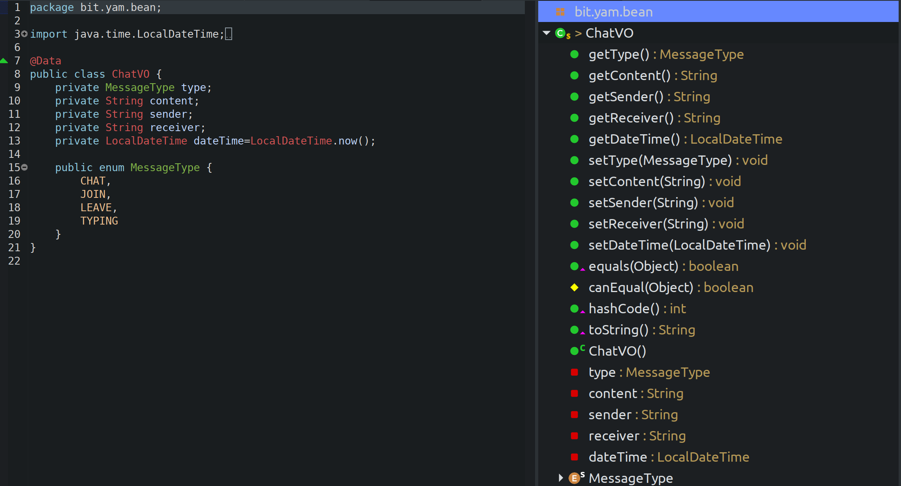

# Lombok 

 

###  Lombok이란?

:  Java에서 DTO, VO, Entity 등 Model Object를 만들 때 Constructor, Getter/Setter, toString() 등 기계적으로 반복해서 생성해야 하는 귀찮은 코드들을 annotation을 통해 쉽게 생성할 수 있게 하는 라이브러리

 

물론 Eclipse 같은 IDE의 자동 생성 기능으로 쉽게 만들 수 있지만, 변수명이 바뀌면 getter/setter 등 함수들을 같이 바꿔줘야 하는 불편함이 있음

 -> 이런 불편함을 해결해주는 Lombok annotation

 

 

### 사용 방법

 

\- `@Data` 

​     : 아래에 있는 모든 annotation을 한번에 생성  
\- `@ToString` 

​     : 모든 field 출력하는 toString() method 생성  
\- `@Getter` 

​     : Getter method 생성  
\- `@Setter` 

​     : Setter method 생성  
\- `@EqualsAndHashCode` 

​     : equals & hashcode method 생성   
\- `@NoArgsConstructor`

​	: argument 없는 constructor 생성  

\- `@RequiredArgsConstructor`

​    : 필수 argument만 있는 constructor 생성  

\- `@AllArgsConstructor`

​    : 모든 argument 가진 constructor 생성

 

 

### 사용 예시

 

 
