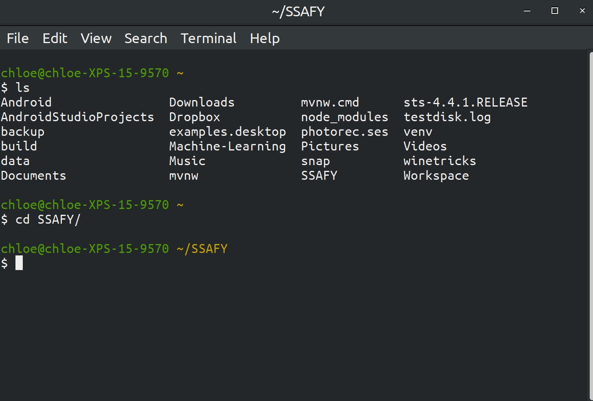

# Customize Your Ubuntu Terminal

<br>

<br>

### Edit .bashrc

> terminal

```bash
vi ~/.bashrc
```

<br>

> .bashrc

```bash
PS1='\[\e]0;\w\a\]\n\[\e[32m\]\u@\h \[\e[33m\]\w\[\e[0m\]\n\$ '
```

<br>

<br>

### Result

<br>



<br>

<br>

<br>

`+`

### Vim cheatsheet

- `:w`  - save
- `:wq:`  - save & close file
- `i` - insert
- `o`  - next line
- `s`  - delete **char** & insert
- `S` - delete **line** & insert
- `Esc` - exit insert mode
