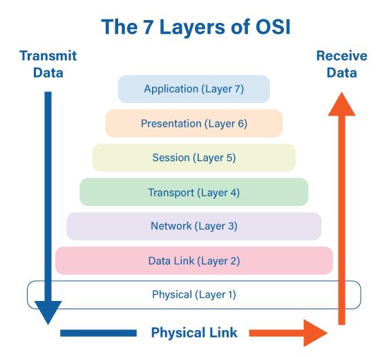

# Layers of OSI Model

 

 

### Before getting started

- 과거에는 통신용 규약이 표준화되지 않아서 호환되지 않는 system이나 application이 많았고 통신이 불가능 했음
  - 이것을 하나의 **규약**으로 **통합** 하려는 노력이 현재의 `OSI 7 Layers` 로 남아있다!
- `OSI 7 Layers`가 network 동작을 나누어 이해하고 개발하는데 도움이 되므로 main network reference model로 활용되고 있지만, 
  - 현재 대부분의 protocol은 **TCP/IP protocol stack** 기반으로 되어 있다 

 

 

## What is OSI 7 Layers?

 

### OSI 7 Layers

- OSI (= Open Systems Interconnection) is a **7 layer** architecture with each layer having specific functionality to perform.
- All these 7 layers work *collaboratively* to **transmit the data** from one person to another across the globe.

 

OSI 7 Layers는 계층의 **역할**과 **목표**에 따라 두 가지 계층으로 나눌 수 있다.

#### 1~4 계층

- `Lower Layer`
- `Data Flow Layer`
  - data를 상대방에게 잘 **전달**하는 역할을 갖고 있다

#### 5~7 계층

- `Upper Layer`
- `Application Layer`
  - data를 **만드는** 역할을 하는 부분이다

 

- **application 개발자**
  - data flow layer를 고려하지 않고 data를 **표현**하는 데 초점을 맞춘다
  - `Top-down` 형식으로 network를 바라본다
- **network engineer**
  - application layer는 application 개발자들이 고려해야 할 영역이므로 network engineer는 이 부분에 대해 일반적으로 심각하게 고민하지 않는다
  - `Bottom-up` 형식으로 network를 바라본다

 

 

## Details

 

### 1. Physical Layer (Layer 1) 

- The lowest layer of the OSI reference model is the physical layer. 
- It is responsible for the actual physical connection between the devices. 
- The physical layer contains information in the form of **bits.** 
  - It is responsible for transmitting individual bits from one node to the next. 
  - When receiving data, this layer will get the signal received and convert it into 0s and 1s and send them to the Data Link layer, which will put the frame back together.

 

### 2. Data Link Layer (DLL) (Layer 2) 

- The data link layer is responsible for the node to node delivery of the message. 
- The main function of this layer is to make sure data transfer is error-free from one node to another, over the physical layer. 
- When a `packet` arrives in a network, it is the responsibility of DLL to transmit it to the Host using its `MAC address`.
- Data Link Layer is divided into two sub layers :
  1. `Logical Link Control (LLC)`
  2. `Media Access Control (MAC)`

- The packet received from Network layer is further divided into frames depending on the frame size of `NIC(Network Interface Card)`. 
- DLL encapsulates Sender and Receiver’s MAC address in the header.
- The Receiver’s MAC address is obtained by placing an `ARP(Address Resolution Protocol)` request onto the wire asking *“Who has that IP address?”* and the destination host will reply with its MAC address.
  

### 3. Network Layer (Layer 3) 

- Network layer works for the transmission of data from one host to the other located in different networks. 
- It also takes care of `packet routing` i.e. selection of the shortest path to transmit the packet, from the number of routes available. 
- The sender & receiver’s IP address are placed in the header by the network layer.
- The functions of the Network layer are :
  1. **Routing** 
     - The network layer protocols determine which route is suitable from source to destination. 
     - This function of network layer is known as routing.
  2. **Logical Addressing** 
     - In order to identify each device on internetwork uniquely, network layer defines an addressing scheme. 
     - The sender & receiver’s IP address are placed in the header by network layer. 
     - Such an address distinguishes each device uniquely and universally.

- Segment in Network layer is referred as **Packet**.
  
- Network layer is implemented by networking devices such as routers

 

### 4. Transport Layer (Layer 4) 

- Transport layer provides services to application layer and takes services from network layer.
- The data in the transport layer is referred to as *`Segments`*. 
- It is responsible for the End to End Delivery of the complete message. 
- The transport layer also provides the acknowledgement of the successful data transmission and re-transmits the data if an error is found.
- Data in the Transport Layer is called as  `Segment`.
- Transport layer is operated by the `Operating System`. 
- It is a part of the OS and communicates with the Application Layer by making system calls.
- Transport Layer is called as **Heart of OSI** model.
  

 

### 5. Session Layer (Layer 5)

- The Session layer is responsible for establishment of connection, maintenance of sessions, authentication and also ensures security.
- The functions of the session layer are :
  1. **Session establishment, maintenance and termination** 
     -  The layer allows the two processes to establish, use and terminate a connection.
  2. **Synchronization ** 
     -  This layer allows a process to add checkpoints which are considered as `synchronization points` into the data. 
     - These synchronization point help to identify the error so that the data is re-synchronized properly, and ends of the messages are not cut prematurely and data loss is avoided.
  3. **Dialog Controller ** 
     - The session layer allows two systems to start communication with each other in half-duplex or full-duplex.

 

### 6. Presentation Layer (Layer 6) 

- Presentation layer is also called the **Translation layer**.
- The data from the application layer is extracted here and manipulated as per the required format to transmit over the network.
- The functions of the presentation layer are :
  1. **Translation**
     - For example, ASCII to EBCDIC.
  2. **Encryption/ Decryption** 
     - Data encryption translates the data into another form or code. 
  3. **Compression** 
     - Reduces the number of bits that need to be transmitted on the network.

 

### 7. Application Layer (Layer 7) 

- At the very top of the OSI Reference Model stack of layers, we find Application layer which is implemented by the network applications. 
- These applications produce the data, which has to be transferred over the network. 
- This layer also serves as a window for the application services to access the network and for displaying the received information to the user.
  - Ex: Application – Browsers, Skype Messenger etc.

- Application Layer is also called as Desktop Layer.

 

 

## Summary

 

