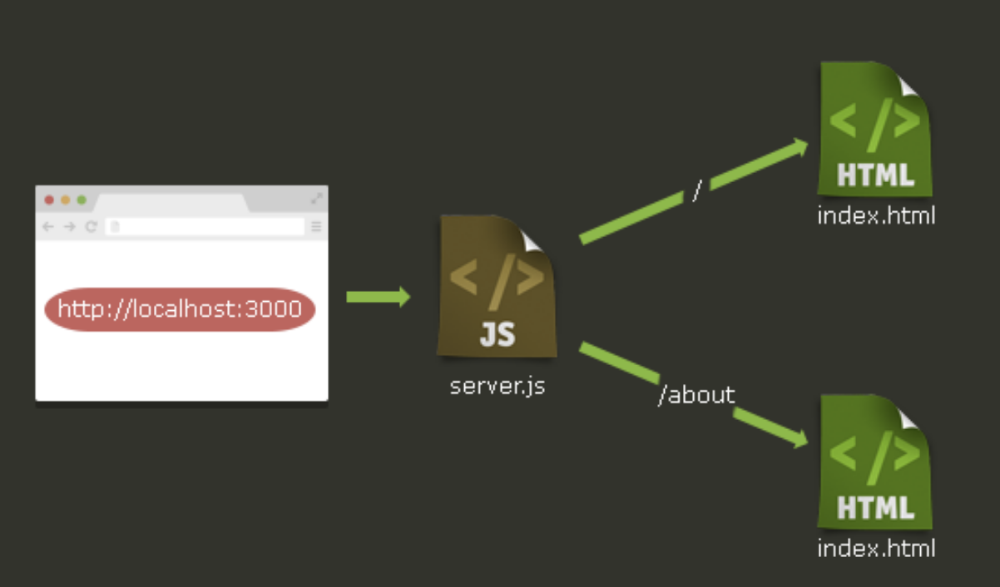
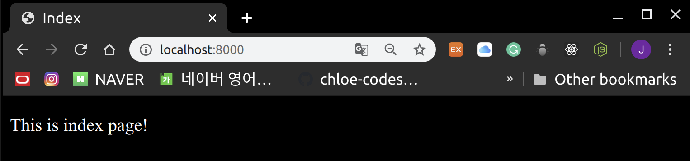
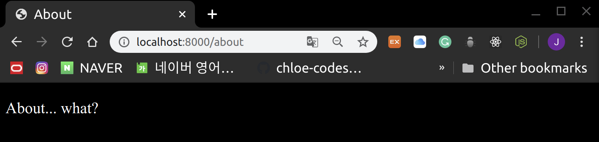

# Express.js Basics

<br>

<br>


<br>

<br>

### What is Express.js?

: Express is a minimal and flexible Node.js web application framework that provides a robust set of features to develop `web` and `mobile` applications.

<br>

#### Core Features

1. Allows to **set up middlewares** to respond to HTTP Requests

2. Defines a **routing table** which is used to perform different actions based on HTTP Method and URL
3. Allows to **dynamically render HTML Pages** based on passing arguments to templates

<br>

<br>

## Installation

<br>

### 1. Installing Express Locally

> Install express

```bash
npm install express --save
```

- saves the installation locally in the **node_modules**
- create a directory **express**  inside **node_modules**

<br>

> Express version check

```bash
$ npm view express version
4.17.1
```

<br>

> Install modules alog with express

```bash
npm install body-parser --save
npm install cookie-parser --save
npm install multer --save
```

<br><br>

### 2. Installing Express in the Project

<br>

#### Directory structure

```
express_tutorial/
├── package.json
├── public
│   └── css
│   └── style.css
├── router
│   └── main.js
├── server.js
└── views
 ├── about.html
 └── index.html
```

<br>

#### 1. create package.json

```json
{
  "name": "express-tutorial",
  "version": "1.0.0",
  "dependencies": 
  {
    "express": "~4.13.1",
    "ejs": "~2.4.1"    
  }
}
```

<br>

<br>

#### 2. Install dependency by using `npm`

```bash
npm install
```

<br>

<br>

#### 3. Create `Express` server

> server.js

```javascript
var express = require('express');
var app = express()
var server = app.listen(8000, function(){
    console.log("Express server running on port 8000!")
})
```

<br>

> result

```bash
$ node server.js
Express server running on port 8000!
```

- port 8000 으로 web server 열어서 들어가면 `Cannot GET/` 이라는 text 출력됨
  - why?
    - `Router`를 아직 정리하지 않아서!

<br>

<br>

#### 4. Basic Routing

<br>

> server.js

```javascript
var express = require('express');
var app = express()
var server = app.listen(8000, function(){
    console.log("Express server running on port 8000!")
})

app.get('/', function(request, response){
    response.send('Hello World')
})
```

<br>

<br>

#### 5. Router

<br>



router code와 server code는 다른 파일에 작성하는 것이 좋은 코딩 습관!

- **router** folder 만들기
- `main.js` 생성

<br>

> router > main.js

```javascript
module.exports = function(app){

    app.get('/', function(request, response){
        response.render('index.html')
    });

    app.get('/about', function(request, response){
        response.render('about.html')
    });
}

```

- `module.exports`는 **router** code를 따로 작성했기 때문에 `server.js`에서 module로서 불러와서 사용 가능~!

<br>

<br>

### 5. Render HTML page

<br>

- **views** directory 만들기
- `html` file들 만들기

<br>

> views > index.html

```html
<!DOCTYPE html>
<html lang="en">
<head>
    <meta charset="UTF-8">
    <meta name="viewport" content="width=device-width, initial-scale=1.0">
    <title>Index</title>
</head>
<body>

<p>This is index page!</p>
</body>
</html>
```

<br>

> views > about.html

```html
<!DOCTYPE html>
<html lang="en">
<head>
    <meta charset="UTF-8">
    <meta name="viewport" content="width=<device-width>, initial-scale=1.0">
    <title>About</title>
</head>
<body>
    <p>About... what?</p>
</body>
</html>
```

<br>

> server.js 수정하기

```javascript
var express = require('express');
var app = express();

// router module인 main.js를 불러와서 app에 전달하긔
var router = require('./router/main')(app);

// server가 읽을 수 있도록 HTML의 위치를 정의해주긔
app.set('views',__dirname + '/views');

// server가 HTML rendering을 할 때 EJS engine 사용하도록 설정하긔
app.set('view engine', 'ejs');
app.engine('html', require('ejs').renderFile);

var server = app.listen(8000, function(){
    console.log("Express server has started on port 8000!!")
})
```

<br>

<br>

### Handling Static Files

<br>

#### Static Files

- HTML에서 사용되는 `.js`, `css`, `image` file들
- **Server**에서 `Static files`을 다루기 위해선 `express.static()` method를 사용하면 된다!

<br>

1. **public** directory 만들기
2. **css** directory 만들기
3. `.css` file들 만들기

<br>

> public > css > style.css

```css
body {
    background-color: black;
    color: white;
}
```

<br>

> server.js 수정하기

```javascript
// public directory를 static folder로 설정
app.use(express.static('public'));
```

<br>

> html file들에 css 링크 추가하기

```html
<link rel="stylesheet" href="css/style.css">
```

<br>

#### result

> 127.0.0.1:8000/



<br>

> 127.0.0.1:8000/about



<br>
