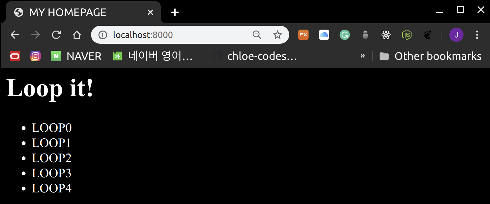

# EJS

<br>

### Directory Structure

```
Test02_EXPRESS/
├── data
│   └── user.json
├── node_modules
├── package.json
├── public
│   └── css
│       └── style.css
├── router
│   └── main.js
├── server.js
└── views
    ├── body.ejs
    ├── header.ejs
    └── index.ejs
```

<br>

<br>

## 1. Add dependency

<br>

### 1-1 Update `package.json`

> package.json

```json
{
  "name": "Test02_EXPRESS",
  "version": "1.0.0",
  "dependencies": {
    "ejs": "~2.4.1",
    "express": "^4.17.1",
    "body-parser":"~1.19.0",
    "express-session": "~1.17.0"
  }
}
```

- `body-parser`

  : **POST** data 처리

- `express-session`

  : session 관리

<br>

> Install the modules

```bash
npm install
```

<br>

### 1-2 Update `server.js``

> server.js

```javascript
var express = require('express');
var app = express();

// server가 읽을 수 있도록 HTML의 위치를 정의해주긔
app.set('views',__dirname + '/views');

// server가 HTML rendering을 할 때 EJS engine 사용하도록 설정하긔
app.set('view engine', 'ejs');
app.engine('html', require('ejs').renderFile);

var server = app.listen(8000, function(){
    console.log("Express server has started on port 8000!!")
})

// public directory를 static folder로 설정
app.use(express.static('public'));

//body-parser 사용하기
var bodyParser = require('body-parser');

// express-session 사용하기
var session = require('express-session');
var fs = require('fs')

app.use(bodyParser.json());
app.use(bodyParser.urlencoded());
app.use(session ({
    secret: '@this#is#secret#key@',
    resave: false,
    saveUninitialized: true
}))

// router module인 main.js를 불러와서 app에 전달하긔
var router = require('./router/main')(ap,fs);
```

- `fs`
  - 파일을 열기 위해 불러온 **Node.js built-in module**
- `secret`
  - 쿠키를 임의로 변조하기 위한 **sign** 값!
  - 원하는 값 넣으면 된다
- `resave`
  - session을 언제나 저장할 지 정하는 값
  - **express-session documentation**에서는 이 값을 *false*로 하는 것을 권장하고 필요에 따라 *true*로 설정함!
- `saveUninitialized`
  - **uninitialized session**이란 새로 생겼지만 변경되지 않은 session을 의미함
  - documentation에서는 *true*로 설정하는 것을 권장함!

<br>

<br>

## 2. EJS Template Engine

<br>

- Teamplate 을 읽어 engine의 문법과 설정에 따라서 file을 HTML 형식으로 변환시키는 모듈
- HTML에서 `<% %>` 를 사용하여 server의 data를 사용하거나 코드를 실행 할 수 있음!

<br>

#### Syntax

```html
<% JavaScript code %>
<% 출력할 JavaScript object %>  => JavaScript 객체를 router에서 받아 올 수도 있음!  
```

<br>

### 2-1. VIEW로 데이터 넘기기

> main.js

```javascript
module.exports = function(app,fs){

    app.get('/', function(request, response) {
        response.render('index', {
            title: "MY HOMEPAGE",
            length: 5
        })
    });
}
```

- `JSON data`를 **render method**의 두번째 인자로 전달함으로써 page에서 data를 사용 가능하게 됨

<br>

<br>

### 2-2. VIEW에서 data 접근 & loop

> views > index.ejs

```ejs
<html>
  <head>
  <title><%= title %></title>
    <link rel="stylesheet" type="text/css" href="css/style.css">
  </head>
  <body>
    <h1>Loop it!</h1>
    <ul>
        <% for(var i=0; i<length; i++){ %>
            <li>
                <%= "LOOP" + i %>
            </li>
        <% } %>
    </ul>
  </body>
</html>
```

<br>

> execute

```bash
node server.js
```

<br>

> result



<br>

<br>

### 2-3. EJS 분할하기

> `PHP` 나 `Rails` 에서 처럼 `EJS`에서도 code를 여러 파일로 분리하고 불럴와서 사용할 수 있다!

<br>

#### File 불러오기

```ejs
<% include FILENAME %>
```

<br>

> views > header.ejs

```ejs
 <title>
     <%= title %>
 </title>
 <link rel="stylesheet" type="text/css" href="css/style.css">
 <script>
    console.log("HelloWorld");
 </script>
```

<br>

> views > body.ejs

```ejs
<h1>Loop it!</h1>
<ul>
    <% for(var i=0; i<length; i++){ %>
        <li>
            <%= "LOOP" + i %>
        </li>
    <% } %>
</ul>
```

<br>

> views > index.ejs 수정!

```ejs
<html>
  <head>
    <% include ./header.ejs %>
  </head>
  <body>
    <% include ./body.ejs %>
  </body>
</html>
```

<br>

<br>

*재밌다!!!*
