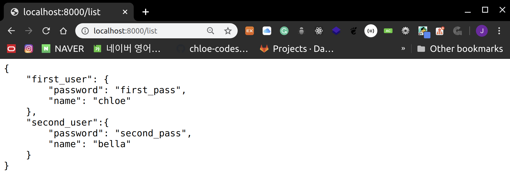
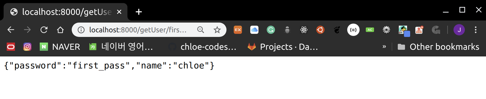

# RESTful API

<br>

<br>

## What is RESTful API?

- **R**epresentational
- **S**tate
- **T**ransfer

<br>

1. WWW (World Wide Web) 와 같은 `Hypermedia system`을 위한 `Software Architecture` 중 하나의 형식
2. `REST Server`는 client가 **HTTP Protocol**을 사용하여 server의 정보에 접근 및 변경을 가능케 함
3. 정보는 `text`, `xml`, `json` 형식으로 제공됨
   - 요즘은 `json`이 대세!

<br>

<br>

## HTTP method

> REST 기반 architecture에서 자주 사용되는 4가지 methods

<br>

1. **GET**

   : 조회

2. **PUT**

   : 생성 및 `업데이트`

3. **DELETE**

   : 제거

4. **POST**

   : 생성

<br>

<br>

## Database 생성

- JSON기반의 user database 만들기

<br>

> Test04_RESTful > data > user.json

```json
{
    "first_user": {
        "password": "first_pass",
        "name": "chloe"
    },
    "second_user":{
        "password": "second_pass",
        "name": "bella"
    }
}
```

<br>

<br>

### 1. API: GET/list

- 모든 user list 출력하는 `GET API` 만들기

<br>

> router > main.js

```javascript
module.exports = function(app,fs){

    app.get('/', function(request, response) {
        response.render('index', {
            title: "MY HOMEPAGE",
            length: 5
        })
    });
    app.get('/list', function(request, response){
        fs.readFile(__dirname + "../data/" + "user.json", "utf8", function(error, data){

            console.log(data);
            response.end(data);
        })
    })
}
```

- `__dirname`
  - 현재 module의 위치를 나타냄
  - **router** module은 router folder안에 있어서 data folder에 접근하려면 상대경로 이용해야함!

<br>

> server 실행 후 <http://localhost/list> 접속



<br>

<br>

### 2. API: GET/getUser/:username

- 특정 username의 detail한 정보 가져오는 `GET API` 만들기!

<br>

> router > main.js 에 추가

```javascript
   app.get('/getUser/:username', function(req, res){
       fs.readFile( __dirname + "/../data/user.json", 'utf8', function (err, data) {
            var users = JSON.parse(data);
            res.json(users[req.params.username]);
       });
    });
```

- file 읽은 후, user id를 찾아서 출력해줌
  - user를 찾으면 user data 출력
  - 없으면 {} 출력
- `fs.readFile()`로 file을 읽었을 시엔 text 형태로 읽어지기 때문에 `JSON.parse()` 를 해야한다!

<br>

> server 다시 실행 후 <http://localhost/getUser/first_user> 접속



<br>

<br>

### 3. API: POST addUser/:username

#### body: { “password”: “_****”, “name”: “****_” }

<br>

> router > main.js 에 추가

```javascript
app.post('/addUser/:username', function(req, res){

        var result = {  };
        var username = req.params.username;

        // CHECK REQ VALIDITY
        if(!req.body["password"] || !req.body["name"]){
            result["success"] = 0;
            result["error"] = "invalid request";
            res.json(result);
            return;
        }

        // LOAD DATA & CHECK DUPLICATION
        fs.readFile( __dirname + "/../data/user.json", 'utf8',  function(err, data){
            var users = JSON.parse(data);
            if(users[username]){
                // DUPLICATION FOUND
                result["success"] = 0;
                result["error"] = "duplicate";
                res.json(result);
                return;
            }

            // ADD TO DATA
            users[username] = req.body;

            // SAVE DATA
            fs.writeFile(__dirname + "/../data/user.json",
                         JSON.stringify(users, null, '\t'), "utf8", function(err, data){
                result = {"success": 1};
                res.json(result);
            })
        })
    });
```

- `JSON` 형태가 **Invalid** 하면 오류 반환
- **valid** 하면 파일을 열어서 `username`의 중복성을 확인 후 `JSON` data에 추가하여 다시 저장
- `stringify(users, null, 2)` 은 JSON 의 **pretty-print** 를 위함

<br>

<br>

### 4. **API: PUT updateUser/:username**

#### **body: { “password”: “_****”, “name”: “****_” }**

<br>

- 사용자 정보를 update하는 API
- `PUT` method 사용
  - **idempotent** 한 `PUT API`
    - 요청을 몇 번 수행하더라도, 같은 결과를 보장해야함!

<br>

> router > main.js 에 추가

```javascript
app.put('/updateUser/:username', function(req, res){

        var result = {  };
        var username = req.params.username;

        // CHECK REQ VALIDITY
        if(!req.body["password"] || !req.body["name"]){
            result["success"] = 0;
            result["error"] = "invalid request";
            res.json(result);
            return;
        }

        // LOAD DATA
        fs.readFile( __dirname + "/../data/user.json", 'utf8',  function(err, data){
            var users = JSON.parse(data);
            // ADD/MODIFY DATA
            users[username] = req.body;

            // SAVE DATA
            fs.writeFile(__dirname + "/../data/user.json",
                         JSON.stringify(users, null, '\t'), "utf8", function(err, data){
                result = {"success": 1};
                res.json(result);
            })
        })
    });
```

<br>

<br>

### 5. **API: DELETE deleteUser/:username**

<br>

- 사용자 data를 삭제하는 API
  - `DELETE` method 사용

<br>

> router > main.js에 추가

```javascript
app.delete('/deleteUser/:username', function(req, res){
        var result = { };
        //LOAD DATA
        fs.readFile(__dirname + "/../data/user.json", "utf8", function(err, data){
            var users = JSON.parse(data);

            // IF NOT FOUND
            if(!users[req.params.username]){
                result["success"] = 0;
                result["error"] = "not found";
                res.json(result);
                return;
            }

            // DELETE FROM DATA
            delete users[req.params.username];

            // SAVE FILE
            fs.writeFile(__dirname + "/../data/user.json",
                         JSON.stringify(users, null, '\t'), "utf8", function(err, data){
                result["success"] = 1;
                res.json(result);
                return;
            })
        })

    });
```
