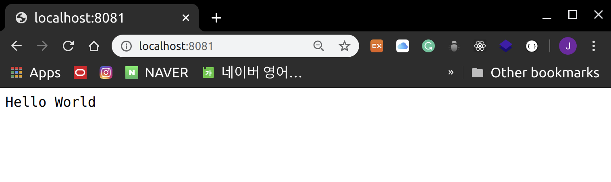

# Node.js - First Application

<br>

<br>

### Node.js Application 만들기

<br>

#### 1단계: 필요한 module import하기

- Application에 필요한 module을 불러올 땐 `require` 명령을 사용

  ```javascript
  var http = require("http");
  ```

  - HTTP module을 불러오고 반환되는 HTTP instance를 http 변수에 저장함

<br>

<br>

#### 2단계: Server 생성하기

- 1단계에서 생성한 http instance를 사용하여 `http.createServer()` method 실행
- `listen()` method를 사용하여 **port 8081**과 bind
- http.createServer()의 매개변수로는 request와 response를 매개변수로 가지고 있는 함수를 넣어줌

<br>

> main.js

```javascript

var http = require("http");

http.createServer(function (request, response) {
    /* 
        HTTP 헤더 전송
        HTTP Status: 200 : OK
        Content Type: text/plain
    */
   response.writeHead(200, {'Content-Type': 'text/plain'});
    
   /*
       Response Body 를 "Hello World" 로 설정
   */
   response.end("Hello World\n");
}).listen(8081);

console.log("Server running at http://127.0.0.1:8081");
```

- 언제나 "Hello World"를 return 하는 port 8081의 web server 생성

<br>

<br>

#### 3단계: Server test 해보기

<br>

> 서버 실행하기

```bash
node main.js
```

<br>

> 서버가 성공적으로 실행되면 다음의 text가 출력됨

```bash
Server running at http://127.0.0.1:8081/
```

<br>

> 브라우저에서[http://127.0.0.1:8081/](http://127.0.0.1:8081/) 을 열으면 다음과 같은 결과를 확인 할 수 있음



<br>
