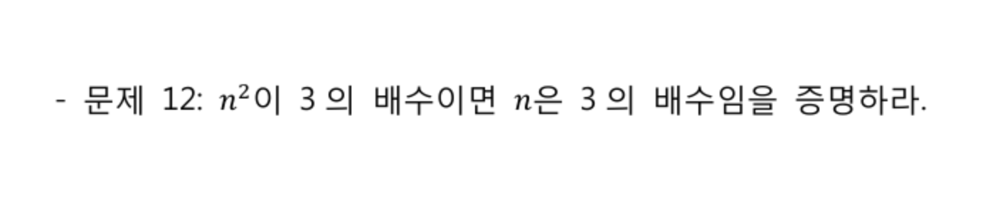
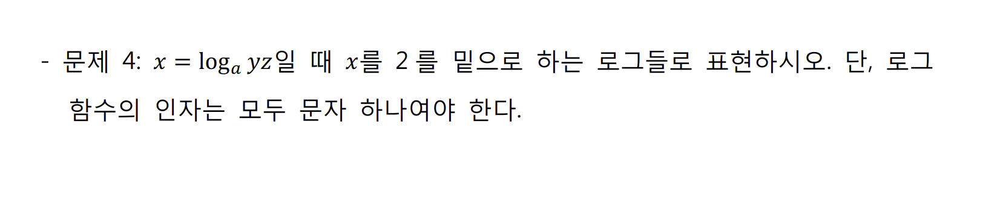
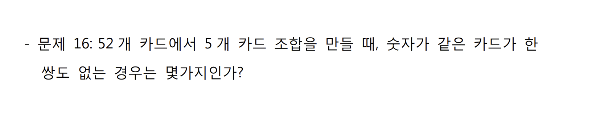

# Computational Thinking

 

## 1. 논리와 증명

 

### 명제

- 참이나 거짓을 알 수 있는 식이나 문장

- p, q, r ... 로 표현

  - p -> q가 참이면 ~q -> ~p도 참이다 (`대우`)

- ex)
  - 서울은 대한민국의 수도다

  - 1 + 1 = 3

  - 두 변의 길이가 같다면 이등변 삼각형이다.

    -> 이등변 삼각형이 아니면 어느 두 변을 선택해도 두 변의 길이는 다르다

 

### 진릿값

- 참이나 거짓을 표현
- T, F or 1, 0

 

### 연산자 우선 순위

-

 

 

### 멍청이 (pseudo-proposition) 논리

>  *너가 경찰서장이면 난 대통령!*

 

#### F -> () 는 무조건 참

- 틀린 명제를 참이라고 가정하면 어떤 명제도 참이 된다
  - ex) 로또 당첨되면 자동차 사줄게
    - 로또에 당첨되지 않으면 자동차를 사주지 않아도 거짓말이 아니며, 미당첨일 경우에 사줘도 거짓말은 아니다
    - 같은 원리로 2가 홀수라고 하면 5는 짝수거나 홀수여도 거짓이 아니다

 

#### T -> F 일때만 확실하게 거짓이다

 

 

## 2. 수와 표현

- 컴퓨터는 0/1을 표현할 수 있는 비트들을 모아 수를 표현
- k개의 비트를 사용하면 0부터 `2^k -1` 까지 표현 가능
  - 사실, 꼭 저 범위인 것은 아님!
  - 약속하는 방식에 따라 다르지만, 어떤 경우든 최대 `2^k` 가지의 값을 표현하는 것이 가능
    - 10진수로 k자리를 쓰면 0부터 `10^k -1`까지 표현이 가능한 것과 완전히 동일한 과정

 

### 어떤 값 n을 표현하기 위해서는 몇 개의 비트가 필요할까?

- 2^k -1 >= n이 성립해야 함
  - 즉, `2^k >= n+1`
- 같은 의미로, k >= log(n+1)   ->  약 logn 비트가 필요
  - x = logn과 2^x = n과 같은말!

 

`+`

#### logn이란

1. 2의 몇 승이 n이 되느냐의 답
2. n을 표한하는 데 몇 비트가 필요한가의 답
3. 1로 시작해서 계속 두 배를 할 때 몇 번 하면 n이 되느냐의 답
4. n을 2로 계속 나눌 때 몇 번 나누면 거의 1이 되느냐에 대한 답

 

- x = logn일 때 x와 n을 비교하면 x가 더 작고, n이 커질수록 엄청나게 달라진다
  - 급격하게 변하는 것을 작게 나타내고 싶을 때 log 사용!
- 100자리로 표현할 수 있는 10진수 값은 읽을 수도 없을 정도로 큰 값이다!
- 컴퓨터 분야에서 log의 밑은 항상 2

- 32비트 컴퓨터의 주소 공간은 2^32 = 약 40억개 주소

 

 

### Exercises

1. 2진수 표현에서 logn 비트로 표현할 수 있는 숫자 범위는?
   - n개
2. 스무고개가 이상적으로 진행된다고 할 때, 맞출 수 있는 답의 종류는 몇 가지인가?
3. n이 충분히 큰 값 일 때 다음중 어느 값이 더 큰가?
   1.  `2n`  <  `n^2`
   2. `2^(nlogn)`   >   `n!`
4. 
5. 다음 함수들의 역함수를 구하시오
   1.  f(x) = log(x-3) -5
      - f^-1(x) = 2^(x+5) +3
   2.  f(x) = 3 log(x+3) +1
   3.  f(x) = 2 x 3^x -1

 

 

## 집합과 조합론

 

### 집합

- 두 집합 A와 B에 대해 A가 B의 부분집합임을 증명한다는 것은 A의 임의의 원소가 B에 포함됨을 보이는 것과 같다
  - ex) 모든 4의 배수는  2의 배수라는 것을 증명하려면, 4k = 2(2k) 임을 보이면 되는 것!
- 두 집합 A와 B가 같다는 것을 증명하기 위해서는 A가 B의 부분집합이고 B가 A의 부분집합임을 증명하면 된다

 

### 조합

- 조합론은 경우의 수를 따지는 문제들을 보통 말한다
- 조합은 개수는 C를 이용하여 표현하기도 하지만 (5 밑에 2) = 10 과 같은 괄호 표현을 더 많이 쓴다

 

 

`+`

### 수학적 귀납법

 

`+`

### 귀류법

- 명제를 증명하려고 할 때, 그 명제의 부정을 참이라고 가정
- 그 가정이 참이 아님(모순임)을 통해 원래 가정이 참임을 보여줌

### Exercises

 

 

## 문제

 

 

