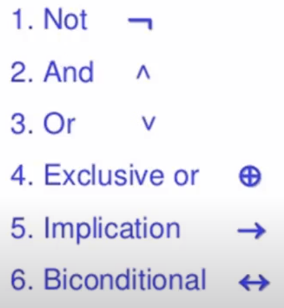

# Discrete Mathematics

> 컴퓨터를 위한 수학

 

*Discrete Mathematics* provides a common forum for significant research in many areas of **discrete mathematics** and **combinatorics**.

 

 

## 이산수학 개요

> 참과 거짓으로 살펴보는 컴퓨터 수학

 

### 왜 배워야 하는가?

- 이산수학이란 불연속적인 숫자를 다루는 수학

- 컴퓨터에서는 내부적으로 0과 1만을 다루는데 그러한 불연속적인 데이터의 흐름을 다루기에 적합한 수학적 사고를 배양하는데 필수적인 강의다

- 이산수학에서 다루는 내용이 자료구조, 알고리즘 등의 베이스가 되어 전체적인 Computational Thinking을 길러준다

   

*이산수학은 컴퓨터 과학의 베이스 학문이다!*

 

 

## 명제와 연산자

 

### 명제

> 진실 혹은 거짓

- 참(True)이나 거짓(False)으로 진리를 구분할 수 있는 문장
- 명제는 0 또는 1만을 가지는 컴퓨터 메모리처럼 항상 참과 거짓 둘 중 하나의 값만을 가진다
- 여러개의 명제를 조합할 수도 있다
  - **합성 명제 (`Compound Proposition`)**

 

### 논리 연산자

> 연산자는 명제를 연산하기 위한 도구이며, 이산수학의 기본 연산자로는 6가지가 있다

 

 

 

1. `Not`

   - 뒤에 오는 명제에 대해 참 <-> 거짓을 바꾸어줌

2. `And`

   - 논리곱

   - 두 개의 명제를 묶을 때 사용
   - 둘 다 참일때만 참
     - 한 개라도 거짓이면 거짓

3. `Or`

   - 논리합

   - 둘 중 하나라도 참이면 참

4. `Exclusive or`

   - 배타적 논리합
     - 서로를 배제한다
   - 둘 중 단 한 개만 참인 경우 참

5. `Implication (함축)`

   - **조건 명제 (`Conditional Proposition`)**
     - 어떠한 조건일때, 이런 결과가 나온다
       - 조건과 결과에 따른 흐름을 표현할 때 사용
     - **원인**이 되는 명제와 **결과**가 되는 명제가 존재하는 명제
   - p -> q
     - p가 True, q가 False일 때에만 조건 명제는 False 값을 반환

6. `Biconditional`

   - 쌍방 조건 명제
   - 두 값이 서로 일치할 때에만 쌍방 조건 명제는 True 값을 반환함

