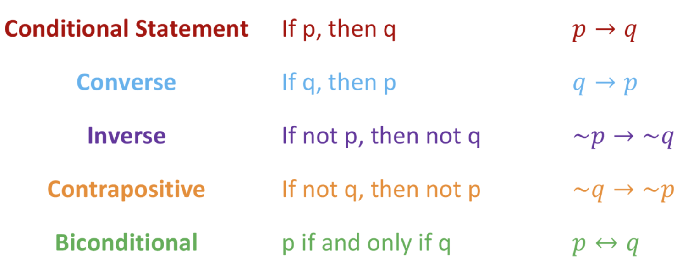

# Discrete Mathematics

> 컴퓨터를 위한 수학

 

*Discrete Mathematics* provides a common forum for significant research in many areas of **discrete mathematics** and **combinatorics**.

 

 

## 이산수학 개요

> 참과 거짓으로 살펴보는 컴퓨터 수학

 

### 왜 배워야 하는가?

- 이산수학이란 불연속적인 숫자를 다루는 수학

- 컴퓨터에서는 내부적으로 0과 1만을 다루는데 그러한 불연속적인 데이터의 흐름을 다루기에 적합한 수학적 사고를 배양하는데 필수적인 강의다

- 이산수학에서 다루는 내용이 자료구조, 알고리즘 등의 베이스가 되어 전체적인 Computational Thinking을 길러준다

   

*이산수학은 컴퓨터 과학의 베이스 학문이다!*

 

 

## 명제와 연산자

 

### 명제 (proposition)

> 진실 혹은 거짓

- 참(True)이나 거짓(False)으로 진리를 구분할 수 있는 문장
- 명제는 0 또는 1만을 가지는 컴퓨터 메모리처럼 항상 참과 거짓 둘 중 하나의 값만을 가진다
- 여러개의 명제를 조합할 수도 있다
  - **합성 명제 (`Compound Proposition`)**

 

### 논리 연산자 (logical operator)

> 연산자는 명제를 연산하기 위한 도구이며, 이산수학의 기본 연산자로는 6가지가 있다

 

 

 

1. `Not`

   - 뒤에 오는 명제에 대해 참 <-> 거짓을 바꾸어줌

2. `And`

   - 논리곱

   - 두 개의 명제를 묶을 때 사용
   - 둘 다 참일때만 참
     - 한 개라도 거짓이면 거짓

3. `Or`

   - 논리합

   - 둘 중 하나라도 참이면 참

4. `Exclusive or`

   - 배타적 논리합
     - 서로를 배제한다
   - 둘 중 단 한 개만 참인 경우 참

5. `Implication (함축)`

   - **조건 명제 (`Conditional Proposition`)**
     - 어떠한 조건일때, 이런 결과가 나온다
       - 조건과 결과에 따른 흐름을 표현할 때 사용
     - **원인**이 되는 명제와 **결과**가 되는 명제가 존재하는 명제
   - p -> q
     - p가 True, q가 False일 때에만 조건 명제는 False 값을 반환

6. `Biconditional`

   - 쌍방 조건 명제
   - 두 값이 서로 일치할 때에만 쌍방 조건 명제는 True 값을 반환함

 

 

## 역, 이 , 대우 (converse, inverse, contrapositive)

 

### 진리표 (Truth-Table)

- 각 명제 사이의 관계식의 진릿값을 보여주는 표
- 아무리 복잡한 **합성 명제** 라도 진리표를 통해 풀어낼 수 있다!

 

 

 

### 역, 이, 대우

 

 

- **조건 명제** (`Conditional Proposition`)에서 사용함
- 하나의 명제를 변형해 표헌함
- 증명에 도움을 준다
- 증명하기 어려운 명제는 **대우**를 이용해 증명할 수 있음
  - 어떤 명제의 대우가 참인 경우, 본 명제 또한 참이기 때문!

  

## 동치 (equivalent)

> 두 개의 명제가 서로 같은 진리값을 갖고 있을 때

 

### 동치의 의미

- 동치란 '*논리적으로 일치한다*' 는 의미
- 같은 의미를 가진 더 쉬운 명제를 발견하는 데 사용
- 동치 법칙에는 다양한 종류가 있음

 

### 동치 법칙을 이용해 증명하기

> 복잡해 보이는 합셩 명제 (compositional proposition)도 동치 법칙을 이용해 간단한 명제로 바꿀 수 있다!

 

 

- #### 항등 법칙

  - 비교 대상의 True/False 여부에 관계 없이 p 값을 가진다

- #### 지배 법칙

  - 비교 대상에 따라 결과가 지배적으로 결정된다

- #### 드 모르간의 법칙

  - p and q 일 때, not을 붙이면 각각 ~p or ~q 가 된다
  - 반대로 p or q에 not을 붙이면 각각 ~p and ~q가 된다

- #### 흡수 법칙

  - 바깥에 있는 값이 강력해서 괄호 () 안의 여부에 상관 없이 바깥의 결과에 흡수된다

- #### 부정 법칙

  - 둘 중 하나가 not 일 때 and 연산이면 True, or 연산이면 False 반환

- #### 함축 법칙

  - `p -> q`  <-> `~q or q`

 
