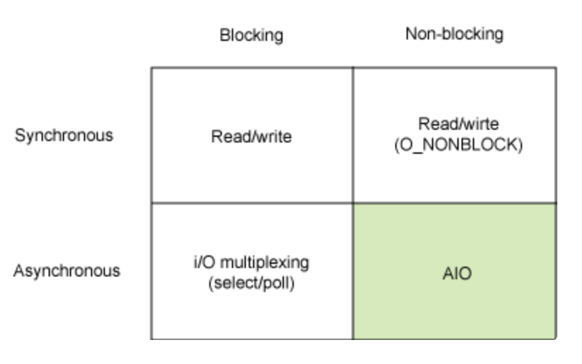

# Sync vs Async and Blocking vs Non-Blocking

> 헷갈리는 개념을 정리해보아요!

 

 

## Block vs Non-Block

: 제어할 수 없는 대상의 처리 방법

 

### Block 이란?

- `제어권`을 호출한 함수가 가지고 있다가, **결과값**을 **반환**할 때 같이 주는 것

 

 

## Sync vs Async

: 동기 vs 비동기 (추상적)

 

### Synchronous 란?

- Syn (함께) + Chrono (시간) 
  - *대상들의 시간이 맞춰지는가?*
    - 시간을 일치시키는 것 
  - `제어권`을 **반환**하는 시간과 `결과값`을 **전달**하는 시간이 같을 때
    - 동기! 

 

### Asynchronous 란?

- 시간을 일치시키지 않는 것

 

 

## `Block & Non-Block`  vs  `Sync & Async`

 

### Block & Non-Block

- `제어권`에 관한 것
- *제어할 수 없는 대상을 어떻게 처리하는가?*

 

### Sync & Async

- `제어권`을 **반환**하는 **시간** (**타이밍**) 에 관한 것

- *대상들의 시간을 일치시키는가?*

 

